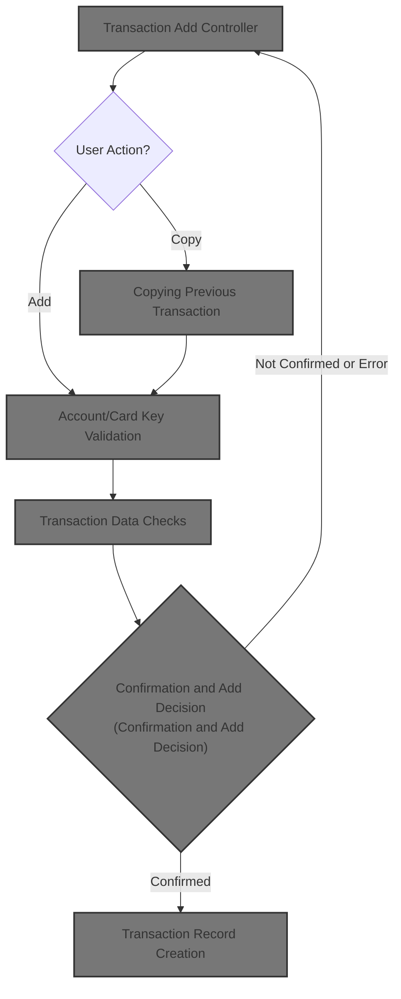
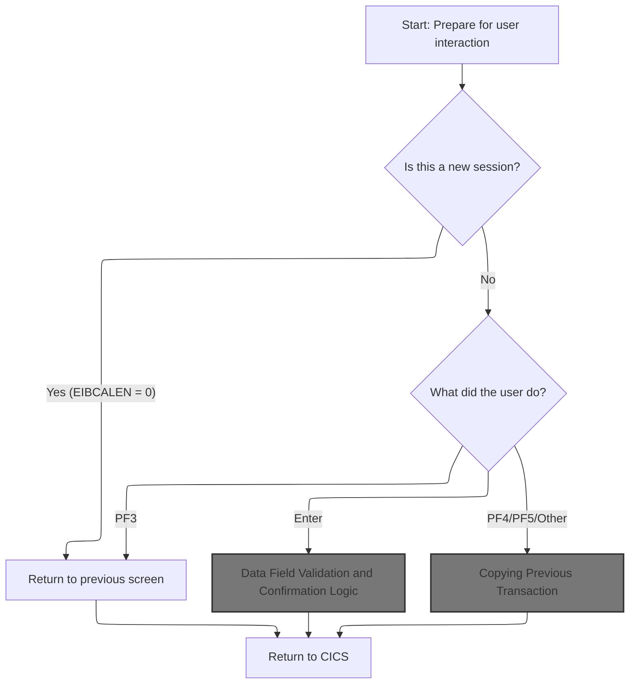
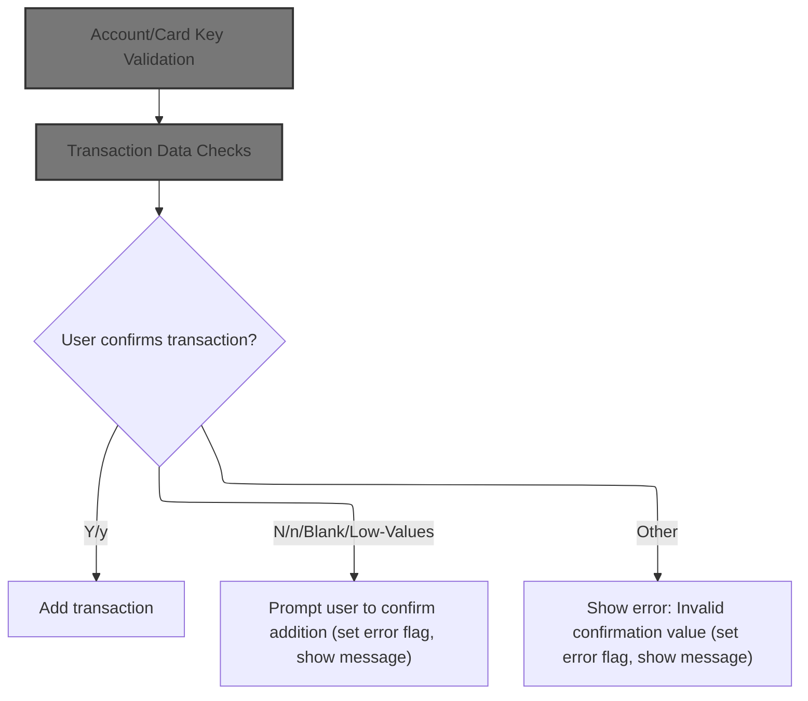
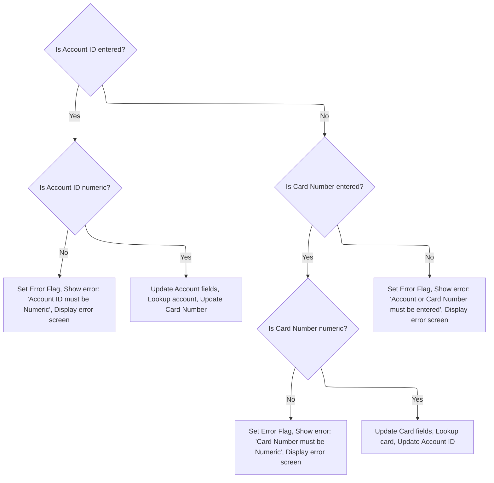
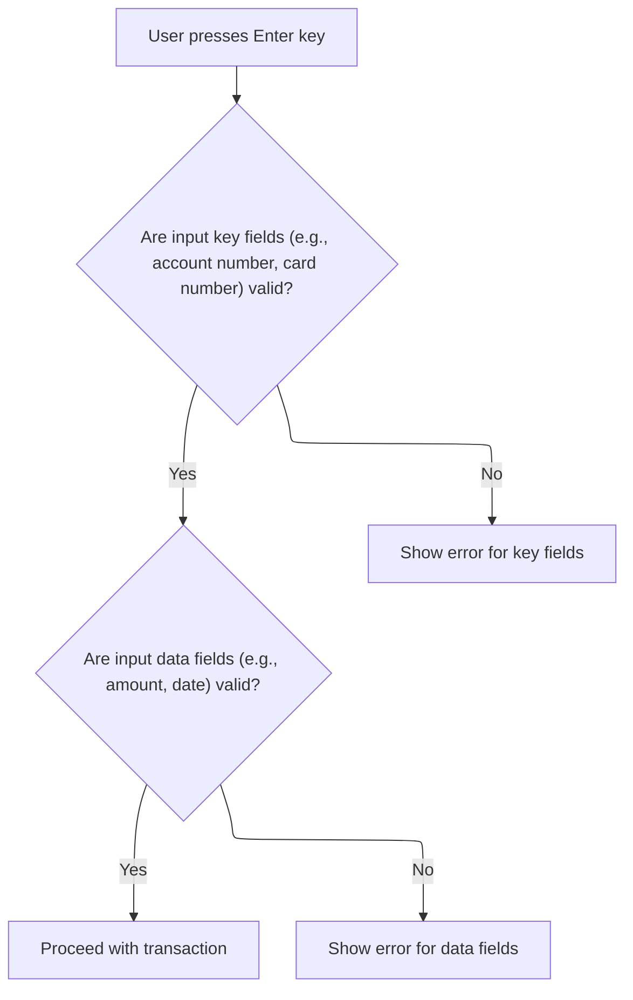
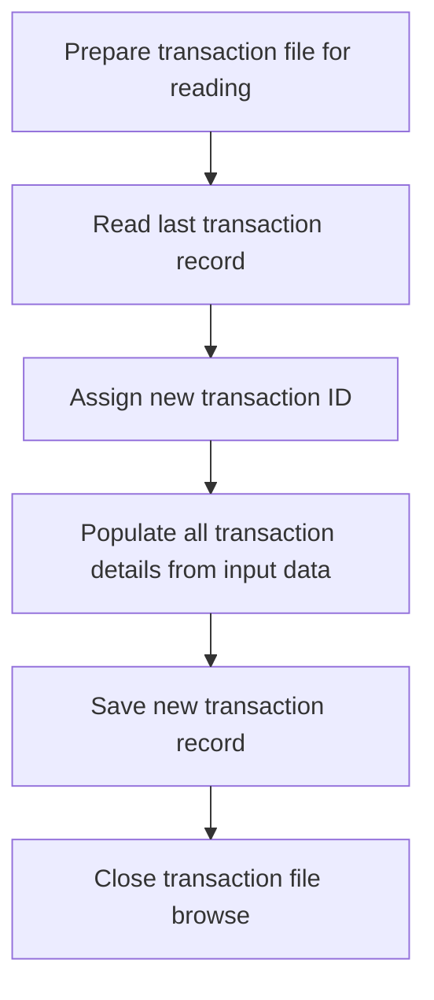
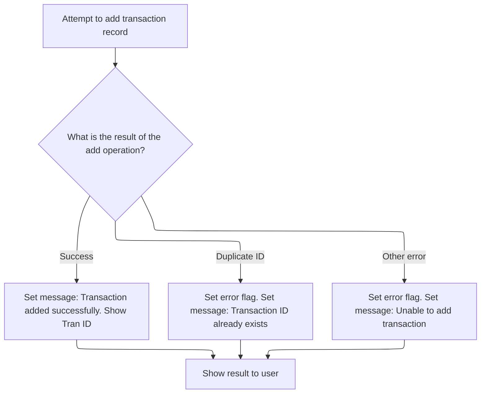
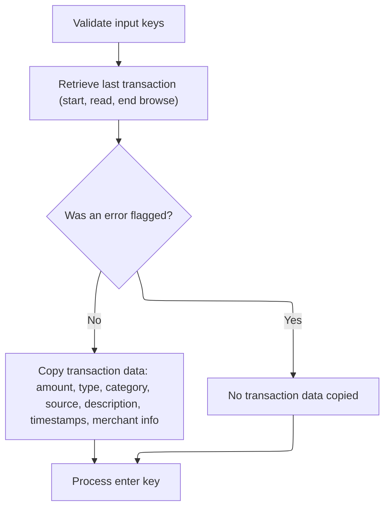

# Overview

This document describes the flow for adding a new credit card transaction. Users provide account or card identification, transaction details, and confirmation. The flow validates input, requires confirmation, and creates a new transaction record, providing feedback and navigation options.



## Dependencies

### Programs

- <SwmToken path="app/cbl/COTRN02C.cbl" pos="2:7:7" line-data="      * Program     : COTRN02C.CBL">`COTRN02C`</SwmToken> (<SwmPath>[app/cbl/COTRN02C.cbl](app/cbl/COTRN02C.cbl)</SwmPath>)
- CSUTLDTC (<SwmPath>[app/cbl/CSUTLDTC.cbl](app/cbl/CSUTLDTC.cbl)</SwmPath>)
- CEEDAYS

### Copybooks

- <SwmToken path="app/cbl/COTRN02C.cbl" pos="71:3:3" line-data="       COPY COCOM01Y.">`COCOM01Y`</SwmToken> (<SwmPath>[app/cpy/COCOM01Y.cpy](app/cpy/COCOM01Y.cpy)</SwmPath>)
- <SwmToken path="app/cbl/COTRN02C.cbl" pos="82:3:3" line-data="       COPY COTRN02.">`COTRN02`</SwmToken> (<SwmPath>[app/cpy-bms/COTRN02.CPY](app/cpy-bms/COTRN02.CPY)</SwmPath>)
- <SwmToken path="app/cbl/COTRN02C.cbl" pos="84:3:3" line-data="       COPY COTTL01Y.">`COTTL01Y`</SwmToken> (<SwmPath>[app/cpy/COTTL01Y.cpy](app/cpy/COTTL01Y.cpy)</SwmPath>)
- <SwmToken path="app/cbl/COTRN02C.cbl" pos="85:3:3" line-data="       COPY CSDAT01Y.">`CSDAT01Y`</SwmToken> (<SwmPath>[app/cpy/CSDAT01Y.cpy](app/cpy/CSDAT01Y.cpy)</SwmPath>)
- <SwmToken path="app/cbl/COTRN02C.cbl" pos="86:3:3" line-data="       COPY CSMSG01Y.">`CSMSG01Y`</SwmToken> (<SwmPath>[app/cpy/CSMSG01Y.cpy](app/cpy/CSMSG01Y.cpy)</SwmPath>)
- <SwmToken path="app/cbl/COTRN02C.cbl" pos="88:3:3" line-data="       COPY CVTRA05Y.">`CVTRA05Y`</SwmToken> (<SwmPath>[scripts/markers/CVTRA05Y](scripts/markers/CVTRA05Y)</SwmPath>)
- <SwmToken path="app/cbl/COTRN02C.cbl" pos="89:3:3" line-data="       COPY CVACT01Y.">`CVACT01Y`</SwmToken> (<SwmPath>[scripts/markers/CVACT01Y](scripts/markers/CVACT01Y)</SwmPath>)
- <SwmToken path="app/cbl/COTRN02C.cbl" pos="90:3:3" line-data="       COPY CVACT03Y.">`CVACT03Y`</SwmToken> (<SwmPath>[scripts/markers/CVACT03Y](scripts/markers/CVACT03Y)</SwmPath>)
- DFHAID
- DFHBMSCA

# Workflow

# Transaction Add Controller



This section governs the business logic for initializing and managing the add transaction workflow, including session validation, navigation, and user input handling for credit card transactions.

| Category        | Rule Name                         | Description                                                                                                                                                                      |
| --------------- | --------------------------------- | -------------------------------------------------------------------------------------------------------------------------------------------------------------------------------- |
| Data validation | New Session Navigation            | If the session is new (no data in the communication area), the user is immediately returned to the previous screen without processing transaction logic.                         |
| Data validation | Input Validation and Confirmation | If the user presses the Enter key, the system must validate all transaction input fields and confirm the user's intent before proceeding with the add operation.                 |
| Business logic  | Session State Reset               | All error flags and user modification indicators must be reset at the start of the add transaction flow to ensure a clean state for user interaction.                            |
| Business logic  | PF3 Navigation                    | If the user presses PF3, the system must return the user to the previous screen without adding or modifying any transaction data.                                                |
| Business logic  | Copy Previous Transaction         | If the user presses PF4, PF5, or other supported keys, the system must attempt to copy the previous transaction's data into the current input fields for user review or editing. |

<SwmSnippet path="/app/cbl/COTRN02C.cbl" line="107">

---

In <SwmToken path="app/cbl/COTRN02C.cbl" pos="107:1:3" line-data="       MAIN-PARA.">`MAIN-PARA`</SwmToken> we're kicking off the transaction add flow by resetting error flags, marking the user as not having modified anything yet, and clearing out any leftover messages. This sets up a clean state before we start handling user input or screen navigation. It's not just boilerplate—this is where the orchestration for the add transaction logic begins.

```cobol
       MAIN-PARA.

           SET ERR-FLG-OFF     TO TRUE
           SET USR-MODIFIED-NO TO TRUE

           MOVE SPACES TO WS-MESSAGE
                          ERRMSGO OF COTRN2AO
```

---

</SwmSnippet>

<SwmSnippet path="/app/cbl/COTRN02C.cbl" line="115">

---

Here we're checking if there's any data in the communication area. If not, we set up to return to the previous screen by setting the next program and calling <SwmToken path="app/cbl/COTRN02C.cbl" pos="117:3:9" line-data="               PERFORM RETURN-TO-PREV-SCREEN">`RETURN-TO-PREV-SCREEN`</SwmToken>. This is the first navigation checkpoint before we get into any transaction logic.

```cobol
           IF EIBCALEN = 0
               MOVE 'COSGN00C' TO CDEMO-TO-PROGRAM
               PERFORM RETURN-TO-PREV-SCREEN
```

---

</SwmSnippet>

<SwmSnippet path="/app/cbl/COTRN02C.cbl" line="118">

---

We decide if we're initializing the screen or jumping into input processing, and if there's a selected transaction, we go straight to validation by calling <SwmToken path="app/cbl/COTRN02C.cbl" pos="128:3:7" line-data="                       PERFORM PROCESS-ENTER-KEY">`PROCESS-ENTER-KEY`</SwmToken>.

```cobol
           ELSE
               MOVE DFHCOMMAREA(1:EIBCALEN) TO CARDDEMO-COMMAREA
               IF NOT CDEMO-PGM-REENTER
                   SET CDEMO-PGM-REENTER    TO TRUE
                   MOVE LOW-VALUES          TO COTRN2AO
                   MOVE -1       TO ACTIDINL OF COTRN2AI
                   IF CDEMO-CT02-TRN-SELECTED NOT =
                                              SPACES AND LOW-VALUES
                       MOVE CDEMO-CT02-TRN-SELECTED TO
                            CARDNINI OF COTRN2AI
                       PERFORM PROCESS-ENTER-KEY
                   END-IF
                   PERFORM SEND-TRNADD-SCREEN
```

---

</SwmSnippet>

## User Input Validation and Confirmation



This section ensures that only valid and confirmed credit card transactions are added to the system by validating user input and requiring explicit user confirmation before processing.

| Category        | Rule Name                   | Description                                                                                                                                                            |
| --------------- | --------------------------- | ---------------------------------------------------------------------------------------------------------------------------------------------------------------------- |
| Data validation | Key Field Requirement       | A transaction can only be added if either a valid account ID or a valid card number is provided by the user. At least one of these fields must be present and numeric. |
| Data validation | Transaction Data Validation | All transaction data fields (such as amount and date) must be present, numeric where applicable, and in the correct format. Dates must be valid calendar dates.        |
| Business logic  | Explicit User Confirmation  | The user must explicitly confirm the addition of a transaction by entering 'Y' or 'y'. Only upon confirmation is the transaction added.                                |

<SwmSnippet path="/app/cbl/COTRN02C.cbl" line="164">

---

We kick off by checking the key fields, then the rest of the data, so we don't process junk input.

```cobol
       PROCESS-ENTER-KEY.

           PERFORM VALIDATE-INPUT-KEY-FIELDS
           PERFORM VALIDATE-INPUT-DATA-FIELDS.
```

---

</SwmSnippet>

### Account/Card Key Validation



This section ensures that users provide valid identification information (either Account ID or Card Number) before proceeding with credit card management operations. It enforces input requirements and provides clear feedback on errors.

| Category        | Rule Name                       | Description                                                                                                                                                                                              |
| --------------- | ------------------------------- | -------------------------------------------------------------------------------------------------------------------------------------------------------------------------------------------------------- |
| Data validation | Mandatory Key Entry             | The user must enter either an Account ID or a Card Number to proceed. If neither is provided, the system will not continue and will display an error message requiring at least one field to be entered. |
| Data validation | Account ID Numeric Validation   | If an Account ID is entered, it must consist only of numeric characters. If not, the system will display an error message stating 'Account ID must be Numeric' and halt further processing.              |
| Data validation | Card Number Numeric Validation  | If a Card Number is entered, it must consist only of numeric characters. If not, the system will display an error message stating 'Card Number must be Numeric' and halt further processing.             |
| Business logic  | Account to Card Cross-Reference | If the Account ID is valid and provided, the system will use it to look up and populate the corresponding Card Number and other account fields for further processing.                                   |
| Business logic  | Card to Account Cross-Reference | If the Card Number is valid and provided, the system will use it to look up and populate the corresponding Account ID and other card fields for further processing.                                      |

<SwmSnippet path="/app/cbl/COTRN02C.cbl" line="193">

---

In <SwmToken path="app/cbl/COTRN02C.cbl" pos="193:1:7" line-data="       VALIDATE-INPUT-KEY-FIELDS.">`VALIDATE-INPUT-KEY-FIELDS`</SwmToken> we check if the user gave us an account ID or card number, make sure it's numeric, and then look up the corresponding cross-reference data. If the input is bad, we bail out early and show an error. If it's good, we prep the data for the next step.

```cobol
       VALIDATE-INPUT-KEY-FIELDS.

           EVALUATE TRUE
               WHEN ACTIDINI OF COTRN2AI NOT = SPACES AND LOW-VALUES
                   IF ACTIDINI OF COTRN2AI IS NOT NUMERIC
                       MOVE 'Y'     TO WS-ERR-FLG
                       MOVE 'Account ID must be Numeric...' TO
                                       WS-MESSAGE
                       MOVE -1       TO ACTIDINL OF COTRN2AI
                       PERFORM SEND-TRNADD-SCREEN
                   END-IF
                   COMPUTE WS-ACCT-ID-N = FUNCTION NUMVAL(ACTIDINI OF
                   COTRN2AI)
                   MOVE WS-ACCT-ID-N            TO XREF-ACCT-ID
                                                ACTIDINI OF COTRN2AI
                   PERFORM READ-CXACAIX-FILE
                   MOVE XREF-CARD-NUM         TO CARDNINI OF COTRN2AI
```

---

</SwmSnippet>

<SwmSnippet path="/app/cbl/COTRN02C.cbl" line="210">

---

If the account ID wasn't provided, we check the card number next. Same deal—make sure it's numeric, then look up the card cross-reference. If that's bad, we error out and show the screen again. If it's good, we update the account ID from the card data.

```cobol
               WHEN CARDNINI OF COTRN2AI NOT = SPACES AND LOW-VALUES
                   IF CARDNINI OF COTRN2AI IS NOT NUMERIC
                       MOVE 'Y'     TO WS-ERR-FLG
                       MOVE 'Card Number must be Numeric...' TO
                                       WS-MESSAGE
                       MOVE -1       TO CARDNINL OF COTRN2AI
                       PERFORM SEND-TRNADD-SCREEN
                   END-IF
                   COMPUTE WS-CARD-NUM-N = FUNCTION NUMVAL(CARDNINI OF
                   COTRN2AI)
                   MOVE WS-CARD-NUM-N        TO XREF-CARD-NUM
                                                CARDNINI OF COTRN2AI
                   PERFORM READ-CCXREF-FILE
                   MOVE XREF-ACCT-ID         TO ACTIDINI OF COTRN2AI
```

---

</SwmSnippet>

<SwmSnippet path="/app/cbl/COTRN02C.cbl" line="224">

---

If neither key is entered, we error out and prompt the user to enter at least one before continuing.

```cobol
               WHEN OTHER
                   MOVE 'Y'     TO WS-ERR-FLG
                   MOVE 'Account or Card Number must be entered...' TO
                                   WS-MESSAGE
                   MOVE -1       TO ACTIDINL OF COTRN2AI
                   PERFORM SEND-TRNADD-SCREEN
           END-EVALUATE.
```

---

</SwmSnippet>

### Data Field Validation and Confirmation Logic



<SwmSnippet path="/app/cbl/COTRN02C.cbl" line="164">

---

After key validation, we check the rest of the transaction data to make sure it's all good before proceeding.

```cobol
       PROCESS-ENTER-KEY.

           PERFORM VALIDATE-INPUT-KEY-FIELDS
           PERFORM VALIDATE-INPUT-DATA-FIELDS.
```

---

</SwmSnippet>

### Transaction Data Checks

The Transaction Data Checks section ensures that all incoming transaction data adheres to defined business rules for correctness, completeness, and format before further processing. This is critical for maintaining data integrity and preventing invalid transactions from entering the system.

| Category        | Rule Name                         | Description                                                                                                                                                                                                                                                                                                                       |
| --------------- | --------------------------------- | --------------------------------------------------------------------------------------------------------------------------------------------------------------------------------------------------------------------------------------------------------------------------------------------------------------------------------- |
| Data validation | Valid Transaction Amount          | A transaction amount must be a valid numeric value and cannot be negative. If the transaction amount is not valid, the transaction is flagged with an error and an appropriate message is set.                                                                                                                                    |
| Data validation | Transaction Date Format           | The transaction date must be provided in the <SwmToken path="app/cbl/COTRN02C.cbl" pos="60:19:23" line-data="         05 WS-DATE-FORMAT             PIC X(10) VALUE &#39;YYYY-MM-DD&#39;.">`YYYY-MM-DD`</SwmToken> format. If the date does not match this format, the transaction is flagged with an error and a message is set. |
| Data validation | Mandatory Account and Card Number | All transaction records must contain a non-empty account ID and card number. If either is missing or zero, the transaction is flagged with an error.                                                                                                                                                                              |

See <SwmLink doc-title="Validating Transaction Input Fields">[Validating Transaction Input Fields](/.swm/validating-transaction-input-fields.rl9ig4fx.sw.md)</SwmLink>

### Confirmation and Add Decision

<SwmSnippet path="/app/cbl/COTRN02C.cbl" line="169">

---

After all validation in <SwmToken path="app/cbl/COTRN02C.cbl" pos="128:3:7" line-data="                       PERFORM PROCESS-ENTER-KEY">`PROCESS-ENTER-KEY`</SwmToken>, we check if the user confirmed the add action. If they said 'Y', we call <SwmToken path="app/cbl/COTRN02C.cbl" pos="172:3:5" line-data="                   PERFORM ADD-TRANSACTION">`ADD-TRANSACTION`</SwmToken> to actually create the record. If not, we either prompt for confirmation or show an error, depending on what they entered.

```cobol
           EVALUATE CONFIRMI OF COTRN2AI
               WHEN 'Y'
               WHEN 'y'
                   PERFORM ADD-TRANSACTION
               WHEN 'N'
               WHEN 'n'
               WHEN SPACES
               WHEN LOW-VALUES
                   MOVE 'Y'     TO WS-ERR-FLG
                   MOVE 'Confirm to add this transaction...'
                                TO WS-MESSAGE
                   MOVE -1      TO CONFIRML OF COTRN2AI
                   PERFORM SEND-TRNADD-SCREEN
               WHEN OTHER
                   MOVE 'Y'     TO WS-ERR-FLG
                   MOVE 'Invalid value. Valid values are (Y/N)...'
                                TO WS-MESSAGE
                   MOVE -1      TO CONFIRML OF COTRN2AI
                   PERFORM SEND-TRNADD-SCREEN
           END-EVALUATE.
```

---

</SwmSnippet>

## Transaction Record Creation



The main product role of this section is to ensure that every new transaction is accurately recorded with a unique identifier and all required details, supporting downstream processing, reporting, and audit requirements.

| Category        | Rule Name                             | Description                                                                                                                                                                                      |
| --------------- | ------------------------------------- | ------------------------------------------------------------------------------------------------------------------------------------------------------------------------------------------------ |
| Data validation | Complete Transaction Data Requirement | All transaction fields (type, category, source, description, amount, merchant details, card number, and timestamps) must be populated from validated user input before the transaction is saved. |
| Data validation | Transaction Amount Validation         | The transaction amount must be a valid numeric value and must be converted from the input format to the internal numeric format before being stored.                                             |
| Business logic  | Sequential Transaction ID Assignment  | Each new transaction must be assigned a unique transaction ID that is one greater than the highest existing transaction ID in the system.                                                        |
| Business logic  | Immediate Transaction Persistence     | The transaction record must be written to persistent storage immediately after all fields are populated and validated.                                                                           |

<SwmSnippet path="/app/cbl/COTRN02C.cbl" line="442">

---

In <SwmToken path="app/cbl/COTRN02C.cbl" pos="442:1:3" line-data="       ADD-TRANSACTION.">`ADD-TRANSACTION`</SwmToken>, we prep to generate a new transaction ID by jumping to the end of the transaction file, reading the last record, and then closing the file. This sets us up to assign the next available ID for the new transaction.

```cobol
       ADD-TRANSACTION.

           MOVE HIGH-VALUES TO TRAN-ID
           PERFORM STARTBR-TRANSACT-FILE
           PERFORM READPREV-TRANSACT-FILE
           PERFORM ENDBR-TRANSACT-FILE
```

---

</SwmSnippet>

<SwmSnippet path="app/cbl/COTRN02C.cbl" line="448">

---

After prepping the new transaction record with all the user input and generated IDs, we call <SwmToken path="/app/cbl/COTRN02C.cbl" pos="447:3:7" line-data="           PERFORM ENDBR-TRANSACT-FILE">`ENDBR-TRANSACT-FILE`</SwmToken> to actually save it. This is where the transaction gets written to storage.

```cobol
           MOVE TRAN-ID     TO WS-TRAN-ID-N
           ADD 1 TO WS-TRAN-ID-N
           INITIALIZE TRAN-RECORD
           MOVE WS-TRAN-ID-N         TO TRAN-ID
           MOVE TTYPCDI  OF COTRN2AI TO TRAN-TYPE-CD
           MOVE TCATCDI  OF COTRN2AI TO TRAN-CAT-CD
           MOVE TRNSRCI  OF COTRN2AI TO TRAN-SOURCE
           MOVE TDESCI  OF COTRN2AI TO TRAN-DESC
       
           COMPUTE WS-TRAN-AMT-N = FUNCTION NUMVAL-C(TRNAMTI OF
           COTRN2AI)
           MOVE WS-TRAN-AMT-N TO TRAN-AMT
           MOVE CARDNINI OF COTRN2AI TO TRAN-CARD-NUM
           MOVE MIDI     OF COTRN2AI TO TRAN-MERCHANT-ID
           MOVE MNAMEI   OF COTRN2AI TO TRAN-MERCHANT-NAME
           MOVE MCITYI   OF COTRN2AI TO TRAN-MERCHANT-CITY
           MOVE MZIPI    OF COTRN2AI TO TRAN-MERCHANT-ZIP
           MOVE TORIGDTI OF COTRN2AI TO TRAN-ORIG-TS
           MOVE TPROCDTI OF COTRN2AI TO TRAN-PROC-TS
           \ WRITE-TRANSACT-FILE.
```

---

</SwmSnippet>

## Persisting Transaction Data



This section governs the business rules for handling the addition of new transaction records, including success, duplicate detection, and error notification, ensuring users receive clear feedback and guidance for their next action.

| Category        | Rule Name                          | Description                                                                                                                                                                                           |
| --------------- | ---------------------------------- | ----------------------------------------------------------------------------------------------------------------------------------------------------------------------------------------------------- |
| Data validation | Duplicate transaction ID detection | If the transaction ID already exists, the user must be notified with an error message indicating the duplicate, and the system must prompt the user to correct the entry without clearing all fields. |
| Business logic  | Successful transaction addition    | If a transaction is added successfully, the user must be notified with a confirmation message that includes the new transaction ID. All input fields must be reset to allow for a new entry.          |

<SwmSnippet path="/app/cbl/COTRN02C.cbl" line="712">

---

In <SwmToken path="/app/cbl/COTRN02C.cbl" pos="712:1:5" line-data="       WRITE-TRANSACT-FILE.">`WRITE-TRANSACT-FILE`</SwmToken>, we use EXEC CICS WRITE to save the transaction record to the dataset. The response codes let us know if it worked or if we hit an error like a duplicate key.

```cobol
       WRITE-TRANSACT-FILE.

           EXEC CICS WRITE
                DATASET   (WS-TRANSACT-FILE)
                FROM      (TRAN-RECORD)
                LENGTH    (LENGTH OF TRAN-RECORD)
                RIDFLD    (TRAN-ID)
                KEYLENGTH (LENGTH OF TRAN-ID)
                RESP      (WS-RESP-CD)
                RESP2     (WS-REAS-CD)
           END-EXEC
```

---

</SwmSnippet>

<SwmSnippet path="/app/cbl/COTRN02C.cbl" line="724">

---

If the write was successful, we reset all fields, set a green success message with the new transaction ID, and show the add screen again. This gives the user immediate feedback and a clean slate for the next entry.

```cobol
           EVALUATE WS-RESP-CD
               WHEN DFHRESP(NORMAL)
                   PERFORM INITIALIZE-ALL-FIELDS
                   MOVE SPACES             TO WS-MESSAGE
                   MOVE DFHGREEN           TO ERRMSGC  OF COTRN2AO
                   STRING 'Transaction added successfully. '
                                               DELIMITED BY SIZE
                     ' Your Tran ID is ' DELIMITED BY SIZE
                          TRAN-ID  DELIMITED BY SPACE
                          '.' DELIMITED BY SIZE
                     INTO WS-MESSAGE
                   PERFORM SEND-TRNADD-SCREEN
```

---

</SwmSnippet>

<SwmSnippet path="/app/cbl/COTRN02C.cbl" line="736">

---

If we hit a duplicate key or record, we flag the error, show a message about the duplicate, and send the user back to the add screen to fix it.

```cobol
               WHEN DFHRESP(DUPKEY)
               WHEN DFHRESP(DUPREC)
                   MOVE 'Y'     TO WS-ERR-FLG
                   MOVE 'Tran ID already exist...' TO
                                   WS-MESSAGE
                   MOVE -1       TO ACTIDINL OF COTRN2AI
                   PERFORM SEND-TRNADD-SCREEN
```

---

</SwmSnippet>

<SwmSnippet path="/app/cbl/COTRN02C.cbl" line="743">

---

For any other write error, we log the response, flag the error, show a generic failure message, and send the user back to the add screen. No fancy recovery, just a prompt to try again.

```cobol
               WHEN OTHER
                   DISPLAY 'RESP:' WS-RESP-CD 'REAS:' WS-REAS-CD
                   MOVE 'Y'     TO WS-ERR-FLG
                   MOVE 'Unable to Add Transaction...' TO
                                   WS-MESSAGE
                   MOVE -1       TO ACTIDINL OF COTRN2AI
                   PERFORM SEND-TRNADD-SCREEN
           END-EVALUATE.
```

---

</SwmSnippet>

## Screen Input and Navigation

```mermaid
%%{init: {"flowchart": {"defaultRenderer": "elk"}} }%%
flowchart TD
    node1["Receive user input from transaction add screen"]
    click node1 openCode "app/cbl/COTRN02C.cbl:132:132"
    node1 --> node2{"Which key did the user press?"}
    click node2 openCode "app/cbl/COTRN02C.cbl:133:152"
    node2 -->|"Enter"| node3["Process transaction"]
    click node3 openCode "app/cbl/COTRN02C.cbl:135:135"
    node2 -->|"PF3"| node4{"Is previous program name empty or low-values?"}
    click node4 openCode "app/cbl/COTRN02C.cbl:137:142"
    node4 -->|"Yes"| node5["Navigate to COMEN01C"]
    click node5 openCode "app/cbl/COTRN02C.cbl:138:138"
    node4 -->|"No"| node6["Navigate to previous program"]
    click node6 openCode "app/cbl/COTRN02C.cbl:140:141"
    node5 --> node7["Return to previous screen"]
    click node7 openCode "app/cbl/COTRN02C.cbl:143:143"
    node6 --> node7
    node2 -->|"PF4"| node8["Clear current screen"]
    click node8 openCode "app/cbl/COTRN02C.cbl:145:145"
    node2 -->|"PF5"| node9["Copy last transaction data"]
    click node9 openCode "app/cbl/COTRN02C.cbl:147:147"
    node2 -->|"Other"| node10["Set error flag, show 'Invalid key pressed', redisplay screen"]
    click node10 openCode "app/cbl/COTRN02C.cbl:149:151"

classDef HeadingStyle fill:#777777,stroke:#333,stroke-width:2px;

%% Swimm:
%% %%{init: {"flowchart": {"defaultRenderer": "elk"}} }%%
%% flowchart TD
%%     node1["Receive user input from transaction add screen"]
%%     click node1 openCode "<SwmPath>[app/cbl/COTRN02C.cbl](app/cbl/COTRN02C.cbl)</SwmPath>:132:132"
%%     node1 --> node2{"Which key did the user press?"}
%%     click node2 openCode "<SwmPath>[app/cbl/COTRN02C.cbl](app/cbl/COTRN02C.cbl)</SwmPath>:133:152"
%%     node2 -->|"Enter"| node3["Process transaction"]
%%     click node3 openCode "<SwmPath>[app/cbl/COTRN02C.cbl](app/cbl/COTRN02C.cbl)</SwmPath>:135:135"
%%     node2 -->|"PF3"| node4{"Is previous program name empty or low-values?"}
%%     click node4 openCode "<SwmPath>[app/cbl/COTRN02C.cbl](app/cbl/COTRN02C.cbl)</SwmPath>:137:142"
%%     node4 -->|"Yes"| node5["Navigate to <SwmToken path="app/cbl/COTRN02C.cbl" pos="138:4:4" line-data="                               MOVE &#39;COMEN01C&#39; TO CDEMO-TO-PROGRAM">`COMEN01C`</SwmToken>"]
%%     click node5 openCode "<SwmPath>[app/cbl/COTRN02C.cbl](app/cbl/COTRN02C.cbl)</SwmPath>:138:138"
%%     node4 -->|"No"| node6["Navigate to previous program"]
%%     click node6 openCode "<SwmPath>[app/cbl/COTRN02C.cbl](app/cbl/COTRN02C.cbl)</SwmPath>:140:141"
%%     node5 --> node7["Return to previous screen"]
%%     click node7 openCode "<SwmPath>[app/cbl/COTRN02C.cbl](app/cbl/COTRN02C.cbl)</SwmPath>:143:143"
%%     node6 --> node7
%%     node2 -->|"PF4"| node8["Clear current screen"]
%%     click node8 openCode "<SwmPath>[app/cbl/COTRN02C.cbl](app/cbl/COTRN02C.cbl)</SwmPath>:145:145"
%%     node2 -->|"PF5"| node9["Copy last transaction data"]
%%     click node9 openCode "<SwmPath>[app/cbl/COTRN02C.cbl](app/cbl/COTRN02C.cbl)</SwmPath>:147:147"
%%     node2 -->|"Other"| node10["Set error flag, show 'Invalid key pressed', redisplay screen"]
%%     click node10 openCode "<SwmPath>[app/cbl/COTRN02C.cbl](app/cbl/COTRN02C.cbl)</SwmPath>:149:151"
%% 
%% classDef HeadingStyle fill:#777777,stroke:#333,stroke-width:2px;
```



<SwmSnippet path="/app/cbl/COTRN02C.cbl" line="131">

---

After <SwmToken path="app/cbl/COTRN02C.cbl" pos="128:3:7" line-data="                       PERFORM PROCESS-ENTER-KEY">`PROCESS-ENTER-KEY`</SwmToken>, <SwmToken path="app/cbl/COTRN02C.cbl" pos="107:1:3" line-data="       MAIN-PARA.">`MAIN-PARA`</SwmToken> moves to <SwmToken path="app/cbl/COTRN02C.cbl" pos="132:3:7" line-data="                   PERFORM RECEIVE-TRNADD-SCREEN">`RECEIVE-TRNADD-SCREEN`</SwmToken> to grab the user's input from the screen. This sets up the next step, whether that's more validation, navigation, or error handling.

```cobol
               ELSE
                   PERFORM RECEIVE-TRNADD-SCREEN
```

---

</SwmSnippet>

<SwmSnippet path="/app/cbl/COTRN02C.cbl" line="133">

---

Here we branch based on which PF key the user pressed. If it's PF5, we call <SwmToken path="app/cbl/COTRN02C.cbl" pos="147:3:9" line-data="                           PERFORM COPY-LAST-TRAN-DATA">`COPY-LAST-TRAN-DATA`</SwmToken> to pull in the previous transaction's data for the user to reuse or review. Other keys handle navigation, clearing, or error messages.

```cobol
                   EVALUATE EIBAID
                       WHEN DFHENTER
                           PERFORM PROCESS-ENTER-KEY
                       WHEN DFHPF3
                           IF CDEMO-FROM-PROGRAM = SPACES OR LOW-VALUES
                               MOVE 'COMEN01C' TO CDEMO-TO-PROGRAM
                           ELSE
                               MOVE CDEMO-FROM-PROGRAM TO
                               CDEMO-TO-PROGRAM
                           END-IF
                           PERFORM RETURN-TO-PREV-SCREEN
                       WHEN DFHPF4
                           PERFORM CLEAR-CURRENT-SCREEN
                       WHEN DFHPF5
                           PERFORM COPY-LAST-TRAN-DATA
                       WHEN OTHER
                           MOVE 'Y'                       TO WS-ERR-FLG
                           MOVE CCDA-MSG-INVALID-KEY      TO WS-MESSAGE
                           PERFORM SEND-TRNADD-SCREEN
                   END-EVALUATE
```

---

</SwmSnippet>

## Copying Previous Transaction



The main product role of this section is to streamline the entry of repeat or similar transactions by allowing users to quickly copy the details of their most recent transaction into a new transaction entry, reducing manual data entry and potential errors.

| Category        | Rule Name                   | Description                                                                                                                                                                                                     |
| --------------- | --------------------------- | --------------------------------------------------------------------------------------------------------------------------------------------------------------------------------------------------------------- |
| Data validation | Input Key Validation        | Input key fields (such as account and card number) must be valid before any transaction data can be copied.                                                                                                     |
| Data validation | User Confirmation Required  | After copying the transaction data, the user must confirm or edit the information before the transaction is finalized.                                                                                          |
| Business logic  | Copy All Transaction Fields | When a previous transaction is successfully retrieved, all relevant transaction fields (amount, type, category, source, description, timestamps, merchant info) are copied to the new transaction entry fields. |

<SwmSnippet path="/app/cbl/COTRN02C.cbl" line="472">

---

In <SwmToken path="/app/cbl/COTRN02C.cbl" pos="472:1:7" line-data="       COPY-LAST-TRAN-DATA.">`COPY-LAST-TRAN-DATA`</SwmToken>, we start by validating the key fields just like in the add flow. If the keys are good, we can safely look up and copy the last transaction data.

```cobol
       COPY-LAST-TRAN-DATA.

           PERFORM VALIDATE-INPUT-KEY-FIELDS
```

---

</SwmSnippet>

<SwmSnippet path="/app/cbl/COTRN02C.cbl" line="444">

---

After validating the keys in <SwmToken path="app/cbl/COTRN02C.cbl" pos="147:3:9" line-data="                           PERFORM COPY-LAST-TRAN-DATA">`COPY-LAST-TRAN-DATA`</SwmToken>, we jump to the end of the transaction file, read the last record, and close the file. If all goes well, we copy the transaction details into the screen fields for the user.

```cobol
           MOVE HIGH-VALUES TO TRAN-ID
           PERFORM STARTBR-TRANSACT-FILE
           PERFORM READPREV-TRANSACT-FILE
           PERFORM ENDBR-TRANSACT-FILE
```

---

</SwmSnippet>

<SwmSnippet path="/app/cbl/COTRN02C.cbl" line="481">

---

After copying the last transaction data, we call <SwmToken path="/app/cbl/COTRN02C.cbl" pos="496:3:7" line-data="           PERFORM PROCESS-ENTER-KEY.">`PROCESS-ENTER-KEY`</SwmToken> to validate the copied info and let the user confirm or edit before proceeding. This keeps the flow consistent whether the data is new or reused.

```cobol
           IF NOT ERR-FLG-ON
               MOVE TRAN-AMT TO WS-TRAN-AMT-E
               MOVE TRAN-TYPE-CD        TO TTYPCDI  OF COTRN2AI
               MOVE TRAN-CAT-CD         TO TCATCDI  OF COTRN2AI
               MOVE TRAN-SOURCE         TO TRNSRCI  OF COTRN2AI
               MOVE WS-TRAN-AMT-E       TO TRNAMTI  OF COTRN2AI
               MOVE TRAN-DESC           TO TDESCI   OF COTRN2AI
               MOVE TRAN-ORIG-TS        TO TORIGDTI OF COTRN2AI
               MOVE TRAN-PROC-TS        TO TPROCDTI OF COTRN2AI
               MOVE TRAN-MERCHANT-ID    TO MIDI     OF COTRN2AI
               MOVE TRAN-MERCHANT-NAME  TO MNAMEI   OF COTRN2AI
               MOVE TRAN-MERCHANT-CITY  TO MCITYI   OF COTRN2AI
               MOVE TRAN-MERCHANT-ZIP   TO MZIPI    OF COTRN2AI
           END-IF

           PERFORM PROCESS-ENTER-KEY.
```

---

</SwmSnippet>

## Finalizing and Returning Control

<SwmSnippet path="/app/cbl/COTRN02C.cbl" line="156">

---

We wrap up by returning to CICS, keeping the user's state for the next step.

```cobol
           EXEC CICS RETURN
                     TRANSID (WS-TRANID)
                     COMMAREA (CARDDEMO-COMMAREA)
           END-EXEC.
```

---

</SwmSnippet>

&nbsp;

*This is an auto-generated document by Swimm 🌊 and has not yet been verified by a human*

<SwmMeta version="3.0.0" repo-id="Z2l0aHViJTNBJTNBYXdzLW1haW5mcmFtZS1tb2Rlcm5pemF0aW9uLWNhcmRkZW1vJTNBJTNBbXVkYXNpbjE=" repo-name="aws-mainframe-modernization-carddemo"><sup>Powered by [Swimm](https://app.swimm.io/)</sup></SwmMeta>
