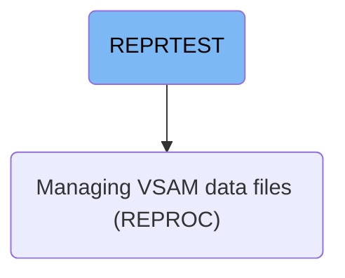

This document explains the REPRTEST job which backs up credit card transaction data. It reads all records from the main transaction data store and writes them to a backup dataset to ensure data recovery capability.

For example, it copies records from AWS.M2.CARDDEMO.TRANSACT.VSAM.KSDS to AWS.M2.CARDDEMO.TRANSACT.BKUP(+1).

# Dependencies

## Backup Transactions

Step in this section: `STEP05`.

This section handles the backup of credit card transaction data by transferring it from the main operational data store to a designated backup dataset, supporting business continuity in case of data loss or corruption.

1. All records from the current transaction data store are read in sequence.
2. Each transaction record is copied directly and in full to the newly created backup dataset.
3. The backup dataset is cataloged and retained for future use, ensuring a complete snapshot of the transaction data is available for recovery if required.

### Input

**AWS.M2.CARDDEMO.TRANSACT.VSAM.KSDS (Transaction Data Store)**

The key-sequenced data set containing all transaction records for credit card activities.

### Output

**AWS.M2.CARDDEMO.TRANSACT.BKUP(+1) (Transaction Backup Dataset)**

The backup file that receives a copy of all credit card transaction records to support recovery operations.

&nbsp;

*This is an auto-generated document by Swimm 🌊 and has not yet been verified by a human*

<SwmMeta version="3.0.0" repo-id="Z2l0aHViJTNBJTNBYXdzLW1haW5mcmFtZS1tb2Rlcm5pemF0aW9uLWNhcmRkZW1vJTNBJTNBbXVkYXNpbjE=" repo-name="aws-mainframe-modernization-carddemo">Powered by [Swimm](https://app.swimm.io/)</SwmMeta>
