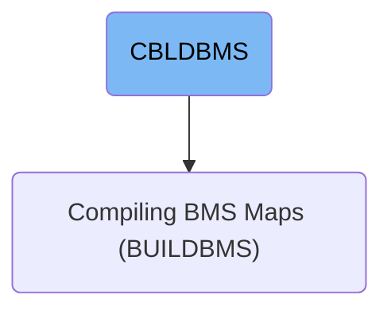
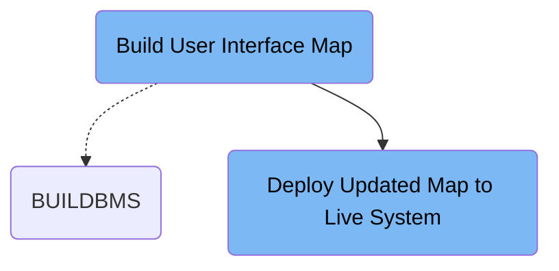

This document describes the CBLDBMS job that compiles and deploys user interface maps for the credit card management system. It takes a screen map source as input, compiles it into a deployable map, and refreshes the live system to present updated screens to users. For example, compiling and deploying CICSMAP updates the live interface for credit card management transactions.

# Dependencies

Here is a high level diagram of the file:

## Build User Interface Map

Step in this section: `STEP1`.

This section generates and compiles the visual screen layouts that staff interact with in the credit card management application, making them available for deployment.

1. The section takes a screen map source definition with user interface field arrangements and formatting information.
2. It compiles this source into interface components and supporting files understood by the application runtime environment.
3. As a result, the compiled output enables visual screens through which staff can interact with the credit card management system, using the business logic defined by the original map layout.

### Input

**CICSMAP**

Map source definition for the credit card management user interface, describing field positions, labels, and attributes.

### Output

**CICSMAP (compiled and linked)**

Compiled user interface map and copybooks, ready for use by application programs to display and process screens.

## Deploy Updated Map to Live System

Step in this section: `SDSF1`.

This section makes the latest version of the credit card management user interface available to end users by deploying the refreshed screen layout to the live system.

1. The compiled interface map is selected as the new version to be used by the transaction system.
2. A system command is issued to refresh the existing program copy in the live environment, activating the newly compiled interface map for user access.
3. End users are now presented with the updated screen layout the next time they access credit card management functions in the system.

### Input

**CICSMAP (compiled and linked)**

Compiled user interface map produced from the map build process, representing the updated screen layout for credit card management transactions.

### Output

**Live user interface in CICS transactions**

The updated screen layout becomes active for users in the credit card management system's live environment.

&nbsp;

*This is an auto-generated document by Swimm 🌊 and has not yet been verified by a human*

<SwmMeta version="3.0.0" repo-id="Z2l0aHViJTNBJTNBYXdzLW1haW5mcmFtZS1tb2Rlcm5pemF0aW9uLWNhcmRkZW1vJTNBJTNBbXVkYXNpbjE=" repo-name="aws-mainframe-modernization-carddemo">Powered by [Swimm](https://app.swimm.io/)</SwmMeta>
