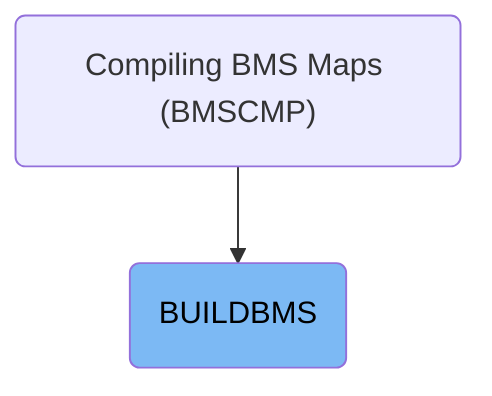
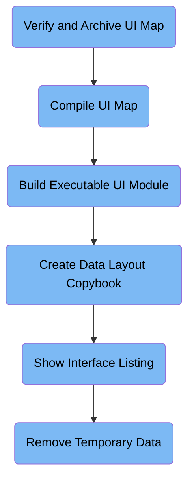

The BUILDBMS job compiles BMS maps by verifying, compiling, linking, and generating data layout copybooks for the credit card management application. It transforms UI map source code into executable UI modules and standardized data layouts, outputs interface listings for review, and removes temporary datasets after processing. For example, it takes a BMS map source as input and produces executable UI components and copybooks as output.

# Dependencies

Here is a high level diagram of the file:

## Verify and Archive UI Map

Step in this section: `PRINT`.

This section ensures the UI map definition for credit card management screens is properly validated, temporarily stored for further compilation, and available for future reference or auditing.

- The system reads the BMS map source code for a specific credit card screen from the input dataset.
- The job step copies this data into a temporary dataset, effectively archiving the definition so it can be validated and used in subsequent compilation and linkage steps.
- The content in the temporary dataset remains unchanged from the original source definition, but serves as an archived reference for further processing in the job stream.

### Input

**&SRCCODE(&MAPNAME)**

Source code for the BMS map definition that describes the layout of credit card management application screens.

### Output

**&&TEMPM**

Temporary dataset containing the verified and archived map definition, ready for subsequent compilation and assembly steps.

## Compile UI Map

Step in this section: `MAP`.

Converts the credit card management application’s screen layout definition into assembler-readable instructions to enable integration with the system.

- The assembler utility receives the validated UI map definition from the temporary dataset (&&TEMPM).
- It interprets the map source and generates assembler instructions that describe how the user interface will be rendered and processed by the mainframe system.
- These instructions are written out to a new temporary dataset (&&MAP) in deck format, which will be used for subsequent linking and deployment steps.

### Input

**&&TEMPM**

Temporary dataset with the validated UI map source for credit card management screens, archived from the previous step.

### Output

**&&MAP**

Temporary dataset containing the assembler-deck (intermediate compiled instructions) representing the screen layout for the application, to be used in the next link-edit step.

## Build Executable UI Module

Step in this section: `LKED`.

This section links the compiled screen instructions with application libraries to produce an executable UI component for the credit card management system.

## Create Data Layout Copybook

Step in this section: `DSECT`.

Generates and stores a copybook that precisely defines how credit card management application screen fields are laid out and mapped to application data, supporting accurate and reliable data exchange between the UI and backend logic.

- The assembler utility reads the archived UI map source from the temporary dataset.
- It processes the field definitions and layout metadata within this source.
- The utility then generates a standardized copybook that defines the structure and mapping of all relevant screen fields to application data.
- This output copybook is written to the designated copybook dataset, making it available to all future processing or development work requiring standardized UI field access.

### Input

**&&TEMPM**

Temporary dataset containing the archived UI map source for a specific credit card management screen.

### Output

**&CPYBKS(&MAPNAME)**

Copybook dataset where the standardized data layout definition for the screen fields is written, used for consistent programmatic access to UI data.

## Show Interface Listing

Step in this section: `DISPLIST`.

This section duplicates the detailed interface listing generated during earlier steps so that developers can examine it directly in the job output stream for troubleshooting and validation purposes.

The IEBGENER utility reads the interface listing for the specified screen from &LISTING(&MAPNAME). It then writes an exact copy of this listing to SYSOUT, allowing developers to review the content in their job output. No modification is made to the data; the section acts as a passthrough for visibility.

### Input

**&LISTING(&MAPNAME)**

Interface listing generated for a specific user screen, containing detailed output from previous map compilation or data layout steps.

### Output

**SYSOUT**

Replicated interface listing written to system output so developers can view or review it in their job logs.

## Remove Temporary Data

Step in this section: `DELTEMP`.

Removes intermediate datasets used for UI map processing to maintain system hygiene and prevent leftover data from affecting subsequent jobs.

&nbsp;

*This is an auto-generated document by Swimm 🌊 and has not yet been verified by a human*

<SwmMeta version="3.0.0" repo-id="Z2l0aHViJTNBJTNBYXdzLW1haW5mcmFtZS1tb2Rlcm5pemF0aW9uLWNhcmRkZW1vJTNBJTNBbXVkYXNpbjE=" repo-name="aws-mainframe-modernization-carddemo">Powered by [Swimm](https://app.swimm.io/)</SwmMeta>
