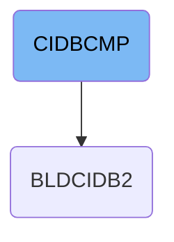

This document explains the CIDBCMP job that compiles the core COBOL program for credit card transaction processing. It sets up the environment and produces executable load modules used by the application to manage cardholder operations. For example, it compiles source code into a load module deployable in CICS.

# Dependencies

## Compile Core Transaction Logic

Step in this section: `CICSCMP`.

This section compiles the COBOL code that forms the backbone of credit card transaction processing, ensuring the application can manage cardholder operations reliably.

&nbsp;

*This is an auto-generated document by Swimm 🌊 and has not yet been verified by a human*

<SwmMeta version="3.0.0" repo-id="Z2l0aHViJTNBJTNBYXdzLW1haW5mcmFtZS1tb2Rlcm5pemF0aW9uLWNhcmRkZW1vJTNBJTNBbXVkYXNpbjE=" repo-name="aws-mainframe-modernization-carddemo">Powered by [Swimm](https://app.swimm.io/)</SwmMeta>
