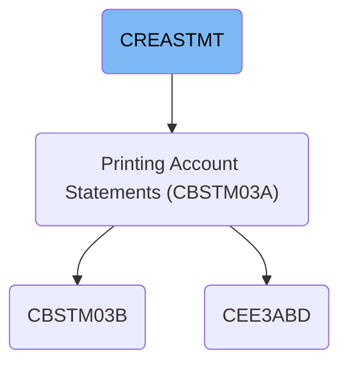
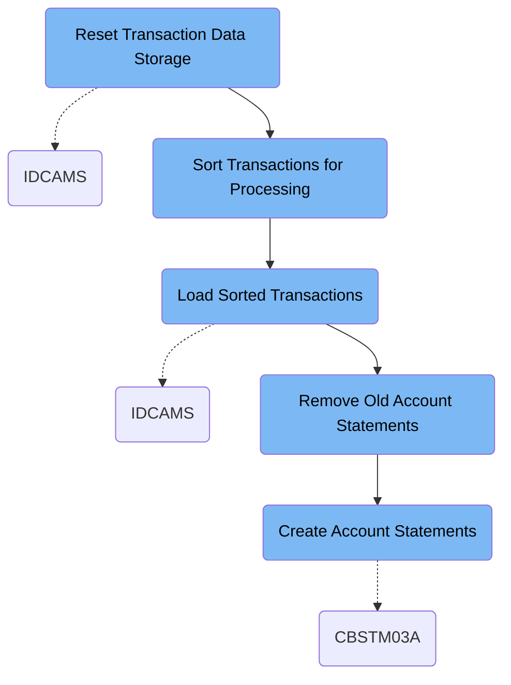

This document describes the CREASTMT job that generates credit card account statements by processing transaction data. It sorts and indexes transactions, removes old statements, and creates updated statements in print and HTML formats for each cardholder. The job inputs unsorted transaction records and outputs detailed account statements reflecting current account activity.

# Dependencies

Here is a high level diagram of the file:

## Reset Transaction Data Storage

Step in this section: `DELDEF01`.

Prepares a fresh, organized environment for storing batch transaction data to ensure accurate and conflict-free transaction statement creation.

## Sort Transactions for Processing

Step in this section: `STEP010`.

Sorts and reorders transaction data to facilitate reliable downstream processing and accurate statement creation for each card.

The input consists of unsorted transaction records, each containing fields such as card number and transaction ID within their record layout. The section sorts each record first by card number and then by transaction ID, ensuring all transactions for a given card are contiguously ordered and processed in the correct sequence. The sorted records are written to a new sequential dataset, creating an organized structure optimized for subsequent batch processing and statement creation.

### Input

**AWS.M2.CARDDEMO.TRANSACT.VSAM.KSDS (Transaction VSAM KSDS)**

Holds raw online transaction data awaiting batch processing.

### Output

**AWS.M2.CARDDEMO.TRXFL.SEQ (Sorted Transaction Sequential File)**

Contains transaction records sorted by card number and transaction ID, ready for downstream use.

## Load Sorted Transactions

Step in this section: `STEP020`.

This section copies previously sorted credit card transaction records into an indexed, easily accessible data store for use in batch statement creation and other processing steps.

- The section reads the input dataset containing transaction records already sorted by card number and transaction ID.
- It transfers each transaction record from the sequential dataset into the indexed VSAM KSDS dataset without altering the contents or order of the records.
- The output VSAM KSDS file now contains all sorted transactions, making them available for efficient indexed access by downstream batch jobs responsible for statement preparation and credit card account processing.

### Input

**AWS.M2.CARDDEMO.TRXFL.SEQ**

A sequential dataset containing credit card transaction records already sorted by card number and transaction ID, prepared for indexed storage.

Sample:

| Column Name | Sample           |
| ----------- | ---------------- |
| CARD_NUMBER | 4532453245324532 |
| TRAN_ID     | 0000000000000001 |
| POST_DATE   | 20240601         |
| AMOUNT      | 000000001000     |
| DESCRIPTION | GROCERY STORE    |
| ...         | ...              |

### Output

**AWS.M2.CARDDEMO.TRXFL.VSAM.KSDS**

An indexed VSAM KSDS dataset holding the same sorted credit card transaction records, optimized for indexed retrieval and downstream statement processing.

Sample:

| Column Name | Sample           |
| ----------- | ---------------- |
| CARD_NUMBER | 4532453245324532 |
| TRAN_ID     | 0000000000000001 |
| POST_DATE   | 20240601         |
| AMOUNT      | 000000001000     |
| DESCRIPTION | GROCERY STORE    |
| ...         | ...              |

## Remove Old Account Statements

Step in this section: `STEP030`.

Removes older statement files to prevent outdated data from being included, ensuring new account statements reflect the latest transactions.

## Create Account Statements

Step in this section: `STEP040`.

It creates new account statements (both text and HTML) for every card using all up-to-date transactional, account, and customer information, and outputs them into statement files for further use or delivery.

- The section reads the cross-reference file to determine which cards belong to which accounts and customers.
- For each card, it retrieves all sorted transactions from the indexed transaction file, gathers account details from the account data file, and personal info from the customer data file.
- It combines all this information and formats it into a detailed statement for each account holder, including transaction history, current balances, and account holder identification.
- The statement records are written to a print stream dataset (for plain text/PDF generation) and to an HTML dataset for web-based statement presentation.

### Input

**AWS.M2.CARDDEMO.TRXFL.VSAM.KSDS (Sorted Transaction VSAM File)**

Indexed collection of all sorted transaction records to be consolidated into statements.

Sample:

| Column Name | Sample           |
| ----------- | ---------------- |
| CARD_NUMBER | 4532453245324532 |
| TRAN_ID     | 0000000000000001 |
| POST_DATE   | 20240601         |
| AMOUNT      | 000000001000     |
| DESCRIPTION | GROCERY STORE    |

**AWS.M2.CARDDEMO.CARDXREF.VSAM.KSDS (Card Cross-Reference Data)**

Core indexed data linking cards to accounts and customers.

**AWS.M2.CARDDEMO.ACCTDATA.VSAM.KSDS (Account Data)**

Account profiles and balances needed for statement details.

**AWS.M2.CARDDEMO.CUSTDATA.VSAM.KSDS (Customer Data)**

Customer personal information for statement personalization.

### Output

[**AWS.M2.CARDDEMO.STATEMNT.PS**](http://AWS.M2.CARDDEMO.STATEMNT.PS)\*\* (Account Statement Print File)\*\*

Print stream file containing the formatted statements for each cardholder.

**AWS.M2.CARDDEMO.STATEMNT.HTML (Account Statement HTML File)**

HTML file containing the same statement information in web-ready format.

&nbsp;

*This is an auto-generated document by Swimm 🌊 and has not yet been verified by a human*

<SwmMeta version="3.0.0" repo-id="Z2l0aHViJTNBJTNBYXdzLW1haW5mcmFtZS1tb2Rlcm5pemF0aW9uLWNhcmRkZW1vJTNBJTNBbXVkYXNpbjE=" repo-name="aws-mainframe-modernization-carddemo">Powered by [Swimm](https://app.swimm.io/)</SwmMeta>
