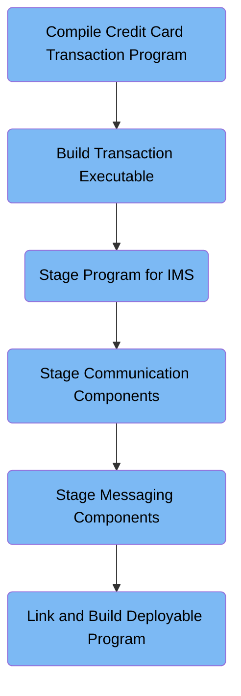

This document details the IMSMQCMP job, which compiles and links the credit card transaction processing program for mainframe deployment. The flow converts COBOL source and system modules into an executable (IMSMQPGM) that enables integrated transaction and messaging operations across CICS, IMS, and MQ.

Here is a high level diagram of the file:



## Compile Credit Card Transaction Program

Step in this section: `TRN`.

This section compiles the source code for credit card transaction processing, enabling the application to execute transaction management and recording functionality.

## Build Transaction Executable

Step in this section: `COBOL`.

This section turns compiled transaction logic and related modules into an executable format so the credit card transaction program can be deployed and used to manage and record transactions.

- The compiled object and support modules from previous steps are taken as input.
- These are linked together into a single executable module which is output to a program library member.
- The resulting executable is ready for deployment as the transaction processing logic in the mainframe credit card system.

### Output

**IMSMQPGM in CICSLOAD**

The built executable for credit card transaction processing, ready for deployment in the mainframe system.

## Stage Program for IMS

Step in this section: `COPYIMS`.

Prepares and stages the transaction processing module in a format required by the IMS subsystem, ensuring it is ready to be linked and executed as part of the mainframe credit card management system.

- The input consists of module linkage information for the IMS credit card transaction processing program provided via SYSUT1 (e.g., ENTRY IMSMQPGM and NAME IMSMQPGM(R)).
- The process uses the IEBGENER utility to copy this input information into a new temporary output dataset (SYSUT2 named &&COPYIMS) without transformation.
- The output is a staged copy of the linkage information, which will be used in the next steps to fully link the transaction processing module for IMS execution.

### Input

**IMSMQPGM**

Linkage information entries for the IMS credit card transaction program, specifying how the module should be staged for execution.

Sample:

```
ENTRY IMSMQPGM
NAME IMSMQPGM(R)
```

### Output

**&&COPYIMS**

A temporary dataset containing prepared linkage input for IMS, making the transaction program ready for subsequent linking and deployment.

Sample:

```
ENTRY IMSMQPGM
NAME IMSMQPGM(R)
```

## Stage Communication Components

Step in this section: `COPYLINK`.

The section copies key system communication components to a temporary dataset, ensuring that the transaction program has access to required communication libraries when running within the integrated credit card management environment.

- The input communication module definition from the system library (DFHELII), provided through SYSUT1, is read by the IEBGENER utility.
- IEBGENER copies this input directly into a new temporary output dataset (SYSUT2/&&COPYLINK), preserving the communication module information.
- The resulting output dataset is later used as input in the link-edit step to bind the communication code into the credit card transaction executable for CICS and IMS communication support.

### Input

**SYSLIB(DFHELII)**

The core system communication library used by CICS-IMS transactions.

Sample:

```
INCLUDE SYSLIB(DFHELII)

```

### Output

**&&COPYLINK**

Temporary dataset with the staged communication code module for linking.

Sample:

```
INCLUDE SYSLIB(DFHELII)

```

## Stage Messaging Components

Step in this section: `COPYMQ`.

This section provides the necessary messaging functionalities so that the transaction program can interact with message queues during transaction and batch handling.

- The messaging service module specification, supplied as an INCLUDE statement, is read from the input stream (SYSUT1) by the IEBGENER utility.
- IEBGENER copies this input statement directly into a new temporary dataset (SYSUT2/&&COPYMQ) with no modifications.
- The resulting output dataset now contains the reference to the messaging service module, enabling it to be included during the subsequent link-edit step for message queue integration in credit card transaction processing.

### Input

**CSQSTUB(CSQCSTUB)**

Definition to include the core messaging service module required for MQ processing in credit card transaction logic.

Sample:

```
INCLUDE CSQSTUB(CSQCSTUB)

```

### Output

**&&COPYMQ**

Temporary dataset with staged messaging service component to be used for linking MQ capabilities into the transaction processing program.

Sample:

```
INCLUDE CSQSTUB(CSQCSTUB)

```

## Link and Build Deployable Program

Step in this section: `LKED`.

This section integrates the staged credit card transaction logic, communication modules, and messaging service references into a final deployable program. This ensures the application can manage, transmit, and process credit card transactions across CICS, IMS, and MQ subsystems.

- The prepared communication code from &&COPYLINK is included, enabling CICS-IMS interoperability needed for transaction operations.
- Messaging integration instructions from &&COPYMQ are incorporated to provide MQ functionality for handling credit card transaction messages.
- The core transaction processing logic from &&LOADSET is integrated, representing the business function for managing credit card operations.
- IMS linkage instructions from &&COPYIMS are used to finalize linkage required for IMS subsystem support.
- The linker program (IEWL) combines all these modules and instructions, resolving dependencies and internal references, then produces a single deployable program member (IMSMQPGM in CICSLOAD) that can run all required transaction and messaging functions in the mainframe credit card management environment.

### Input

**&&COPYLINK**

Temporary dataset with staged communication code module for linking, supporting integrated transaction communication.

Sample:

```
INCLUDE SYSLIB(DFHELII)
```

**&&COPYMQ**

Temporary dataset with messaging service component for MQ integration in transaction program linking.

Sample:

```
INCLUDE CSQSTUB(CSQCSTUB)
```

**&&LOADSET**

Contains the compiled transaction processing logic for credit card operations.

**&&COPYIMS**

Staged linkage input for IMS, preparing the transaction program for integrated deployment.

Sample:

```
ENTRY IMSMQPGM
NAME IMSMQPGM(R)
```

### Output

**IMSMQPGM (IMSMQPGM in CICSLOAD)**

Deployment-ready credit card transaction processing program supporting CICS, IMS, and MQ integration.

&nbsp;

*This is an auto-generated document by Swimm 🌊 and has not yet been verified by a human*

<SwmMeta version="3.0.0" repo-id="Z2l0aHViJTNBJTNBYXdzLW1haW5mcmFtZS1tb2Rlcm5pemF0aW9uLWNhcmRkZW1vJTNBJTNBbXVkYXNpbjE=" repo-name="aws-mainframe-modernization-carddemo"><sup>Powered by [Swimm](https://app.swimm.io/)</sup></SwmMeta>
