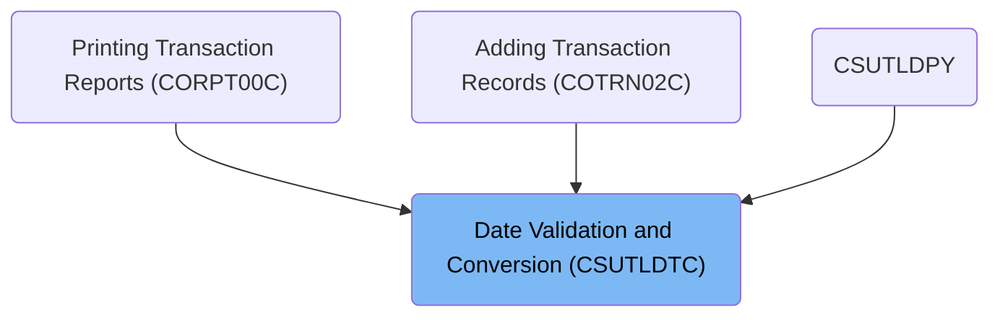

# Overview

This document describes the process for validating date values against a specified format. The flow receives a date and its format, checks validity, and returns a result message indicating whether the date is valid or the specific reason for failure.

## Dependencies

### Programs

- CSUTLDTC (<SwmPath>[app/cbl/CSUTLDTC.cbl](app/cbl/CSUTLDTC.cbl)</SwmPath>)
- CEEDAYS

# Where is this program used?

This program is used multiple times in the codebase as represented in the following diagram:



# Workflow

# Starting the Date Validation Flow

<SwmSnippet path="/app/cbl/CSUTLDTC.cbl" line="88">

---

In PROCEDURE-DIVISION, we kick things off by clearing out the workspace and prepping the date buffer. Then we call <SwmToken path="app/cbl/CSUTLDTC.cbl" pos="93:3:5" line-data="           PERFORM A000-MAIN                                                    ">`A000-MAIN`</SwmToken> right away, since that's where all the actual date validation and conversion logic lives. This keeps the entrypoint clean and pushes the real work to a dedicated section.

```cobol
       PROCEDURE DIVISION USING LS-DATE, LS-DATE-FORMAT, LS-RESULT.             
           
           INITIALIZE WS-MESSAGE
           MOVE SPACES TO WS-DATE
                                                                        
           PERFORM A000-MAIN                                                    
              THRU A000-MAIN-EXIT                                               
```

---

</SwmSnippet>

## Preparing and Validating the Date

```mermaid
%%{init: {"flowchart": {"defaultRenderer": "elk"}} }%%
flowchart TD
    node1["Prepare date and format for validation"]
    click node1 openCode "app/cbl/CSUTLDTC.cbl:103:115"
    node1 --> node2["Call date validation (CEEDAYS)"]
    click node2 openCode "app/cbl/CSUTLDTC.cbl:116:121"
    node2 --> node3["Assign feedback severity and message number"]
    click node3 openCode "app/cbl/CSUTLDTC.cbl:123:124"
    node3 --> node4{"Feedback code result"}
    click node4 openCode "app/cbl/CSUTLDTC.cbl:128:149"
    node4 -->|"Valid"| node5["Set result: 'Date is valid'"]
    click node5 openCode "app/cbl/CSUTLDTC.cbl:130:130"
    node4 -->|"Insufficient"| node6["Set result: 'Insufficient'"]
    click node6 openCode "app/cbl/CSUTLDTC.cbl:132:132"
    node4 -->|"Date value error"| node7["Set result: 'Datevalue error'"]
    click node7 openCode "app/cbl/CSUTLDTC.cbl:134:134"
    node4 -->|"Invalid era"| node8["Set result: 'Invalid Era'"]
    click node8 openCode "app/cbl/CSUTLDTC.cbl:136:136"
    node4 -->|"Unsupported range"| node9["Set result: 'Unsupp. Range'"]
    click node9 openCode "app/cbl/CSUTLDTC.cbl:138:138"
    node4 -->|"Invalid month"| node10["Set result: 'Invalid month'"]
    click node10 openCode "app/cbl/CSUTLDTC.cbl:140:140"
    node4 -->|"Bad pic string"| node11["Set result: 'Bad Pic String'"]
    click node11 openCode "app/cbl/CSUTLDTC.cbl:142:142"
    node4 -->|"Non-numeric data"| node12["Set result: 'Nonnumeric data'"]
    click node12 openCode "app/cbl/CSUTLDTC.cbl:144:144"
    node4 -->|"Year in era zero"| node13["Set result: 'YearInEra is 0'"]
    click node13 openCode "app/cbl/CSUTLDTC.cbl:146:146"
    node4 -->|"Other"| node14["Set result: 'Date is invalid'"]
    click node14 openCode "app/cbl/CSUTLDTC.cbl:148:148"

classDef HeadingStyle fill:#777777,stroke:#333,stroke-width:2px;

%% Swimm:
%% %%{init: {"flowchart": {"defaultRenderer": "elk"}} }%%
%% flowchart TD
%%     node1["Prepare date and format for validation"]
%%     click node1 openCode "<SwmPath>[app/cbl/CSUTLDTC.cbl](app/cbl/CSUTLDTC.cbl)</SwmPath>:103:115"
%%     node1 --> node2["Call date validation (CEEDAYS)"]
%%     click node2 openCode "<SwmPath>[app/cbl/CSUTLDTC.cbl](app/cbl/CSUTLDTC.cbl)</SwmPath>:116:121"
%%     node2 --> node3["Assign feedback severity and message number"]
%%     click node3 openCode "<SwmPath>[app/cbl/CSUTLDTC.cbl](app/cbl/CSUTLDTC.cbl)</SwmPath>:123:124"
%%     node3 --> node4{"Feedback code result"}
%%     click node4 openCode "<SwmPath>[app/cbl/CSUTLDTC.cbl](app/cbl/CSUTLDTC.cbl)</SwmPath>:128:149"
%%     node4 -->|"Valid"| node5["Set result: 'Date is valid'"]
%%     click node5 openCode "<SwmPath>[app/cbl/CSUTLDTC.cbl](app/cbl/CSUTLDTC.cbl)</SwmPath>:130:130"
%%     node4 -->|"Insufficient"| node6["Set result: 'Insufficient'"]
%%     click node6 openCode "<SwmPath>[app/cbl/CSUTLDTC.cbl](app/cbl/CSUTLDTC.cbl)</SwmPath>:132:132"
%%     node4 -->|"Date value error"| node7["Set result: 'Datevalue error'"]
%%     click node7 openCode "<SwmPath>[app/cbl/CSUTLDTC.cbl](app/cbl/CSUTLDTC.cbl)</SwmPath>:134:134"
%%     node4 -->|"Invalid era"| node8["Set result: 'Invalid Era'"]
%%     click node8 openCode "<SwmPath>[app/cbl/CSUTLDTC.cbl](app/cbl/CSUTLDTC.cbl)</SwmPath>:136:136"
%%     node4 -->|"Unsupported range"| node9["Set result: 'Unsupp. Range'"]
%%     click node9 openCode "<SwmPath>[app/cbl/CSUTLDTC.cbl](app/cbl/CSUTLDTC.cbl)</SwmPath>:138:138"
%%     node4 -->|"Invalid month"| node10["Set result: 'Invalid month'"]
%%     click node10 openCode "<SwmPath>[app/cbl/CSUTLDTC.cbl](app/cbl/CSUTLDTC.cbl)</SwmPath>:140:140"
%%     node4 -->|"Bad pic string"| node11["Set result: 'Bad Pic String'"]
%%     click node11 openCode "<SwmPath>[app/cbl/CSUTLDTC.cbl](app/cbl/CSUTLDTC.cbl)</SwmPath>:142:142"
%%     node4 -->|"Non-numeric data"| node12["Set result: 'Nonnumeric data'"]
%%     click node12 openCode "<SwmPath>[app/cbl/CSUTLDTC.cbl](app/cbl/CSUTLDTC.cbl)</SwmPath>:144:144"
%%     node4 -->|"Year in era zero"| node13["Set result: '<SwmToken path="app/cbl/CSUTLDTC.cbl" pos="146:4:4" line-data="                 MOVE &#39;YearInEra is 0 &#39;    TO WS-RESULT              ">`YearInEra`</SwmToken> is 0'"]
%%     click node13 openCode "<SwmPath>[app/cbl/CSUTLDTC.cbl](app/cbl/CSUTLDTC.cbl)</SwmPath>:146:146"
%%     node4 -->|"Other"| node14["Set result: 'Date is invalid'"]
%%     click node14 openCode "<SwmPath>[app/cbl/CSUTLDTC.cbl](app/cbl/CSUTLDTC.cbl)</SwmPath>:148:148"
%% 
%% classDef HeadingStyle fill:#777777,stroke:#333,stroke-width:2px;
```



This section validates a provided date against a specified format, returning a clear result message for each possible validation outcome. It ensures that only dates conforming to expected formats and value ranges are accepted, and provides specific feedback for each type of error encountered.

| Category        | Rule Name                  | Description                                                                                                                                                                                                                       |
| --------------- | -------------------------- | --------------------------------------------------------------------------------------------------------------------------------------------------------------------------------------------------------------------------------- |
| Decision Making | Valid Date Confirmation    | If the date is valid according to the specified format, the result is set to 'Date is valid'.                                                                                                                                     |
| Decision Making | Insufficient Data Handling | If the date input is missing required components, the result is set to 'Insufficient'.                                                                                                                                            |
| Decision Making | Invalid Date Value         | If the date contains an invalid value (e.g., impossible day or month), the result is set to 'Datevalue error'.                                                                                                                    |
| Decision Making | Invalid Era Detection      | If the date specifies an invalid era, the result is set to 'Invalid Era'.                                                                                                                                                         |
| Decision Making | Unsupported Range          | If the date is outside the supported range, the result is set to 'Unsupp. Range'.                                                                                                                                                 |
| Decision Making | Invalid Month Value        | If the month value is invalid, the result is set to 'Invalid month'.                                                                                                                                                              |
| Decision Making | Invalid Format String      | If the date format string is invalid, the result is set to 'Bad Pic String'.                                                                                                                                                      |
| Decision Making | Non-numeric Data           | If the date contains non-numeric data where numbers are expected, the result is set to 'Nonnumeric data'.                                                                                                                         |
| Decision Making | Year In Era Zero           | If the year in the era is zero, the result is set to '<SwmToken path="app/cbl/CSUTLDTC.cbl" pos="146:4:4" line-data="                 MOVE &#39;YearInEra is 0 &#39;    TO WS-RESULT              ">`YearInEra`</SwmToken> is 0'. |
| Decision Making | Unknown Error Handling     | If the feedback code does not match any known error or success condition, the result is set to 'Date is invalid'.                                                                                                                 |

<SwmSnippet path="/app/cbl/CSUTLDTC.cbl" line="103">

---

In <SwmToken path="app/cbl/CSUTLDTC.cbl" pos="103:1:3" line-data="       A000-MAIN.                                                               ">`A000-MAIN`</SwmToken>, we prep the date and format into the expected structures, zero out the feedback, and then call CEEDAYS to do the actual validation and conversion. After the call, we stash the results and feedback details into working storage for later use. The CEEDAYS call is the core of this logic—everything before and after is just setup and result handling.

```cobol
       A000-MAIN.                                                               
                                                                                
           MOVE LENGTH OF LS-DATE                                               
                        TO VSTRING-LENGTH  OF WS-DATE-TO-TEST                   
           MOVE LS-DATE TO VSTRING-TEXT    OF WS-DATE-TO-TEST
                           WS-DATE                  
           MOVE LENGTH OF LS-DATE-FORMAT                                        
                         TO VSTRING-LENGTH OF WS-DATE-FORMAT                    
           MOVE LS-DATE-FORMAT                                                  
                         TO VSTRING-TEXT   OF WS-DATE-FORMAT   
                            WS-DATE-FMT  
           MOVE 0        TO OUTPUT-LILLIAN                              
                                                                        
           CALL "CEEDAYS" USING                                                 
                  WS-DATE-TO-TEST,                                              
                  WS-DATE-FORMAT,                                               
                  OUTPUT-LILLIAN,                                               
                  FEEDBACK-CODE                                                 
                                                                                
           MOVE WS-DATE-TO-TEST            TO WS-DATE                           
           MOVE SEVERITY OF FEEDBACK-CODE  TO WS-SEVERITY-N                     
           MOVE MSG-NO OF FEEDBACK-CODE    TO WS-MSG-NO-N                       
```

---

</SwmSnippet>

<SwmSnippet path="/app/cbl/CSUTLDTC.cbl" line="128">

---

After calling CEEDAYS, we use EVALUATE to map the feedback code to a specific result message. Each known error or success code gets a fixed string, and anything else defaults to 'Date is invalid'. This is what gets returned to the caller.

```cobol
           EVALUATE TRUE                                                        
              WHEN FC-INVALID-DATE                                   
                 MOVE 'Date is valid'      TO WS-RESULT              
              WHEN FC-INSUFFICIENT-DATA                              
                 MOVE 'Insufficient'       TO WS-RESULT              
              WHEN FC-BAD-DATE-VALUE                                 
                 MOVE 'Datevalue error'    TO WS-RESULT              
              WHEN FC-INVALID-ERA                                    
                 MOVE 'Invalid Era    '    TO WS-RESULT              
              WHEN FC-UNSUPP-RANGE                                   
                 MOVE 'Unsupp. Range  '    TO WS-RESULT              
              WHEN FC-INVALID-MONTH                                  
                 MOVE 'Invalid month  '    TO WS-RESULT              
              WHEN FC-BAD-PIC-STRING                                 
                 MOVE 'Bad Pic String '    TO WS-RESULT              
              WHEN FC-NON-NUMERIC-DATA                               
                 MOVE 'Nonnumeric data'    TO WS-RESULT              
              WHEN FC-YEAR-IN-ERA-ZERO                               
                 MOVE 'YearInEra is 0 '    TO WS-RESULT              
              WHEN OTHER                                             
                 MOVE 'Date is invalid'    TO WS-RESULT 
           END-EVALUATE                                                         
```

---

</SwmSnippet>

## Returning the Validation Result

<SwmSnippet path="/app/cbl/CSUTLDTC.cbl" line="97">

---

Back in PROCEDURE-DIVISION, after returning from <SwmToken path="app/cbl/CSUTLDTC.cbl" pos="93:3:5" line-data="           PERFORM A000-MAIN                                                    ">`A000-MAIN`</SwmToken>, we copy the result message and severity code to the output parameters, then exit. This hands the validation result back to whoever called this program.

```cobol
           MOVE WS-MESSAGE                 TO LS-RESULT 
           MOVE WS-SEVERITY-N              TO RETURN-CODE          
                                                                                
           EXIT PROGRAM                                                         
      *    GOBACK                                                               
           .                                                                    
```

---

</SwmSnippet>

&nbsp;

*This is an auto-generated document by Swimm 🌊 and has not yet been verified by a human*

<SwmMeta version="3.0.0" repo-id="Z2l0aHViJTNBJTNBYXdzLW1haW5mcmFtZS1tb2Rlcm5pemF0aW9uLWNhcmRkZW1vJTNBJTNBbXVkYXNpbjE=" repo-name="aws-mainframe-modernization-carddemo"><sup>Powered by [Swimm](https://app.swimm.io/)</sup></SwmMeta>
