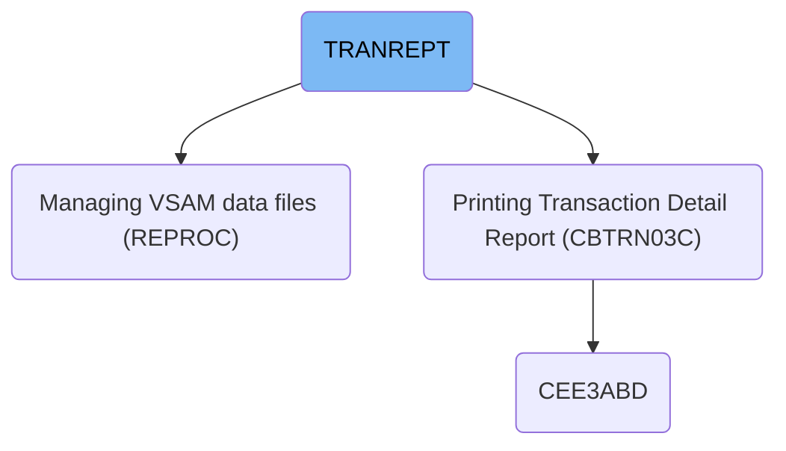
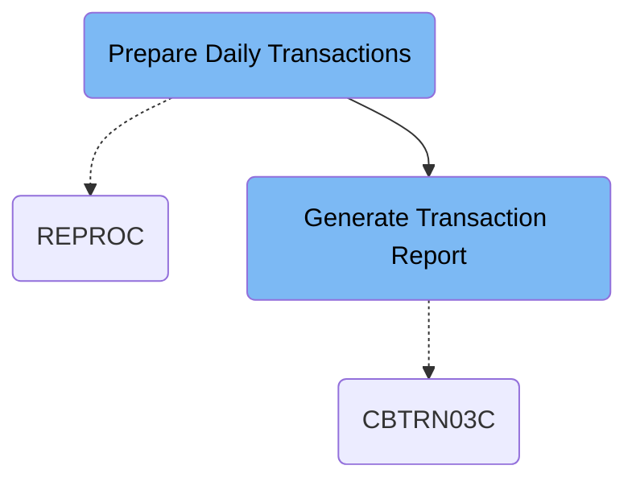

The TRANREPT job prepares daily transaction data by filtering and sorting processed transactions within a specified date range, then generates a detailed report summarizing credit card transactions by account, type, and category. It inputs transaction records and reference data, and outputs a formatted transaction report for analysis.

# Dependencies

Here is a high level diagram of the file:

## Prepare Daily Transactions

Step in this section: `STEP05R`.

This section focuses on creating a daily transaction dataset by extracting and sorting transaction records for a given date range. This enables generation of daily reports and further analysis.

1. All processed transactions are copied from the main transaction data store to a backup dataset, ensuring the most recent data is available and protected.
2. The backup dataset is filtered so that only transactions with processing dates within the specified start and end date are selected.
3. Selected transactions are sorted by card number, organizing the file for easier reporting and downstream processing.
4. The resulting sorted and filtered records are written to the daily transaction dataset, which can be used by reporting jobs or further analysis.

### Input

**AWS.M2.CARDDEMO.TRANSACT.VSAM.KSDS (Main transaction store)**

Full set of processed transaction data for all cards.

Sample:

| Column Name   | Sample           |
| ------------- | ---------------- |
| TRAN-CARD-NUM | 1122334455667788 |
| TRAN-PROC-DT  | 2022-01-05       |
| TRAN-AMOUNT   | 150.00           |
| TRAN-TYPE     | SALE             |
| TRAN-MERCHANT | AMAZON           |

**AWS.M2.CARDDEMO.TRANSACT.BKUP(+1) (Transaction backup)**

Backup copy of transaction data after unloading recent transactions.

Sample:

| Column Name   | Sample           |
| ------------- | ---------------- |
| TRAN-CARD-NUM | 1122334455667788 |
| TRAN-PROC-DT  | 2022-01-05       |
| TRAN-AMOUNT   | 150.00           |
| TRAN-TYPE     | SALE             |
| TRAN-MERCHANT | AMAZON           |

### Output

**AWS.M2.CARDDEMO.TRANSACT.DALY(+1) (Daily transaction file)**

Sorted and filtered daily transaction data, ready for reporting and analysis.

Sample:

| Column Name   | Sample           |
| ------------- | ---------------- |
| TRAN-CARD-NUM | 1122334455667788 |
| TRAN-PROC-DT  | 2022-01-05       |
| TRAN-AMOUNT   | 150.00           |
| TRAN-TYPE     | SALE             |
| TRAN-MERCHANT | AMAZON           |

## Generate Transaction Report

Step in this section: `STEP10R`.

Generates a comprehensive and formatted report of individual credit card transactions for a selected date range, including breakdowns by account, transaction type, and category.

1. The program reads each transaction from the daily transaction file and retrieves associated account, transaction type, and category info using the reference datasets.
2. For each transaction within the specified date range, it outputs the transaction details in a formatted report line.
3. When a new account is encountered, the program calculates and adds a subtotal for the previous account's transactions to the report.
4. The process continues until all transactions have been reported. Grand totals and summary lines are added at the end. This produces a comprehensive transaction report for the selected time span, detailing activity by account, type, and category.

### Input

**TRANFILE - AWS.M2.CARDDEMO.TRANSACT.DALY(+1) (Daily transaction file)**

Contains sorted and filtered daily transaction records to be reported.

Sample:

| Column Name   | Sample           |
| ------------- | ---------------- |
| TRAN-CARD-NUM | 1122334455667788 |
| TRAN-PROC-DT  | 2022-01-05       |
| TRAN-AMOUNT   | 150.00           |
| TRAN-TYPE     | SALE             |
| TRAN-MERCHANT | AMAZON           |

**CARDXREF - AWS.M2.CARDDEMO.CARDXREF.VSAM.KSDS (Card cross-reference data)**

Reference data for mapping card numbers to account holder details.

**TRANTYPE - AWS.M2.CARDDEMO.TRANTYPE.VSAM.KSDS (Transaction type data)**

Reference data describing transaction type codes.

**TRANCATG - AWS.M2.CARDDEMO.TRANCATG.VSAM.KSDS (Transaction category data)**

Reference data linking transactions to categories.

**DATEPARM - AWS.M2.CARDDEMO.DATEPARM (Date parameter file)**

Holds parameters defining the report's date range.

### Output

**TRANREPT - AWS.M2.CARDDEMO.TRANREPT(+1) (Transaction report output)**

Detailed, formatted report of all daily transactions with summaries and totals.

&nbsp;

*This is an auto-generated document by Swimm 🌊 and has not yet been verified by a human*

<SwmMeta version="3.0.0" repo-id="Z2l0aHViJTNBJTNBYXdzLW1haW5mcmFtZS1tb2Rlcm5pemF0aW9uLWNhcmRkZW1vJTNBJTNBbXVkYXNpbjE=" repo-name="aws-mainframe-modernization-carddemo">Powered by [Swimm](https://app.swimm.io/)</SwmMeta>
