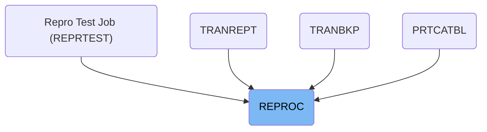

The REPROC job manages loading and unloading of VSAM files containing credit card data. It processes control instructions to move data records into or out of system datasets, supporting batch jobs that handle credit card account management. For example, it can load updated transaction data into the system for processing.

# Dependencies

## Manage Credit Card Data Files

Step in this section: `PRC001`.

This section manages the loading or unloading of credit card data files by processing data records as specified by control instructions. It ensures that data can be moved into or extracted from system datasets as needed for credit card account management.

&nbsp;

*This is an auto-generated document by Swimm 🌊 and has not yet been verified by a human*

<SwmMeta version="3.0.0" repo-id="Z2l0aHViJTNBJTNBYXdzLW1haW5mcmFtZS1tb2Rlcm5pemF0aW9uLWNhcmRkZW1vJTNBJTNBbXVkYXNpbjE=" repo-name="aws-mainframe-modernization-carddemo">Powered by [Swimm](https://app.swimm.io/)</SwmMeta>
