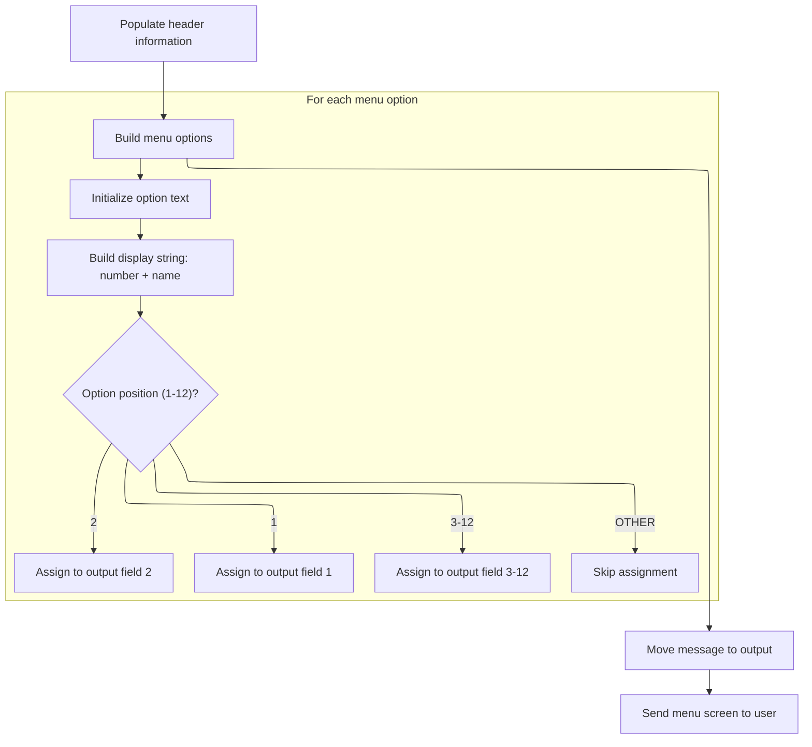
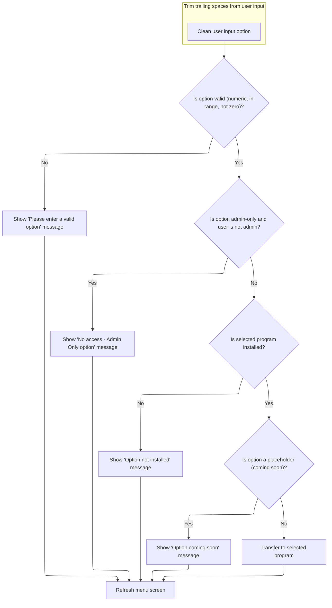

This document describes how users are guided from the main menu to their chosen application function. The flow builds and displays menu options, processes user selections, validates input, checks access rights, and routes users or provides feedback. This is the entry point for accessing application features.

# Main Menu Entry and Navigation Logic

<SwmSnippet path="/app/cbl/COMEN01C.cbl" line="75">

---

MAIN-PARA handles menu entry, checks if the session is new or ongoing, and uses RETURN-TO-SIGNON-SCREEN to redirect to sign-on when needed. Constants like 'COSGN00C' and error messages drive navigation and feedback. The re-entry flag splits the flow between showing the menu and processing input.

```cobol
       MAIN-PARA.

           SET ERR-FLG-OFF TO TRUE

           MOVE SPACES TO WS-MESSAGE
                          ERRMSGO OF COMEN1AO

           IF EIBCALEN = 0
               MOVE 'COSGN00C' TO CDEMO-FROM-PROGRAM
               PERFORM RETURN-TO-SIGNON-SCREEN
           ELSE
               MOVE DFHCOMMAREA(1:EIBCALEN) TO CARDDEMO-COMMAREA
               IF NOT CDEMO-PGM-REENTER
                   SET CDEMO-PGM-REENTER    TO TRUE
                   MOVE LOW-VALUES          TO COMEN1AO
                   PERFORM SEND-MENU-SCREEN
               ELSE
                   PERFORM RECEIVE-MENU-SCREEN
                   EVALUATE EIBAID
                       WHEN DFHENTER
                           PERFORM PROCESS-ENTER-KEY
                       WHEN DFHPF3
                           MOVE 'COSGN00C' TO CDEMO-TO-PROGRAM
                           PERFORM RETURN-TO-SIGNON-SCREEN
                       WHEN OTHER
                           MOVE 'Y'                       TO WS-ERR-FLG
                           MOVE CCDA-MSG-INVALID-KEY      TO WS-MESSAGE
                           PERFORM SEND-MENU-SCREEN
                   END-EVALUATE
               END-IF
           END-IF

           EXEC CICS RETURN
                     TRANSID (WS-TRANID)
                     COMMAREA (CARDDEMO-COMMAREA)
           END-EXEC.
```

---

</SwmSnippet>

<SwmSnippet path="/app/cbl/COMEN01C.cbl" line="196">

---

RETURN-TO-SIGNON-SCREEN checks if the target program field is empty or uninitialized, and if so, sets it to 'COSGN00C' (the sign-on program). Then it calls XCTL to transfer control to whatever is in CDEMO-TO-PROGRAM. This guarantees that if the navigation target isn't set, the user always lands at sign-on, preventing undefined jumps.

```cobol
       RETURN-TO-SIGNON-SCREEN.

           IF CDEMO-TO-PROGRAM = LOW-VALUES OR SPACES
               MOVE 'COSGN00C' TO CDEMO-TO-PROGRAM
           END-IF
           EXEC CICS
               XCTL PROGRAM(CDEMO-TO-PROGRAM)
           END-EXEC.
```

---

</SwmSnippet>

## Menu Screen Rendering



<SwmSnippet path="/app/cbl/COMEN01C.cbl" line="208">

---

SEND-MENU-SCREEN sets up the menu display by first filling in header info, then calling BUILD-MENU-OPTIONS to assemble the visible menu choices. After that, it moves any message to the output area and sends the completed screen to the user. BUILD-MENU-OPTIONS is needed here to make sure the menu options are up-to-date before the screen is rendered.

```cobol
       SEND-MENU-SCREEN.

           PERFORM POPULATE-HEADER-INFO
           PERFORM BUILD-MENU-OPTIONS

           MOVE WS-MESSAGE TO ERRMSGO OF COMEN1AO

           EXEC CICS SEND
                     MAP('COMEN1A')
                     MAPSET('COMEN01')
                     FROM(COMEN1AO)
                     ERASE
           END-EXEC.
```

---

</SwmSnippet>

<SwmSnippet path="/app/cbl/COMEN01C.cbl" line="262">

---

BUILD-MENU-OPTIONS loops through the menu option count (up to 11 here), builds each option's display text by combining its number and name, and assigns it to the corresponding output field (OPTN001O, OPTN002O, etc). The EVALUATE block hard-limits this to 12 options, so if you add more, they won't show up unless you extend the output fields.

```cobol
       BUILD-MENU-OPTIONS.

           PERFORM VARYING WS-IDX FROM 1 BY 1 UNTIL
                           WS-IDX > CDEMO-MENU-OPT-COUNT

               MOVE SPACES             TO WS-MENU-OPT-TXT

               STRING CDEMO-MENU-OPT-NUM(WS-IDX)  DELIMITED BY SIZE
                      '. '                         DELIMITED BY SIZE
                      CDEMO-MENU-OPT-NAME(WS-IDX) DELIMITED BY SIZE
                 INTO WS-MENU-OPT-TXT

               EVALUATE WS-IDX
                   WHEN 1
                       MOVE WS-MENU-OPT-TXT TO OPTN001O
                   WHEN 2
                       MOVE WS-MENU-OPT-TXT TO OPTN002O
                   WHEN 3
                       MOVE WS-MENU-OPT-TXT TO OPTN003O
                   WHEN 4
                       MOVE WS-MENU-OPT-TXT TO OPTN004O
                   WHEN 5
                       MOVE WS-MENU-OPT-TXT TO OPTN005O
                   WHEN 6
                       MOVE WS-MENU-OPT-TXT TO OPTN006O
                   WHEN 7
                       MOVE WS-MENU-OPT-TXT TO OPTN007O
                   WHEN 8
                       MOVE WS-MENU-OPT-TXT TO OPTN008O
                   WHEN 9
                       MOVE WS-MENU-OPT-TXT TO OPTN009O
                   WHEN 10
                       MOVE WS-MENU-OPT-TXT TO OPTN010O
                   WHEN 11
                       MOVE WS-MENU-OPT-TXT TO OPTN011O
                   WHEN 12
                       MOVE WS-MENU-OPT-TXT TO OPTN012O
                   WHEN OTHER
                       CONTINUE
               END-EVALUATE

           END-PERFORM.
```

---

</SwmSnippet>

## Menu Option Selection and Routing



<SwmSnippet path="/app/cbl/COMEN01C.cbl" line="115">

---

PROCESS-ENTER-KEY checks the user's menu selection for validity, handles errors (like non-numeric or out-of-range input), checks access rights, and either calls the right downstream program or shows an error/info message. After any of these, it calls SEND-MENU-SCREEN to redraw the menu and show the result or error to the user.

```cobol
       PROCESS-ENTER-KEY.

           PERFORM VARYING WS-IDX
                   FROM LENGTH OF OPTIONI OF COMEN1AI BY -1 UNTIL
                   OPTIONI OF COMEN1AI(WS-IDX:1) NOT = SPACES OR
                   WS-IDX = 1
           END-PERFORM
           MOVE OPTIONI OF COMEN1AI(1:WS-IDX) TO WS-OPTION-X
           INSPECT WS-OPTION-X REPLACING ALL ' ' BY '0'
           MOVE WS-OPTION-X              TO WS-OPTION
           MOVE WS-OPTION                TO OPTIONO OF COMEN1AO

           IF WS-OPTION IS NOT NUMERIC OR
              WS-OPTION > CDEMO-MENU-OPT-COUNT OR
              WS-OPTION = ZEROS
               MOVE 'Y'     TO WS-ERR-FLG
               MOVE 'Please enter a valid option number...' TO
                               WS-MESSAGE
               PERFORM SEND-MENU-SCREEN
           END-IF

           IF CDEMO-USRTYP-USER AND
              CDEMO-MENU-OPT-USRTYPE(WS-OPTION) = 'A'
               SET ERR-FLG-ON          TO TRUE
               MOVE SPACES             TO WS-MESSAGE
               MOVE 'No access - Admin Only option... ' TO
                                       WS-MESSAGE
               PERFORM SEND-MENU-SCREEN
           END-IF

           IF NOT ERR-FLG-ON
              EVALUATE TRUE
                WHEN CDEMO-MENU-OPT-PGMNAME(WS-OPTION) = 'COPAUS0C'
                   EXEC CICS INQUIRE
                       PROGRAM(CDEMO-MENU-OPT-PGMNAME(WS-OPTION))
                       NOHANDLE
                   END-EXEC
                   IF EIBRESP = DFHRESP(NORMAL)
                      MOVE WS-TRANID    TO CDEMO-FROM-TRANID
                      MOVE WS-PGMNAME   TO CDEMO-FROM-PROGRAM
                      MOVE ZEROS        TO CDEMO-PGM-CONTEXT
                      EXEC CICS XCTL
                          PROGRAM(CDEMO-MENU-OPT-PGMNAME(WS-OPTION))
                          COMMAREA(CARDDEMO-COMMAREA)
                      END-EXEC
                   ELSE
                      MOVE SPACES             TO WS-MESSAGE
                      MOVE DFHRED             TO ERRMSGC  OF COMEN1AO
                      STRING 'This option '       DELIMITED BY SIZE
                               CDEMO-MENU-OPT-NAME(WS-OPTION)
                                          DELIMITED BY '  '
                            ' is not installed...'   DELIMITED BY SIZE
                          INTO WS-MESSAGE
                     END-IF
                  WHEN CDEMO-MENU-OPT-PGMNAME(WS-OPTION)(1:5) = 'DUMMY'
                     MOVE SPACES             TO WS-MESSAGE
                     MOVE DFHGREEN           TO ERRMSGC  OF COMEN1AO
                     STRING 'This option '       DELIMITED BY SIZE
                             CDEMO-MENU-OPT-NAME(WS-OPTION)
                                         DELIMITED BY SPACE
                            'is coming soon ...'   DELIMITED BY SIZE
                       INTO WS-MESSAGE
                  WHEN OTHER
                     MOVE WS-TRANID    TO CDEMO-FROM-TRANID
                     MOVE WS-PGMNAME   TO CDEMO-FROM-PROGRAM
                     MOVE WS-PGMNAME   TO CDEMO-FROM-PROGRAM
      *              MOVE WS-USER-ID   TO CDEMO-USER-ID
      *              MOVE SEC-USR-TYPE TO CDEMO-USER-TYPE
                     MOVE ZEROS        TO CDEMO-PGM-CONTEXT
                     EXEC CICS
                         XCTL PROGRAM(CDEMO-MENU-OPT-PGMNAME(WS-OPTION))
                         COMMAREA(CARDDEMO-COMMAREA)
                     END-EXEC
              END-EVALUATE

              PERFORM SEND-MENU-SCREEN
           END-IF.
```

---

</SwmSnippet>

&nbsp;

*This is an auto-generated document by Swimm 🌊 and has not yet been verified by a human*

<SwmMeta version="3.0.0" repo-id="Z2l0aHViJTNBJTNBYXdzLW1haW5mcmFtZS1tb2Rlcm5pemF0aW9uLWNhcmRkZW1vJTNBJTNBbXVkYXNpbjE=" repo-name="aws-mainframe-modernization-carddemo"><sup>Powered by [Swimm](https://app.swimm.io/)</sup></SwmMeta>
