# Overview

This document describes the flow for handling account inquiry requests. Incoming requests are received from the input queue, validated, and processed to generate account information responses, which are sent to the output queue. Errors are logged to a dedicated error queue, and all resources are closed during shutdown to ensure reliable operation.

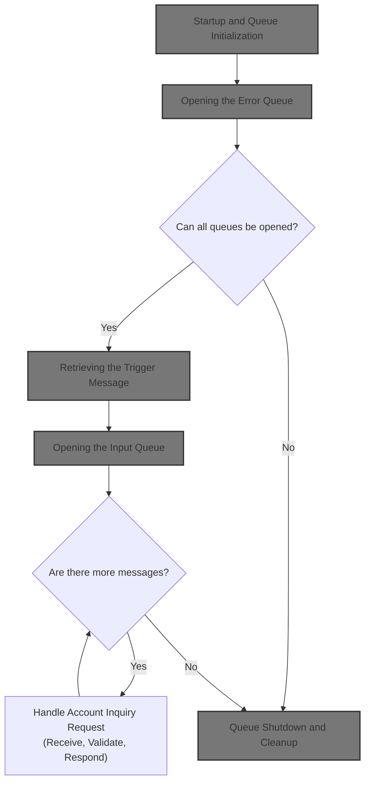

## Dependencies

### Programs

- <SwmToken path="app/app-vsam-mq/cbl/COACCT01.cbl" pos="2:7:7" line-data="000200 PROGRAM-ID.           COACCT01 IS INITIAL.                       00020001">`COACCT01`</SwmToken> (<SwmPath>[app/…/cbl/COACCT01.cbl](app/app-vsam-mq/cbl/COACCT01.cbl)</SwmPath>)
- MQOPEN
- MQGET
- MQPUT
- MQCLOSE

### Copybooks

- CMQGMOV
- CMQPMOV
- CMQMDV
- CMQODV
- CMQV
- CMQTML
- <SwmToken path="app/app-vsam-mq/cbl/COACCT01.cbl" pos="171:3:3" line-data="       COPY CVACT01Y.                                                   01263207">`CVACT01Y`</SwmToken> (<SwmPath>[scripts/markers/CVACT01Y](scripts/markers/CVACT01Y)</SwmPath>)

# Workflow

# Startup and Queue Initialization

```mermaid
%%{init: {"flowchart": {"defaultRenderer": "elk"}} }%%
flowchart TD
    node1["Start: Initialize queues and error display"] --> node2["Opening the Error Queue"]
    click node1 openCode "app/app-vsam-mq/cbl/COACCT01.cbl:178:187"
    
    node2 --> node3["Retrieve message from CICS"]
    click node3 openCode "app/app-vsam-mq/cbl/COACCT01.cbl:191:195"
    node3 --> node4{"Was retrieval successful?"}
    click node4 openCode "app/app-vsam-mq/cbl/COACCT01.cbl:196:210"
    node4 -->|"Yes"| node5["Opening the Output Queue"]
    
    node4 -->|"No"| node6["Set MQ-ERROR-PARA to 'CICS RETREIVE' and terminate"]
    click node6 openCode "app/app-vsam-mq/cbl/COACCT01.cbl:200:210"
    node5 --> node7["Main processing loop: handle requests until NO-MORE-MSGS"]
    click node7 openCode "app/app-vsam-mq/cbl/COACCT01.cbl:215:218"
    subgraph loop1["For each incoming message"]
      node7 --> node8["Receiving and Preparing Requests"]
      
      node8 --> node9{"Are there more messages? (NO-MORE-MSGS)"}
      click node9 openCode "app/app-vsam-mq/cbl/COACCT01.cbl:216:216"
      node9 -->|"No"| node10["Queue Shutdown and Cleanup"]
      
      node9 -->|"Yes"| node8
    end
classDef HeadingStyle fill:#777777,stroke:#333,stroke-width:2px;
click node2 goToHeading "Opening the Error Queue"
node2:::HeadingStyle
click node10 goToHeading "Queue Shutdown and Cleanup"
node10:::HeadingStyle
click node5 goToHeading "Opening the Input Queue"
node5:::HeadingStyle
click node5 goToHeading "Opening the Output Queue"
node5:::HeadingStyle
click node8 goToHeading "Receiving and Preparing Requests"
node8:::HeadingStyle

%% Swimm:
%% %%{init: {"flowchart": {"defaultRenderer": "elk"}} }%%
%% flowchart TD
%%     node1["Start: Initialize queues and error display"] --> node2["Opening the Error Queue"]
%%     click node1 openCode "<SwmPath>[app/…/cbl/COACCT01.cbl](app/app-vsam-mq/cbl/COACCT01.cbl)</SwmPath>:178:187"
%%     
%%     node2 --> node3["Retrieve message from CICS"]
%%     click node3 openCode "<SwmPath>[app/…/cbl/COACCT01.cbl](app/app-vsam-mq/cbl/COACCT01.cbl)</SwmPath>:191:195"
%%     node3 --> node4{"Was retrieval successful?"}
%%     click node4 openCode "<SwmPath>[app/…/cbl/COACCT01.cbl](app/app-vsam-mq/cbl/COACCT01.cbl)</SwmPath>:196:210"
%%     node4 -->|"Yes"| node5["Opening the Output Queue"]
%%     
%%     node4 -->|"No"| node6["Set <SwmToken path="app/app-vsam-mq/cbl/COACCT01.cbl" pos="200:12:16" line-data="016500       MOVE &#39;CICS RETREIVE&#39; TO MQ-ERROR-PARA                      01328407">`MQ-ERROR-PARA`</SwmToken> to 'CICS RETREIVE' and terminate"]
%%     click node6 openCode "<SwmPath>[app/…/cbl/COACCT01.cbl](app/app-vsam-mq/cbl/COACCT01.cbl)</SwmPath>:200:210"
%%     node5 --> node7["Main processing loop: handle requests until <SwmToken path="app/app-vsam-mq/cbl/COACCT01.cbl" pos="216:2:6" line-data="012900             NO-MORE-MSGS                                         01360007">`NO-MORE-MSGS`</SwmToken>"]
%%     click node7 openCode "<SwmPath>[app/…/cbl/COACCT01.cbl](app/app-vsam-mq/cbl/COACCT01.cbl)</SwmPath>:215:218"
%%     subgraph loop1["For each incoming message"]
%%       node7 --> node8["Receiving and Preparing Requests"]
%%       
%%       node8 --> node9{"Are there more messages? (<SwmToken path="app/app-vsam-mq/cbl/COACCT01.cbl" pos="216:2:6" line-data="012900             NO-MORE-MSGS                                         01360007">`NO-MORE-MSGS`</SwmToken>)"}
%%       click node9 openCode "<SwmPath>[app/…/cbl/COACCT01.cbl](app/app-vsam-mq/cbl/COACCT01.cbl)</SwmPath>:216:216"
%%       node9 -->|"No"| node10["Queue Shutdown and Cleanup"]
%%       
%%       node9 -->|"Yes"| node8
%%     end
%% classDef HeadingStyle fill:#777777,stroke:#333,stroke-width:2px;
%% click node2 goToHeading "Opening the Error Queue"
%% node2:::HeadingStyle
%% click node10 goToHeading "Queue Shutdown and Cleanup"
%% node10:::HeadingStyle
%% click node5 goToHeading "Opening the Input Queue"
%% node5:::HeadingStyle
%% click node5 goToHeading "Opening the Output Queue"
%% node5:::HeadingStyle
%% click node8 goToHeading "Receiving and Preparing Requests"
%% node8:::HeadingStyle
```

The main product role of this section is to guarantee that the application starts in a clean, predictable state, with all messaging queues and error handling mechanisms properly initialized before any business processing begins. This ensures reliable operation and robust error handling from the outset.

| Category        | Rule Name               | Description                                                                                                                                                                                                                                                                                                 |
| --------------- | ----------------------- | ----------------------------------------------------------------------------------------------------------------------------------------------------------------------------------------------------------------------------------------------------------------------------------------------------------- |
| Data validation | Queue and Buffer Reset  | All queue names (input, output, error, reply) and message buffers must be cleared to their default values before any queue is opened or used.                                                                                                                                                               |
| Business logic  | Error Queue First       | The error queue must be opened before any other queue or processing step, so that any subsequent errors can be logged immediately.                                                                                                                                                                          |
| Business logic  | Message Processing Loop | The application must process incoming messages in a loop, continuing until there are no more messages (<SwmToken path="app/app-vsam-mq/cbl/COACCT01.cbl" pos="216:2:6" line-data="012900             NO-MORE-MSGS                                         01360007">`NO-MORE-MSGS`</SwmToken> flag is 'Y'). |
| Business logic  | Orderly Shutdown        | When there are no more messages to process, the application must perform orderly shutdown and cleanup of all queues and resources.                                                                                                                                                                          |

<SwmSnippet path="/app/app-vsam-mq/cbl/COACCT01.cbl" line="178">

---

In <SwmToken path="app/app-vsam-mq/cbl/COACCT01.cbl" pos="178:2:4" line-data="012400 1000-CONTROL.                                                    01310007">`1000-CONTROL`</SwmToken> we're kicking off the flow by clearing out all the queue names and message buffers, and prepping the error display structure. We immediately call <SwmToken path="app/app-vsam-mq/cbl/COACCT01.cbl" pos="187:4:10" line-data="014600     PERFORM 2100-OPEN-ERROR-QUEUE                                01327107">`2100-OPEN-ERROR-QUEUE`</SwmToken> so that if anything fails after this point, we can log errors to the error queue right away. No error handling is possible if the error queue isn't open.

```cobol
012400 1000-CONTROL.                                                    01310007
012500                                                                  01320000
013600      MOVE SPACES TO                                              01321007
013700                    INPUT-QUEUE-NAME                              01322007
013800                    QMGR-NAME                                     01323007
013900                    QUEUE-MESSAGE                                 01324007
014000                                                                  01325007
014100      INITIALIZE MQ-ERR-DISPLAY                                   01326007
014200                                                                  01327007
014600     PERFORM 2100-OPEN-ERROR-QUEUE                                01327107
```

---

</SwmSnippet>

## Opening the Error Queue

```mermaid
%%{init: {"flowchart": {"defaultRenderer": "elk"}} }%%
flowchart TD
    node1["Prepare to open error queue CARD.DEMO.ERROR for output"] --> node2["Open error queue"]
    click node1 openCode "app/app-vsam-mq/cbl/COACCT01.cbl:294:296"
    click node2 openCode "app/app-vsam-mq/cbl/COACCT01.cbl:302:307"
    node2 --> node3{"Was queue opened successfully?"}
    click node3 openCode "app/app-vsam-mq/cbl/COACCT01.cbl:309:310"
    node3 -->|"Yes"| node4["Update application: mark error queue as open and store handle"]
    click node4 openCode "app/app-vsam-mq/cbl/COACCT01.cbl:311:314"
    node3 -->|"No"| node5["Record error details and terminate process"]
    click node5 openCode "app/app-vsam-mq/cbl/COACCT01.cbl:316:321"

classDef HeadingStyle fill:#777777,stroke:#333,stroke-width:2px;

%% Swimm:
%% %%{init: {"flowchart": {"defaultRenderer": "elk"}} }%%
%% flowchart TD
%%     node1["Prepare to open error queue <SwmToken path="app/app-vsam-mq/cbl/COACCT01.cbl" pos="294:5:9" line-data="025900     MOVE &#39;CARD.DEMO.ERROR&#39; TO ERROR-QUEUE-NAME                   02660000">`CARD.DEMO.ERROR`</SwmToken> for output"] --> node2["Open error queue"]
%%     click node1 openCode "<SwmPath>[app/…/cbl/COACCT01.cbl](app/app-vsam-mq/cbl/COACCT01.cbl)</SwmPath>:294:296"
%%     click node2 openCode "<SwmPath>[app/…/cbl/COACCT01.cbl](app/app-vsam-mq/cbl/COACCT01.cbl)</SwmPath>:302:307"
%%     node2 --> node3{"Was queue opened successfully?"}
%%     click node3 openCode "<SwmPath>[app/…/cbl/COACCT01.cbl](app/app-vsam-mq/cbl/COACCT01.cbl)</SwmPath>:309:310"
%%     node3 -->|"Yes"| node4["Update application: mark error queue as open and store handle"]
%%     click node4 openCode "<SwmPath>[app/…/cbl/COACCT01.cbl](app/app-vsam-mq/cbl/COACCT01.cbl)</SwmPath>:311:314"
%%     node3 -->|"No"| node5["Record error details and terminate process"]
%%     click node5 openCode "<SwmPath>[app/…/cbl/COACCT01.cbl](app/app-vsam-mq/cbl/COACCT01.cbl)</SwmPath>:316:321"
%% 
%% classDef HeadingStyle fill:#777777,stroke:#333,stroke-width:2px;
```

This section ensures that the application can reliably log errors by opening a dedicated error queue before proceeding with further processing. If the error queue cannot be opened, the application will not continue, ensuring that all errors are properly captured or the process is safely terminated.

| Category        | Rule Name                         | Description                                                                                                                                                                                                                                                                           |
| --------------- | --------------------------------- | ------------------------------------------------------------------------------------------------------------------------------------------------------------------------------------------------------------------------------------------------------------------------------------- |
| Data validation | Error Queue Naming                | The error queue name must be set to <SwmToken path="app/app-vsam-mq/cbl/COACCT01.cbl" pos="294:5:9" line-data="025900     MOVE &#39;CARD.DEMO.ERROR&#39; TO ERROR-QUEUE-NAME                   02660000">`CARD.DEMO.ERROR`</SwmToken> before attempting to open the queue for output. |
| Business logic  | Error Queue Availability Required | The application must not proceed with processing if the error queue cannot be opened; instead, it must record the error details and terminate the process.                                                                                                                            |
| Business logic  | Track Error Queue State           | If the error queue is opened successfully, the application must mark the error queue as open and store the queue handle for subsequent error logging.                                                                                                                                 |

<SwmSnippet path="/app/app-vsam-mq/cbl/COACCT01.cbl" line="289">

---

In <SwmToken path="app/app-vsam-mq/cbl/COACCT01.cbl" pos="289:2:8" line-data="025100 2100-OPEN-ERROR-QUEUE.                                           02580007">`2100-OPEN-ERROR-QUEUE`</SwmToken> we're setting up the error queue name, prepping the MQ object descriptor, and building the options for opening the queue for output. Then we call MQOPEN to get a handle to the error queue so we can write error messages there if needed.

```cobol
025100 2100-OPEN-ERROR-QUEUE.                                           02580007
025200                                                                  02590000
025300* OPEN-OUTPUT WILL OPEN A QUEUE FOR PUT PROCESSING                02600000
025400                                                                  02610000
025800                                                                  02650000
025900     MOVE 'CARD.DEMO.ERROR' TO ERROR-QUEUE-NAME                   02660000
026000     MOVE SPACES            TO MQOD-OBJECTQMGRNAME                02670007
026100     MOVE ERROR-QUEUE-NAME  TO MQOD-OBJECTNAME                    02680007
026200                                                                  02690000
026300     COMPUTE MQ-OPTIONS = MQOO-OUTPUT                             02700000
026400                        + MQOO-PASS-ALL-CONTEXT                   02710000
026500                        + MQOO-FAIL-IF-QUIESCING                  02720007
026600                                                                  02730000
026700     CALL 'MQOPEN' USING QMGR-HANDLE-CONN                         02740000
026800                         MQ-OBJECT-DESCRIPTOR                     02750000
026900                         MQ-OPTIONS                               02760000
027000                         MQ-HOBJ                                  02770000
027100                         MQ-CONDITION-CODE                        02780000
027200                         MQ-REASON-CODE                           02790007
```

---

</SwmSnippet>

<SwmSnippet path="/app/app-vsam-mq/cbl/COACCT01.cbl" line="309">

---

After trying to open the error queue in <SwmToken path="app/app-vsam-mq/cbl/COACCT01.cbl" pos="187:4:10" line-data="014600     PERFORM 2100-OPEN-ERROR-QUEUE                                01327107">`2100-OPEN-ERROR-QUEUE`</SwmToken>, we check the result. If it fails, we log the error details, display them, and call <SwmToken path="app/app-vsam-mq/cbl/COACCT01.cbl" pos="321:4:6" line-data="028600              PERFORM 8000-TERMINATION                            02930007">`8000-TERMINATION`</SwmToken> to shut everything down since we can't continue safely without error logging.

```cobol
027400     EVALUATE MQ-CONDITION-CODE                                   02810000
027500         WHEN MQCC-OK                                             02820000
027600              MOVE MQ-CONDITION-CODE TO MQ-APPL-CONDITION-CODE    02830000
027700              MOVE MQ-REASON-CODE    TO MQ-APPL-REASON-CODE       02840000
027800              MOVE MQ-HOBJ           TO ERROR-QUEUE-HANDLE        02850000
027900              SET  ERR-QUEUE-OPEN   TO TRUE                       02860007
028000         WHEN OTHER                                               02870000
028100              MOVE MQ-CONDITION-CODE TO MQ-APPL-CONDITION-CODE    02880000
028200              MOVE MQ-REASON-CODE    TO MQ-APPL-REASON-CODE       02890000
028300              MOVE ERROR-QUEUE-NAME  TO MQ-APPL-QUEUE-NAME        02900000
028400              MOVE 'ERR MQOPEN ERR'  TO MQ-APPL-RETURN-MESSAGE    02910000
028500              DISPLAY MQ-ERR-DISPLAY                              02920000
028600              PERFORM 8000-TERMINATION                            02930007
028700     END-EVALUATE.                                                02940000
```

---

</SwmSnippet>

## Queue Shutdown and Cleanup

```mermaid
%%{init: {"flowchart": {"defaultRenderer": "elk"}} }%%
flowchart TD
    node1["Start termination process"] --> node2{"Is reply queue open?"}
    click node1 openCode "app/app-vsam-mq/cbl/COACCT01.cbl:538:542"
    node2 -->|"Yes"| node3["Closing the Input Queue"]
    click node2 openCode "app/app-vsam-mq/cbl/COACCT01.cbl:540:542"
    node2 -->|"No"| node4{"Is response queue open?"}
    
    node3 --> node9{"Did close succeed?"}
    node9 -->|"Yes"| node4
    node9 -->|"No"| node7["Error Logging and Notification"]
    click node9 openCode "app/app-vsam-mq/cbl/COACCT01.cbl:552:572"
    
    node4 -->|"Yes"| node5["Closing the Response Queue"]
    click node4 openCode "app/app-vsam-mq/cbl/COACCT01.cbl:543:545"
    node4 -->|"No"| node6{"Is error queue open?"}
    
    node5 --> node10{"Did close succeed?"}
    node10 -->|"Yes"| node6
    node10 -->|"No"| node7
    click node10 openCode "app/app-vsam-mq/cbl/COACCT01.cbl:574:594"
    node6 -->|"Yes"| node11["Final Error Queue Cleanup"]
    click node6 openCode "app/app-vsam-mq/cbl/COACCT01.cbl:546:548"
    node6 -->|"No"| node8["Return control and terminate"]
    
    node11 --> node12{"Did close succeed?"}
    node12 -->|"Yes"| node8["Return control and terminate"]
    node12 -->|"No"| node7
    click node12 openCode "app/app-vsam-mq/cbl/COACCT01.cbl:597:617"
    click node8 openCode "app/app-vsam-mq/cbl/COACCT01.cbl:549:550"
classDef HeadingStyle fill:#777777,stroke:#333,stroke-width:2px;
click node3 goToHeading "Closing the Input Queue"
node3:::HeadingStyle
click node5 goToHeading "Closing the Response Queue"
node5:::HeadingStyle
click node11 goToHeading "Final Error Queue Cleanup"
node11:::HeadingStyle
click node7 goToHeading "Error Logging and Notification"
node7:::HeadingStyle

%% Swimm:
%% %%{init: {"flowchart": {"defaultRenderer": "elk"}} }%%
%% flowchart TD
%%     node1["Start termination process"] --> node2{"Is reply queue open?"}
%%     click node1 openCode "<SwmPath>[app/…/cbl/COACCT01.cbl](app/app-vsam-mq/cbl/COACCT01.cbl)</SwmPath>:538:542"
%%     node2 -->|"Yes"| node3["Closing the Input Queue"]
%%     click node2 openCode "<SwmPath>[app/…/cbl/COACCT01.cbl](app/app-vsam-mq/cbl/COACCT01.cbl)</SwmPath>:540:542"
%%     node2 -->|"No"| node4{"Is response queue open?"}
%%     
%%     node3 --> node9{"Did close succeed?"}
%%     node9 -->|"Yes"| node4
%%     node9 -->|"No"| node7["Error Logging and Notification"]
%%     click node9 openCode "<SwmPath>[app/…/cbl/COACCT01.cbl](app/app-vsam-mq/cbl/COACCT01.cbl)</SwmPath>:552:572"
%%     
%%     node4 -->|"Yes"| node5["Closing the Response Queue"]
%%     click node4 openCode "<SwmPath>[app/…/cbl/COACCT01.cbl](app/app-vsam-mq/cbl/COACCT01.cbl)</SwmPath>:543:545"
%%     node4 -->|"No"| node6{"Is error queue open?"}
%%     
%%     node5 --> node10{"Did close succeed?"}
%%     node10 -->|"Yes"| node6
%%     node10 -->|"No"| node7
%%     click node10 openCode "<SwmPath>[app/…/cbl/COACCT01.cbl](app/app-vsam-mq/cbl/COACCT01.cbl)</SwmPath>:574:594"
%%     node6 -->|"Yes"| node11["Final Error Queue Cleanup"]
%%     click node6 openCode "<SwmPath>[app/…/cbl/COACCT01.cbl](app/app-vsam-mq/cbl/COACCT01.cbl)</SwmPath>:546:548"
%%     node6 -->|"No"| node8["Return control and terminate"]
%%     
%%     node11 --> node12{"Did close succeed?"}
%%     node12 -->|"Yes"| node8["Return control and terminate"]
%%     node12 -->|"No"| node7
%%     click node12 openCode "<SwmPath>[app/…/cbl/COACCT01.cbl](app/app-vsam-mq/cbl/COACCT01.cbl)</SwmPath>:597:617"
%%     click node8 openCode "<SwmPath>[app/…/cbl/COACCT01.cbl](app/app-vsam-mq/cbl/COACCT01.cbl)</SwmPath>:549:550"
%% classDef HeadingStyle fill:#777777,stroke:#333,stroke-width:2px;
%% click node3 goToHeading "Closing the Input Queue"
%% node3:::HeadingStyle
%% click node5 goToHeading "Closing the Response Queue"
%% node5:::HeadingStyle
%% click node11 goToHeading "Final Error Queue Cleanup"
%% node11:::HeadingStyle
%% click node7 goToHeading "Error Logging and Notification"
%% node7:::HeadingStyle
```

The main product role of this section is to ensure that all message queues are properly closed during application shutdown, preventing resource leaks and ensuring that no new messages are processed or lost. It also ensures that any errors encountered during queue closure are logged and handled according to business requirements.

| Category       | Rule Name                       | Description                                                                                                                                                        |
| -------------- | ------------------------------- | ------------------------------------------------------------------------------------------------------------------------------------------------------------------ |
| Business logic | Input Queue Closure Requirement | If the input queue is open at shutdown, it must be closed before proceeding to close other queues. No new messages should be processed once shutdown begins.       |
| Business logic | Response Queue Closure Sequence | If the response queue is open at shutdown, it must be closed after the input queue. This ensures that all responses are finalized before termination.              |
| Business logic | Error Queue Finalization        | If the error queue is open at shutdown, it must be closed last, after input and response queues. This ensures all error messages are processed before termination. |
| Business logic | Complete Shutdown Enforcement   | The shutdown process must not return control to the calling process until all open queues have been closed or an unrecoverable error has been logged and handled.  |

<SwmSnippet path="/app/app-vsam-mq/cbl/COACCT01.cbl" line="538">

---

In <SwmToken path="app/app-vsam-mq/cbl/COACCT01.cbl" pos="538:2:4" line-data="045200 8000-TERMINATION.                                                04700007">`8000-TERMINATION`</SwmToken>, we check if the input queue is open and, if so, call <SwmToken path="app/app-vsam-mq/cbl/COACCT01.cbl" pos="541:4:10" line-data="045500        PERFORM 5000-CLOSE-INPUT-QUEUE                            04730010">`5000-CLOSE-INPUT-QUEUE`</SwmToken> to close it. This prevents any new messages from being processed during shutdown.

```cobol
045200 8000-TERMINATION.                                                04700007
045300                                                                  04710000
045400     IF REPLY-QUEUE-OPEN                                          04720007
045500        PERFORM 5000-CLOSE-INPUT-QUEUE                            04730010
045600     END-IF                                                       04740000
```

---

</SwmSnippet>

### Closing the Input Queue

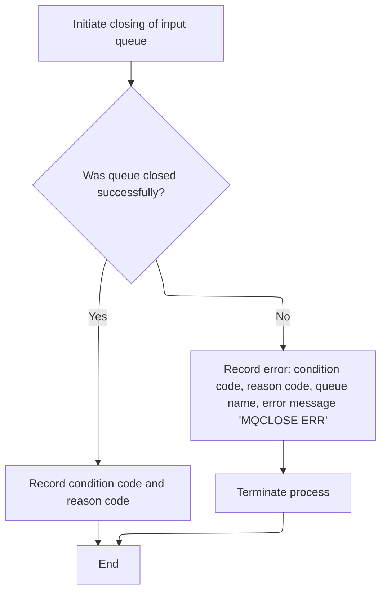

This section ensures that the input queue is properly closed at the end of processing, and that any errors during the close operation are captured and handled according to business requirements. Proper closure of the input queue is critical for resource management and application stability.

| Category        | Rule Name                  | Description                                                                                                                               |
| --------------- | -------------------------- | ----------------------------------------------------------------------------------------------------------------------------------------- |
| Data validation | Successful Closure Logging | If the input queue is closed successfully, the system must record the condition code and reason code for audit and traceability purposes. |

<SwmSnippet path="/app/app-vsam-mq/cbl/COACCT01.cbl" line="552">

---

In <SwmToken path="app/app-vsam-mq/cbl/COACCT01.cbl" pos="552:2:8" line-data="046600 5000-CLOSE-INPUT-QUEUE.                                          04840010">`5000-CLOSE-INPUT-QUEUE`</SwmToken>, we prep the queue name and handle, set options, and call MQCLOSE to close the input queue connection. This is the actual resource release step for the input queue.

```cobol
046600 5000-CLOSE-INPUT-QUEUE.                                          04840010
046700     MOVE INPUT-QUEUE-NAME           TO MQ-QUEUE                  04850000
046800     MOVE INPUT-QUEUE-HANDLE         TO MQ-HOBJ                   04860000
046900     COMPUTE MQ-OPTIONS = MQCO-NONE                               04870007
047000                                                                  04880000
047100     CALL 'MQCLOSE' USING MQ-HCONN                                04890000
047200                          MQ-HOBJ                                 04900000
047300                          MQ-OPTIONS                              04910000
047400                          MQ-CONDITION-CODE                       04920000
047500                          MQ-REASON-CODE                          04930007
```

---

</SwmSnippet>

<SwmSnippet path="/app/app-vsam-mq/cbl/COACCT01.cbl" line="563">

---

After closing the input queue in <SwmToken path="app/app-vsam-mq/cbl/COACCT01.cbl" pos="541:4:10" line-data="045500        PERFORM 5000-CLOSE-INPUT-QUEUE                            04730010">`5000-CLOSE-INPUT-QUEUE`</SwmToken>, if the close fails, we set error details and call <SwmToken path="app/app-vsam-mq/cbl/COACCT01.cbl" pos="572:4:6" line-data="048600              PERFORM 8000-TERMINATION                            05040007">`8000-TERMINATION`</SwmToken> to keep cleaning up other resources and log the failure.

```cobol
047700     EVALUATE MQ-CONDITION-CODE                                   04950000
047800         WHEN MQCC-OK                                             04960000
047900              MOVE MQ-CONDITION-CODE TO MQ-APPL-CONDITION-CODE    04970000
048000              MOVE MQ-REASON-CODE    TO MQ-APPL-REASON-CODE       04980000
048100         WHEN OTHER                                               04990000
048200              MOVE MQ-CONDITION-CODE TO MQ-APPL-CONDITION-CODE    05000000
048300              MOVE MQ-REASON-CODE    TO MQ-APPL-REASON-CODE       05010000
048400              MOVE INPUT-QUEUE-NAME  TO MQ-APPL-QUEUE-NAME        05020000
048500              MOVE 'MQCLOSE ERR'     TO MQ-APPL-RETURN-MESSAGE    05030000
048600              PERFORM 8000-TERMINATION                            05040007
048700     END-EVALUATE.                                                05050000
```

---

</SwmSnippet>

### Closing the Output Queue

<SwmSnippet path="/app/app-vsam-mq/cbl/COACCT01.cbl" line="543">

---

Back in <SwmToken path="app/app-vsam-mq/cbl/COACCT01.cbl" pos="209:4:6" line-data="017400       PERFORM 8000-TERMINATION                                   01329307">`8000-TERMINATION`</SwmToken>, after closing the input queue, we check if the output queue is open and call <SwmToken path="app/app-vsam-mq/cbl/COACCT01.cbl" pos="544:4:10" line-data="045800        PERFORM 5100-CLOSE-OUTPUT-QUEUE                           04760010">`5100-CLOSE-OUTPUT-QUEUE`</SwmToken> to close it. This keeps the shutdown order clean and avoids sending responses after input is stopped.

```cobol
045700     IF RESP-QUEUE-OPEN                                           04750007
045800        PERFORM 5100-CLOSE-OUTPUT-QUEUE                           04760010
045900     END-IF                                                       04770000
```

---

</SwmSnippet>

### Closing the Response Queue

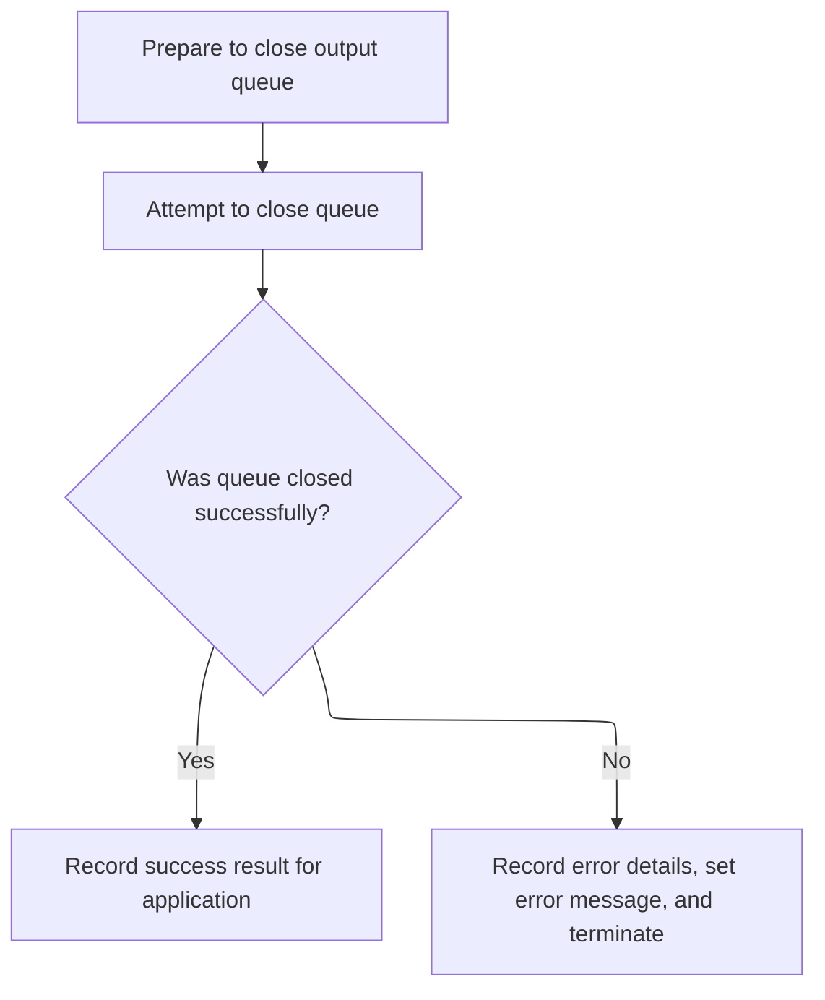

This section governs the business process for releasing the response queue resource at the end of a transaction, ensuring that the queue is closed properly and that any errors are captured and handled according to business requirements.

| Category       | Rule Name                | Description                                                                                                                                                                  |
| -------------- | ------------------------ | ---------------------------------------------------------------------------------------------------------------------------------------------------------------------------- |
| Business logic | Success result recording | If the response queue is closed successfully, the application must record the success result, including the condition and reason codes, for audit and traceability purposes. |

<SwmSnippet path="/app/app-vsam-mq/cbl/COACCT01.cbl" line="574">

---

In <SwmToken path="app/app-vsam-mq/cbl/COACCT01.cbl" pos="574:2:8" line-data="048800 5100-CLOSE-OUTPUT-QUEUE.                                         05060010">`5100-CLOSE-OUTPUT-QUEUE`</SwmToken>, we set up the reply queue name and handle, set options, and call MQCLOSE to close the output queue connection. This is the resource release for the response queue.

```cobol
048800 5100-CLOSE-OUTPUT-QUEUE.                                         05060010
048900     MOVE REPLY-QUEUE-NAME            TO MQ-QUEUE                 05070000
049000     MOVE OUTPUT-QUEUE-HANDLE         TO MQ-HOBJ                  05080000
049100     COMPUTE MQ-OPTIONS = MQCO-NONE                               05090007
049200                                                                  05100000
049300     CALL 'MQCLOSE' USING MQ-HCONN                                05110000
049400                          MQ-HOBJ                                 05120000
049500                          MQ-OPTIONS                              05130000
049600                          MQ-CONDITION-CODE                       05140000
049700                          MQ-REASON-CODE                          05150007
```

---

</SwmSnippet>

<SwmSnippet path="/app/app-vsam-mq/cbl/COACCT01.cbl" line="585">

---

After closing the output queue in <SwmToken path="app/app-vsam-mq/cbl/COACCT01.cbl" pos="544:4:10" line-data="045800        PERFORM 5100-CLOSE-OUTPUT-QUEUE                           04760010">`5100-CLOSE-OUTPUT-QUEUE`</SwmToken>, if the close fails, we set error details and call <SwmToken path="app/app-vsam-mq/cbl/COACCT01.cbl" pos="594:4:6" line-data="050800              PERFORM 8000-TERMINATION                            05260007">`8000-TERMINATION`</SwmToken> to keep cleaning up other resources and log the failure.

```cobol
049900     EVALUATE MQ-CONDITION-CODE                                   05170000
050000         WHEN MQCC-OK                                             05180000
050100              MOVE MQ-CONDITION-CODE TO MQ-APPL-CONDITION-CODE    05190000
050200              MOVE MQ-REASON-CODE    TO MQ-APPL-REASON-CODE       05200000
050300         WHEN OTHER                                               05210000
050400              MOVE MQ-CONDITION-CODE TO MQ-APPL-CONDITION-CODE    05220000
050500              MOVE MQ-REASON-CODE    TO MQ-APPL-REASON-CODE       05230000
050600              MOVE INPUT-QUEUE-NAME  TO MQ-APPL-QUEUE-NAME        05240000
050700              MOVE 'MQCLOSE ERR'     TO MQ-APPL-RETURN-MESSAGE    05250000
050800              PERFORM 8000-TERMINATION                            05260007
050900     END-EVALUATE.                                                05270000
```

---

</SwmSnippet>

### Closing the Error Queue

<SwmSnippet path="/app/app-vsam-mq/cbl/COACCT01.cbl" line="546">

---

Back in <SwmToken path="app/app-vsam-mq/cbl/COACCT01.cbl" pos="209:4:6" line-data="017400       PERFORM 8000-TERMINATION                                   01329307">`8000-TERMINATION`</SwmToken>, after closing the output queue, we check if the error queue is open and call <SwmToken path="app/app-vsam-mq/cbl/COACCT01.cbl" pos="547:4:10" line-data="046100        PERFORM 5200-CLOSE-ERROR-QUEUE                            04790010">`5200-CLOSE-ERROR-QUEUE`</SwmToken> to close it. This way, we can still log errors from earlier shutdown steps before releasing the error queue.

```cobol
046000     IF ERR-QUEUE-OPEN                                            04780007
046100        PERFORM 5200-CLOSE-ERROR-QUEUE                            04790010
046200     END-IF                                                       04800000
```

---

</SwmSnippet>

### Final Error Queue Cleanup

This section ensures that the error queue messaging resource is properly closed at the end of processing. It guarantees that any issues encountered during closure are logged and that the application terminates in a controlled manner if cleanup fails.

| Category        | Rule Name                          | Description                                                                                                                                                                                                                                                                                                                     |
| --------------- | ---------------------------------- | ------------------------------------------------------------------------------------------------------------------------------------------------------------------------------------------------------------------------------------------------------------------------------------------------------------------------------- |
| Data validation | Correct Error Queue Identification | The error queue name used for closure must match the configured error queue name (<SwmToken path="app/app-vsam-mq/cbl/COACCT01.cbl" pos="294:5:9" line-data="025900     MOVE &#39;CARD.DEMO.ERROR&#39; TO ERROR-QUEUE-NAME                   02660000">`CARD.DEMO.ERROR`</SwmToken>) to ensure the correct resource is managed. |

<SwmSnippet path="/app/app-vsam-mq/cbl/COACCT01.cbl" line="597">

---

In <SwmToken path="app/app-vsam-mq/cbl/COACCT01.cbl" pos="597:2:8" line-data="051100 5200-CLOSE-ERROR-QUEUE.                                          05290010">`5200-CLOSE-ERROR-QUEUE`</SwmToken>, we set up the error queue name and handle, set options, and call MQCLOSE to close the error queue connection. This is the last messaging resource cleanup.

```cobol
051100 5200-CLOSE-ERROR-QUEUE.                                          05290010
051200     MOVE ERROR-QUEUE-NAME          TO MQ-QUEUE                   05300000
051300     MOVE ERROR-QUEUE-HANDLE         TO MQ-HOBJ                   05310000
051400     COMPUTE MQ-OPTIONS = MQCO-NONE                               05320007
051500                                                                  05330000
051600     CALL 'MQCLOSE' USING MQ-HCONN                                05340000
051700                          MQ-HOBJ                                 05350000
051800                          MQ-OPTIONS                              05360000
051900                          MQ-CONDITION-CODE                       05370000
052000                          MQ-REASON-CODE                          05380007
```

---

</SwmSnippet>

<SwmSnippet path="/app/app-vsam-mq/cbl/COACCT01.cbl" line="608">

---

After trying to close the error queue in <SwmToken path="app/app-vsam-mq/cbl/COACCT01.cbl" pos="547:4:10" line-data="046100        PERFORM 5200-CLOSE-ERROR-QUEUE                            04790010">`5200-CLOSE-ERROR-QUEUE`</SwmToken>, if it fails, we call <SwmToken path="app/app-vsam-mq/cbl/COACCT01.cbl" pos="617:4:6" line-data="053100              PERFORM 9000-ERROR                                  05490007">`9000-ERROR`</SwmToken> to log the failure, then call <SwmToken path="app/app-vsam-mq/cbl/COACCT01.cbl" pos="618:4:6" line-data="053200              PERFORM 8000-TERMINATION                            05500007">`8000-TERMINATION`</SwmToken> to exit cleanly.

```cobol
052200     EVALUATE MQ-CONDITION-CODE                                   05400000
052300         WHEN MQCC-OK                                             05410000
052400              MOVE MQ-CONDITION-CODE TO MQ-APPL-CONDITION-CODE    05420000
052500              MOVE MQ-REASON-CODE    TO MQ-APPL-REASON-CODE       05430000
052600         WHEN OTHER                                               05440000
052700              MOVE MQ-CONDITION-CODE TO MQ-APPL-CONDITION-CODE    05450000
052800              MOVE MQ-REASON-CODE    TO MQ-APPL-REASON-CODE       05460000
052900              MOVE ERROR-QUEUE-NAME  TO MQ-APPL-QUEUE-NAME        05470000
053000              MOVE 'MQCLOSE ERR'     TO MQ-APPL-RETURN-MESSAGE    05480000
053100              PERFORM 9000-ERROR                                  05490007
053200              PERFORM 8000-TERMINATION                            05500007
053300     END-EVALUATE.                                                05510000
```

---

</SwmSnippet>

### Error Logging and Notification

```mermaid
%%{init: {"flowchart": {"defaultRenderer": "elk"}} }%%
flowchart TD
    node1["Prepare error message for error queue CARD.DEMO.ERROR"] --> node2["Put error message on error queue"]
    click node1 openCode "app/app-vsam-mq/cbl/COACCT01.cbl:501:523"
    node2 --> node3{"Was message put successfully?"}
    click node2 openCode "app/app-vsam-mq/cbl/COACCT01.cbl:516:523"
    node3 -->|"Yes"| node4["Record success and reason code for audit"]
    click node3 openCode "app/app-vsam-mq/cbl/COACCT01.cbl:525:528"
    node3 -->|"No"| node5["Log/display failure, record details, and end error handling"]
    click node4 openCode "app/app-vsam-mq/cbl/COACCT01.cbl:527:528"
    click node5 openCode "app/app-vsam-mq/cbl/COACCT01.cbl:529:535"

classDef HeadingStyle fill:#777777,stroke:#333,stroke-width:2px;

%% Swimm:
%% %%{init: {"flowchart": {"defaultRenderer": "elk"}} }%%
%% flowchart TD
%%     node1["Prepare error message for error queue <SwmToken path="app/app-vsam-mq/cbl/COACCT01.cbl" pos="294:5:9" line-data="025900     MOVE &#39;CARD.DEMO.ERROR&#39; TO ERROR-QUEUE-NAME                   02660000">`CARD.DEMO.ERROR`</SwmToken>"] --> node2["Put error message on error queue"]
%%     click node1 openCode "<SwmPath>[app/…/cbl/COACCT01.cbl](app/app-vsam-mq/cbl/COACCT01.cbl)</SwmPath>:501:523"
%%     node2 --> node3{"Was message put successfully?"}
%%     click node2 openCode "<SwmPath>[app/…/cbl/COACCT01.cbl](app/app-vsam-mq/cbl/COACCT01.cbl)</SwmPath>:516:523"
%%     node3 -->|"Yes"| node4["Record success and reason code for audit"]
%%     click node3 openCode "<SwmPath>[app/…/cbl/COACCT01.cbl](app/app-vsam-mq/cbl/COACCT01.cbl)</SwmPath>:525:528"
%%     node3 -->|"No"| node5["Log/display failure, record details, and end error handling"]
%%     click node4 openCode "<SwmPath>[app/…/cbl/COACCT01.cbl](app/app-vsam-mq/cbl/COACCT01.cbl)</SwmPath>:527:528"
%%     click node5 openCode "<SwmPath>[app/…/cbl/COACCT01.cbl](app/app-vsam-mq/cbl/COACCT01.cbl)</SwmPath>:529:535"
%% 
%% classDef HeadingStyle fill:#777777,stroke:#333,stroke-width:2px;
```

The main product role of this section is to ensure that all errors encountered by the application are reliably logged and communicated to downstream systems or support teams via a dedicated error queue, supporting auditability and operational awareness.

| Category        | Rule Name                           | Description                                                                                                                                                                                                                                                                                                  |
| --------------- | ----------------------------------- | ------------------------------------------------------------------------------------------------------------------------------------------------------------------------------------------------------------------------------------------------------------------------------------------------------------ |
| Data validation | Comprehensive error details         | Each error message must include the error parameters, a return message, condition code, reason code, and the name of the queue involved.                                                                                                                                                                     |
| Data validation | Fixed error queue destination       | The error queue name used for logging must always be <SwmToken path="app/app-vsam-mq/cbl/COACCT01.cbl" pos="294:5:9" line-data="025900     MOVE &#39;CARD.DEMO.ERROR&#39; TO ERROR-QUEUE-NAME                   02660000">`CARD.DEMO.ERROR`</SwmToken>.                                                      |
| Business logic  | Centralized error logging           | All application errors must be logged by sending a detailed error message to the designated error queue (<SwmToken path="app/app-vsam-mq/cbl/COACCT01.cbl" pos="294:5:9" line-data="025900     MOVE &#39;CARD.DEMO.ERROR&#39; TO ERROR-QUEUE-NAME                   02660000">`CARD.DEMO.ERROR`</SwmToken>). |
| Business logic  | Audit successful error notification | If the error message is successfully placed on the error queue, the system must record the success and the associated reason code for audit purposes.                                                                                                                                                        |

<SwmSnippet path="/app/app-vsam-mq/cbl/COACCT01.cbl" line="501">

---

In <SwmToken path="app/app-vsam-mq/cbl/COACCT01.cbl" pos="501:2:4" line-data="041100 9000-ERROR.                                                      04290007">`9000-ERROR`</SwmToken>, we build the error message from the error display structure, set up the buffer and MQMD fields, and call MQPUT to send the error details to the error queue.

```cobol
041100 9000-ERROR.                                                      04290007
041200* PUT WILL PUT A MESSAGE ON THE QUEUE AND CONVERT IT TO A STRING  04300000
041300                                                                  04310000
041600                                                                  04340000
041700     MOVE MQ-ERR-DISPLAY               TO ERROR-MESSAGE,          04350000
041800     MOVE ERROR-MESSAGE                TO MQ-BUFFER               04360007
041900     MOVE 1000                         TO MQ-BUFFER-LENGTH        04370007
042200     MOVE MQFMT-STRING                 TO MQMD-FORMAT             04400007
042300                                                                  04410000
042400     COMPUTE MQMD-CODEDCHARSETID      =  MQCCSI-Q-MGR             04420007
042500                                                                  04430000
042600     COMPUTE MQPMO-OPTIONS = MQPMO-SYNCPOINT                      04440000
042700                           + MQPMO-DEFAULT-CONTEXT                04450000
042800                           + MQPMO-FAIL-IF-QUIESCING              04460007
042900                                                                  04470000
043000     CALL 'MQPUT'  USING MQ-HCONN                                 04480000
043100                         ERROR-QUEUE-HANDLE                       04490000
043200                         MQ-MESSAGE-DESCRIPTOR                    04500000
043300                         MQ-PUT-MESSAGE-OPTIONS                   04510000
043400                         MQ-BUFFER-LENGTH                         04520000
043500                         MQ-BUFFER                                04530000
043600                         MQ-CONDITION-CODE                        04540000
043700                         MQ-REASON-CODE                           04550007
```

---

</SwmSnippet>

<SwmSnippet path="/app/app-vsam-mq/cbl/COACCT01.cbl" line="525">

---

After sending the error message in <SwmToken path="app/app-vsam-mq/cbl/COACCT01.cbl" pos="208:3:5" line-data="             PERFORM 9000-ERROR                                         01329207">`9000-ERROR`</SwmToken>, we call <SwmToken path="app/app-vsam-mq/cbl/COACCT01.cbl" pos="535:4:6" line-data="044900              PERFORM 8000-TERMINATION                            04670007">`8000-TERMINATION`</SwmToken> to clean up and exit, no matter if the error message was put successfully or not.

```cobol
043900     EVALUATE MQ-CONDITION-CODE                                   04570000
044000         WHEN MQCC-OK                                             04580000
044100              MOVE MQ-CONDITION-CODE TO MQ-APPL-CONDITION-CODE    04590000
044200              MOVE MQ-REASON-CODE    TO MQ-APPL-REASON-CODE       04600000
044300         WHEN OTHER                                               04610000
044400              MOVE MQ-CONDITION-CODE TO MQ-APPL-CONDITION-CODE    04620000
044500              MOVE MQ-REASON-CODE    TO MQ-APPL-REASON-CODE       04630000
044600              MOVE ERROR-QUEUE-NAME  TO MQ-APPL-QUEUE-NAME        04640000
044700              MOVE 'MQPUT ERR'       TO MQ-APPL-RETURN-MESSAGE    04650000
044800              DISPLAY MQ-ERR-DISPLAY                              04660000
044900              PERFORM 8000-TERMINATION                            04670007
045000     END-EVALUATE.                                                04680000
```

---

</SwmSnippet>

### Final Program Exit

<SwmSnippet path="/app/app-vsam-mq/cbl/COACCT01.cbl" line="549">

---

After closing all queues in <SwmToken path="app/app-vsam-mq/cbl/COACCT01.cbl" pos="209:4:6" line-data="017400       PERFORM 8000-TERMINATION                                   01329307">`8000-TERMINATION`</SwmToken>, we hit EXEC CICS RETURN and GOBACK to exit the program for good. This is the final step, handing control back to CICS or the OS.

```cobol
046300     EXEC CICS RETURN END-EXEC                                    04810000
046400     GOBACK.                                                      04820000
```

---

</SwmSnippet>

## Retrieving the Trigger Message

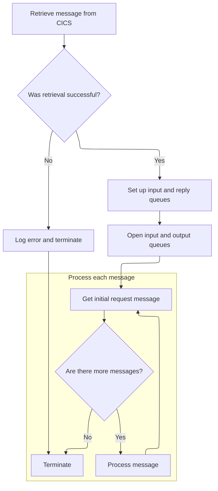

<SwmSnippet path="/app/app-vsam-mq/cbl/COACCT01.cbl" line="191">

---

Back in <SwmToken path="app/app-vsam-mq/cbl/COACCT01.cbl" pos="178:2:4" line-data="012400 1000-CONTROL.                                                    01310007">`1000-CONTROL`</SwmToken>, after opening the error queue, we use EXEC CICS RETRIEVE to get the trigger message (MQTM) and store response codes for error handling. If this fails, we have the error queue ready to log the issue.

```cobol
015600     EXEC CICS RETRIEVE                                           01327507
015700       INTO(MQTM)                                                 01327607
015800       RESP(WS-CICS-RESP1-CD)                                     01327707
015900       RESP2(WS-CICS-RESP2-CD)                                    01327807
016000     END-EXEC                                                     01327907
```

---

</SwmSnippet>

<SwmSnippet path="/app/app-vsam-mq/cbl/COACCT01.cbl" line="196">

---

If RETRIEVE fails, we build an error message with the response codes, log it using <SwmToken path="app/app-vsam-mq/cbl/COACCT01.cbl" pos="208:3:5" line-data="             PERFORM 9000-ERROR                                         01329207">`9000-ERROR`</SwmToken>, and then call <SwmToken path="app/app-vsam-mq/cbl/COACCT01.cbl" pos="209:4:6" line-data="017400       PERFORM 8000-TERMINATION                                   01329307">`8000-TERMINATION`</SwmToken> to exit. This prevents the app from running with bad trigger info.

```cobol
016100     IF WS-CICS-RESP1-CD =  DFHRESP(NORMAL)                       01328007
016200       MOVE MQTM-QNAME  TO INPUT-QUEUE-NAME                       01328107
016300       MOVE 'CARD.DEMO.REPLY.ACCT' TO REPLY-QUEUE-NAME            01328207
016400     ELSE                                                         01328307
016500       MOVE 'CICS RETREIVE' TO MQ-ERROR-PARA                      01328407
016600       MOVE WS-CICS-RESP1-CD TO WS-CICS-RESP1-CD-D                01328507
016700       MOVE WS-CICS-RESP2-CD TO WS-CICS-RESP2-CD                  01328607
016800       STRING 'RESP: ', WS-CICS-RESP1-CD-D , WS-CICS-RESP2-CD-D,  01328707
016900              'END' DELIMITED BY SIZE                             01328807
017000              INTO MQ-APPL-RETURN-MESSAGE                         01328907
017100       END-STRING                                                 01329007
017200                                                                  01329107
             PERFORM 9000-ERROR                                         01329207
017400       PERFORM 8000-TERMINATION                                   01329307
017500     END-IF                                                       01329407
```

---

</SwmSnippet>

<SwmSnippet path="/app/app-vsam-mq/cbl/COACCT01.cbl" line="212">

---

After setup, <SwmToken path="app/app-vsam-mq/cbl/COACCT01.cbl" pos="178:2:4" line-data="012400 1000-CONTROL.                                                    01310007">`1000-CONTROL`</SwmToken> opens the input/output queues and starts the main processing loop.

```cobol
014800     PERFORM 2300-OPEN-INPUT-QUEUE                                01329807
014900     PERFORM 2400-OPEN-OUTPUT-QUEUE                               01329907
012700     PERFORM 3000-GET-REQUEST                                     01340007
012800     PERFORM 4000-MAIN-PROCESS UNTIL                              01350007
012900             NO-MORE-MSGS                                         01360007
013000                                                                  01370000
013100     PERFORM 8000-TERMINATION.                                    01380007
```

---

</SwmSnippet>

## Opening the Input Queue

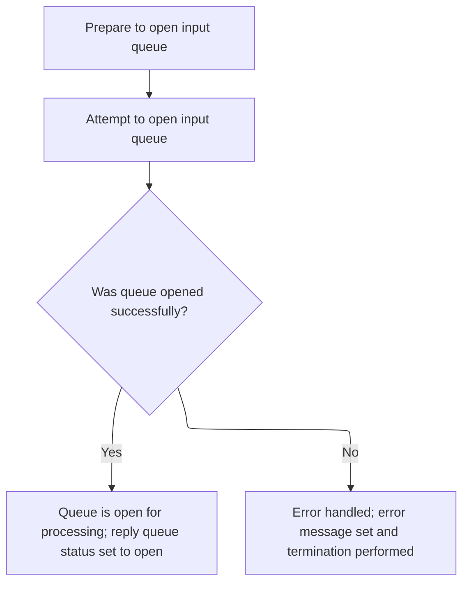

This section ensures that the application can access the input queue for processing incoming messages. It validates the ability to open the queue and enforces application termination if the queue is unavailable, maintaining data integrity and operational reliability.

<SwmSnippet path="/app/app-vsam-mq/cbl/COACCT01.cbl" line="222">

---

In <SwmToken path="app/app-vsam-mq/cbl/COACCT01.cbl" pos="222:2:8" line-data="017800 2300-OPEN-INPUT-QUEUE.                                           01850007">`2300-OPEN-INPUT-QUEUE`</SwmToken>, we set up the input queue name, object descriptor, and options for shared input, then call MQOPEN to get a handle for reading messages.

```cobol
017800 2300-OPEN-INPUT-QUEUE.                                           01850007
017900* OPEN-INPUT WILL OPEN A QUEUE FOR GET PROCESSING                 01860000
018000                                                                  01870000
018400                                                                  01910000
018500     MOVE SPACES           TO MQOD-OBJECTQMGRNAME                 01920007
018600     MOVE INPUT-QUEUE-NAME TO MQOD-OBJECTNAME                     01930007
018700                                                                  01940000
018800     COMPUTE MQ-OPTIONS = MQOO-INPUT-SHARED                       01950000
018900                        + MQOO-SAVE-ALL-CONTEXT                   01960000
019000                        + MQOO-FAIL-IF-QUIESCING                  01970007
019100                                                                  01980000
019200     CALL 'MQOPEN' USING QMGR-HANDLE-CONN                         01990000
019300                         MQ-OBJECT-DESCRIPTOR                     02000000
019400                         MQ-OPTIONS                               02010000
019500                         MQ-HOBJ                                  02020000
019600                         MQ-CONDITION-CODE                        02030000
019700                         MQ-REASON-CODE                           02040007
```

---

</SwmSnippet>

<SwmSnippet path="/app/app-vsam-mq/cbl/COACCT01.cbl" line="240">

---

After trying to open the input queue in <SwmToken path="app/app-vsam-mq/cbl/COACCT01.cbl" pos="212:4:10" line-data="014800     PERFORM 2300-OPEN-INPUT-QUEUE                                01329807">`2300-OPEN-INPUT-QUEUE`</SwmToken>, if it fails, we log the error with <SwmToken path="app/app-vsam-mq/cbl/COACCT01.cbl" pos="251:4:6" line-data="021000              PERFORM 9000-ERROR                                  02170007">`9000-ERROR`</SwmToken> and terminate to avoid running without a valid input source.

```cobol
019900     EVALUATE MQ-CONDITION-CODE                                   02060000
020000         WHEN MQCC-OK                                             02070000
020100              MOVE MQ-CONDITION-CODE TO MQ-APPL-CONDITION-CODE    02080000
020200              MOVE MQ-REASON-CODE    TO MQ-APPL-REASON-CODE       02090000
020300              MOVE MQ-HOBJ           TO INPUT-QUEUE-HANDLE        02100000
020400              SET  REPLY-QUEUE-OPEN  TO TRUE                      02110007
020500         WHEN OTHER                                               02120000
020600              MOVE MQ-CONDITION-CODE TO MQ-APPL-CONDITION-CODE    02130000
020700              MOVE MQ-REASON-CODE    TO MQ-APPL-REASON-CODE       02140000
020800              MOVE INPUT-QUEUE-NAME  TO MQ-APPL-QUEUE-NAME        02150000
020900              MOVE 'INP MQOPEN ERR'  TO MQ-APPL-RETURN-MESSAGE    02160000
021000              PERFORM 9000-ERROR                                  02170007
021100              PERFORM 8000-TERMINATION                            02180007
021200     END-EVALUATE.                                                02190000
```

---

</SwmSnippet>

## Opening the Output Queue

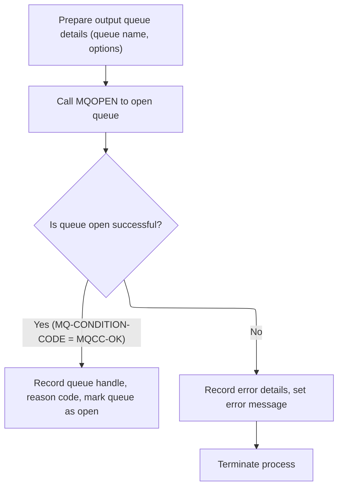

This section ensures that the application has a valid output queue available for sending responses. It enforces that no further processing occurs unless the output queue is successfully opened, maintaining the integrity of message delivery.

| Category        | Rule Name                    | Description                                                                                                                                                                                                                                                                    |
| --------------- | ---------------------------- | ------------------------------------------------------------------------------------------------------------------------------------------------------------------------------------------------------------------------------------------------------------------------------ |
| Data validation | Output Queue Must Be Open    | The output queue must be opened successfully before any response messages can be sent. If the queue cannot be opened, the process must terminate immediately to prevent message loss or misrouting.                                                                            |
| Data validation | Reply Queue Naming Standard  | The reply queue name used for opening the output queue must be set to <SwmToken path="app/app-vsam-mq/cbl/COACCT01.cbl" pos="198:5:11" line-data="016300       MOVE &#39;CARD.DEMO.REPLY.ACCT&#39; TO REPLY-QUEUE-NAME            01328207">`CARD.DEMO.REPLY.ACCT`</SwmToken>. |
| Data validation | Output Queue Status Tracking | The output queue status must be marked as open only if the queue is successfully opened, ensuring that subsequent operations can verify the queue's availability.                                                                                                              |

<SwmSnippet path="/app/app-vsam-mq/cbl/COACCT01.cbl" line="255">

---

In <SwmToken path="app/app-vsam-mq/cbl/COACCT01.cbl" pos="255:2:8" line-data="021400 2400-OPEN-OUTPUT-QUEUE.                                          02210007">`2400-OPEN-OUTPUT-QUEUE`</SwmToken>, we set up the reply queue name, object descriptor, and options for output, then call MQOPEN to get a handle for sending responses.

```cobol
021400 2400-OPEN-OUTPUT-QUEUE.                                          02210007
021500                                                                  02220000
021600* OPEN-OUTPUT WILL OPEN A QUEUE FOR PUT PROCESSING                02230000
021700                                                                  02240000
022100                                                                  02280000
022200     MOVE SPACES            TO MQOD-OBJECTQMGRNAME                02290007
022300     MOVE REPLY-QUEUE-NAME  TO MQOD-OBJECTNAME                    02300007
022400                                                                  02310000
022500     COMPUTE MQ-OPTIONS = MQOO-OUTPUT                             02320000
022600                        + MQOO-PASS-ALL-CONTEXT                   02330000
022700                        + MQOO-FAIL-IF-QUIESCING                  02340007
022800                                                                  02350000
022900     CALL 'MQOPEN' USING QMGR-HANDLE-CONN                         02360000
023000                         MQ-OBJECT-DESCRIPTOR                     02370000
023100                         MQ-OPTIONS                               02380000
023200                         MQ-HOBJ                                  02390000
023300                         MQ-CONDITION-CODE                        02400000
023400                         MQ-REASON-CODE                           02410007
```

---

</SwmSnippet>

<SwmSnippet path="/app/app-vsam-mq/cbl/COACCT01.cbl" line="274">

---

After trying to open the output queue in <SwmToken path="app/app-vsam-mq/cbl/COACCT01.cbl" pos="213:4:10" line-data="014900     PERFORM 2400-OPEN-OUTPUT-QUEUE                               01329907">`2400-OPEN-OUTPUT-QUEUE`</SwmToken>, if it fails, we log the error with <SwmToken path="app/app-vsam-mq/cbl/COACCT01.cbl" pos="285:4:6" line-data="024700              PERFORM 9000-ERROR                                  02540007">`9000-ERROR`</SwmToken> and terminate to avoid running without a valid output destination.

```cobol
023600     EVALUATE MQ-CONDITION-CODE                                   02430000
023700         WHEN MQCC-OK                                             02440000
023800              MOVE MQ-CONDITION-CODE TO MQ-APPL-CONDITION-CODE    02450000
023900              MOVE MQ-REASON-CODE    TO MQ-APPL-REASON-CODE       02460000
024000              MOVE MQ-HOBJ           TO OUTPUT-QUEUE-HANDLE       02470000
024100              SET  RESP-QUEUE-OPEN   TO TRUE                      02480007
024200         WHEN OTHER                                               02490000
024300              MOVE MQ-CONDITION-CODE TO MQ-APPL-CONDITION-CODE    02500000
024400              MOVE MQ-REASON-CODE    TO MQ-APPL-REASON-CODE       02510000
024500              MOVE REPLY-QUEUE-NAME  TO MQ-APPL-QUEUE-NAME        02520000
024600              MOVE 'OUT MQOPEN ERR'  TO MQ-APPL-RETURN-MESSAGE    02530000
024700              PERFORM 9000-ERROR                                  02540007
024800              PERFORM 8000-TERMINATION                            02550007
024900     END-EVALUATE.                                                02560000
```

---

</SwmSnippet>

## Receiving and Preparing Requests

This section governs how incoming requests are received from the message queue, validated for presence, and prepared for downstream processing in the credit card management workflow.

| Category        | Rule Name                       | Description                                                                                                                                                                                                    |
| --------------- | ------------------------------- | -------------------------------------------------------------------------------------------------------------------------------------------------------------------------------------------------------------- |
| Data validation | Queue Initialization Validation | The system must only process requests from queues that have been properly initialized with valid queue handles and names.                                                                                      |
| Business logic  | Successful Message Preparation  | If a message is successfully retrieved from the input queue, the message content, message ID, correlation ID, and reply-to queue name must be extracted and prepared for processing.                           |
| Business logic  | No More Messages Handling       | If no message is available in the input queue within the defined wait interval (5 seconds), the system must set the 'no more messages' flag to indicate there are no further requests to process at this time. |

<SwmSnippet path="/app/app-vsam-mq/cbl/COACCT01.cbl" line="334">

---

In <SwmToken path="app/app-vsam-mq/cbl/COACCT01.cbl" pos="334:2:6" line-data="029900 3000-GET-REQUEST.                                                03060007">`3000-GET-REQUEST`</SwmToken>, we set up the MQGET call with a 5-second wait, a 1000-byte buffer, and combined options for syncpoint, conversion, and waiting. We assume <SwmToken path="app/app-vsam-mq/cbl/COACCT01.cbl" pos="340:4:8" line-data="031100     MOVE INPUT-QUEUE-NAME                TO MQ-QUEUE             03180000">`INPUT-QUEUE-NAME`</SwmToken> and <SwmToken path="app/app-vsam-mq/cbl/COACCT01.cbl" pos="341:4:8" line-data="031200     MOVE INPUT-QUEUE-HANDLE              TO MQ-HOBJ              03190000">`INPUT-QUEUE-HANDLE`</SwmToken> are already valid from earlier setup.

```cobol
029900 3000-GET-REQUEST.                                                03060007
030000* GET WILL GET A MESSAGE FROM THE QUEUE                           03070012
030700*** ADDED 5000 MS (5 SECS) AS THE WAIT INTERVAL FOR GET           03140000
030800     MOVE 5000                            TO MQGMO-WAITINTERVAL   03150000
030900     MOVE SPACES                          TO MQ-CORRELID          03160000
031000     MOVE SPACES                          TO MQ-MSG-ID            03170000
031100     MOVE INPUT-QUEUE-NAME                TO MQ-QUEUE             03180000
031200     MOVE INPUT-QUEUE-HANDLE              TO MQ-HOBJ              03190000
031300     MOVE 1000                            TO MQ-BUFFER-LENGTH     03200000
031400     MOVE MQMI-NONE         TO MQMD-MSGID                         03210000
031500     MOVE MQCI-NONE         TO MQMD-CORRELID                      03220000
031500     INITIALIZE REQUEST-MSG-COPY  REPLACING NUMERIC BY ZEROES     03221000
031600                                                                  03230000
031700     COMPUTE MQGMO-OPTIONS = MQGMO-SYNCPOINT                      03240000
031800                           + MQGMO-FAIL-IF-QUIESCING              03250000
031900                           + MQGMO-CONVERT                        03260000
032000                           + MQGMO-WAIT                           03270000
032100                                                                  03280000
032200     CALL 'MQGET'  USING MQ-HCONN                                 03290000
032300                         MQ-HOBJ                                  03300000
032400                         MQ-MESSAGE-DESCRIPTOR                    03310000
032500                         MQ-GET-MESSAGE-OPTIONS                   03320000
032600                         MQ-BUFFER-LENGTH                         03330000
032700                         MQ-BUFFER                                03340000
032800                         MQ-DATA-LENGTH                           03350000
032900                         MQ-CONDITION-CODE                        03360000
033000                         MQ-REASON-CODE                           03370007
```

---

</SwmSnippet>

<SwmSnippet path="/app/app-vsam-mq/cbl/COACCT01.cbl" line="363">

---

After a successful MQGET in <SwmToken path="app/app-vsam-mq/cbl/COACCT01.cbl" pos="214:4:8" line-data="012700     PERFORM 3000-GET-REQUEST                                     01340007">`3000-GET-REQUEST`</SwmToken>, we move the message and IDs to local variables and call <SwmToken path="app/app-vsam-mq/cbl/COACCT01.cbl" pos="374:4:10" line-data="034400        PERFORM 4000-PROCESS-REQUEST-REPLY                        03510010">`4000-PROCESS-REQUEST-REPLY`</SwmToken> to handle the request. If there's no message, we set <SwmToken path="app/app-vsam-mq/cbl/COACCT01.cbl" pos="216:2:6" line-data="012900             NO-MORE-MSGS                                         01360007">`NO-MORE-MSGS`</SwmToken>; for other errors, we log and terminate.

```cobol
033300     IF MQ-CONDITION-CODE = MQCC-OK                               03400000
033400        MOVE MQMD-MSGID        TO MQ-MSG-ID                       03410000
033500        MOVE MQMD-CORRELID     TO MQ-CORRELID                     03420000
033600        MOVE MQMD-REPLYTOQ     TO MQ-QUEUE-REPLY                  03430000
033700        MOVE MQ-CONDITION-CODE TO MQ-APPL-CONDITION-CODE          03440000
033800        MOVE MQ-REASON-CODE    TO MQ-APPL-REASON-CODE             03450000
033900        MOVE MQ-BUFFER         TO REQUEST-MESSAGE                 03460000
034000        MOVE MQ-CORRELID       TO SAVE-CORELID                    03470000
034100        MOVE MQ-QUEUE-REPLY    TO SAVE-REPLY2Q                    03480000
034200        MOVE MQ-MSG-ID         TO SAVE-MSGID                      03490000
034300        MOVE REQUEST-MESSAGE   TO REQUEST-MSG-COPY                03500000
034400        PERFORM 4000-PROCESS-REQUEST-REPLY                        03510010
034500        ADD  1                 TO MQ-MSG-COUNT                    03520000
```

---

</SwmSnippet>

### Processing and Responding to Requests

This section is responsible for receiving, interpreting, and responding to account-related requests from the message queue. It ensures that each request is validated, processed according to business rules, and results in a structured response or an appropriate error message.

| Category        | Rule Name                      | Description                                                                                                                                                                                                                  |
| --------------- | ------------------------------ | ---------------------------------------------------------------------------------------------------------------------------------------------------------------------------------------------------------------------------- |
| Data validation | Account Identifier Validation  | A request must include a valid account identifier. If the account identifier is missing or invalid, the request is rejected and an error response is generated.                                                              |
| Data validation | Account Data Integrity         | If any required account field is missing or contains invalid data (e.g., non-numeric balance), the system must return an error response indicating a data integrity issue.                                                   |
| Business logic  | Comprehensive Account Response | The response must include the current account status, balance, credit limit, cash credit limit, open date, expiration date, reissue date, group ID, current cycle credit, and current cycle debit for the requested account. |
| Technical step  | Reply Queue Enforcement        | All responses, whether successful or error, must be sent to the reply queue specified in the request context.                                                                                                                |

See <SwmLink doc-title="Processing Account Inquiry Requests">[Processing Account Inquiry Requests](/.swm/processing-account-inquiry-requests.z09v5z6w.sw.md)</SwmLink>

### Handling No More Messages or MQGET Errors

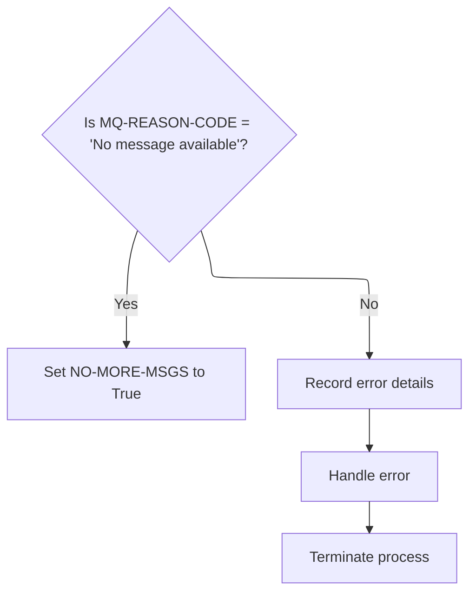

<SwmSnippet path="/app/app-vsam-mq/cbl/COACCT01.cbl" line="376">

---

After returning from <SwmToken path="app/app-vsam-mq/cbl/COACCT01.cbl" pos="374:4:10" line-data="034400        PERFORM 4000-PROCESS-REQUEST-REPLY                        03510010">`4000-PROCESS-REQUEST-REPLY`</SwmToken> in <SwmToken path="app/app-vsam-mq/cbl/COACCT01.cbl" pos="214:4:8" line-data="012700     PERFORM 3000-GET-REQUEST                                     01340007">`3000-GET-REQUEST`</SwmToken>, we check if the MQGET reason code is <SwmToken path="app/app-vsam-mq/cbl/COACCT01.cbl" pos="377:12:18" line-data="034700        IF MQ-REASON-CODE  =  MQRC-NO-MSG-AVAILABLE               03540011">`MQRC-NO-MSG-AVAILABLE`</SwmToken>. If so, we set <SwmToken path="app/app-vsam-mq/cbl/COACCT01.cbl" pos="378:4:8" line-data="034800          SET NO-MORE-MSGS             TO  TRUE                   03550007">`NO-MORE-MSGS`</SwmToken> to TRUE, which tells the rest of the flow that there are no more messages to process and to stop looping for new requests.

```cobol
034600     ELSE                                                         03530000
034700        IF MQ-REASON-CODE  =  MQRC-NO-MSG-AVAILABLE               03540011
034800          SET NO-MORE-MSGS             TO  TRUE                   03550007
```

---

</SwmSnippet>

<SwmSnippet path="/app/app-vsam-mq/cbl/COACCT01.cbl" line="380">

---

If MQGET fails for any reason other than 'no message available', <SwmToken path="app/app-vsam-mq/cbl/COACCT01.cbl" pos="214:4:8" line-data="012700     PERFORM 3000-GET-REQUEST                                     01340007">`3000-GET-REQUEST`</SwmToken> logs the error details by calling <SwmToken path="app/app-vsam-mq/cbl/COACCT01.cbl" pos="385:4:6" line-data="035500           PERFORM 9000-ERROR                                     03620007">`9000-ERROR`</SwmToken>, then immediately calls <SwmToken path="app/app-vsam-mq/cbl/COACCT01.cbl" pos="386:4:6" line-data="035600           PERFORM 8000-TERMINATION                               03630007">`8000-TERMINATION`</SwmToken> to shut down. This guarantees that all unexpected failures are captured in the error queue before the program exits.

```cobol
035000        ELSE                                                      03570000
035100           MOVE MQ-CONDITION-CODE TO MQ-APPL-CONDITION-CODE       03580000
035200           MOVE MQ-REASON-CODE    TO MQ-APPL-REASON-CODE          03590000
035300           MOVE INPUT-QUEUE-NAME  TO MQ-APPL-QUEUE-NAME           03600000
035400           MOVE 'INP MQGET ERR:'  TO MQ-APPL-RETURN-MESSAGE       03610000
035500           PERFORM 9000-ERROR                                     03620007
035600           PERFORM 8000-TERMINATION                               03630007
035700       END-IF                                                     03640000
035800     END-IF.                                                      03650000
```

---

</SwmSnippet>

## Main Processing Loop and Transaction Commit

<SwmSnippet path="/app/app-vsam-mq/cbl/COACCT01.cbl" line="325">

---

<SwmToken path="app/app-vsam-mq/cbl/COACCT01.cbl" pos="325:2:6" line-data="029000 4000-MAIN-PROCESS.                                               02970007">`4000-MAIN-PROCESS`</SwmToken> commits the last transaction, then fetches the next request to keep the processing loop going.

```cobol
029000 4000-MAIN-PROCESS.                                               02970007
029100     EXEC CICS                                                    02980000
029200          SYNCPOINT                                               02990000
029300     END-EXEC                                                     03000000
029400                                                                  03010000
029500     PERFORM 3000-GET-REQUEST                                     03020007
```

---

</SwmSnippet>

&nbsp;

*This is an auto-generated document by Swimm 🌊 and has not yet been verified by a human*

<SwmMeta version="3.0.0" repo-id="Z2l0aHViJTNBJTNBYXdzLW1haW5mcmFtZS1tb2Rlcm5pemF0aW9uLWNhcmRkZW1vJTNBJTNBbXVkYXNpbjE=" repo-name="aws-mainframe-modernization-carddemo"><sup>Powered by [Swimm](https://app.swimm.io/)</sup></SwmMeta>
