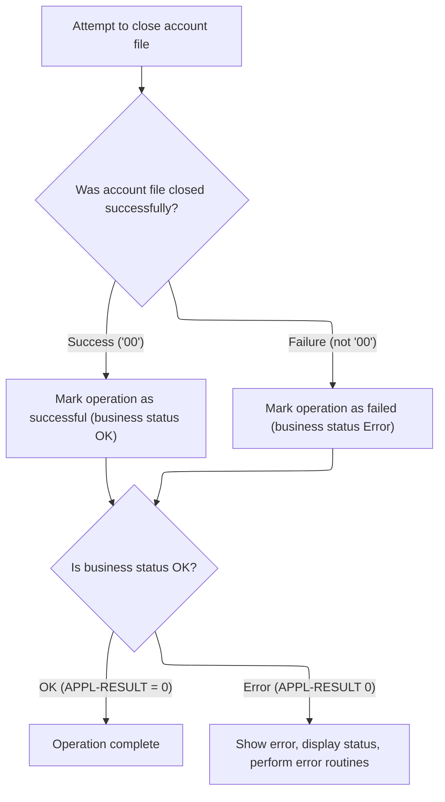

# Overview

This document describes the flow of processing account records in the credit card management system. Account data is read from an input file, transformed according to business rules, and written to multiple output files for downstream use.

## Dependencies

### Programs

- <SwmToken path="app/cbl/CBACT01C.cbl" pos="141:14:14" line-data="           DISPLAY &#39;START OF EXECUTION OF PROGRAM CBACT01C&#39;.">`CBACT01C`</SwmToken> (<SwmPath>[app/cbl/CBACT01C.cbl](app/cbl/CBACT01C.cbl)</SwmPath>)
- COBDATFT
- <SwmToken path="app/cbl/CBACT01C.cbl" pos="410:4:4" line-data="           CALL &#39;CEE3ABD&#39; USING ABCODE, TIMING.">`CEE3ABD`</SwmToken>

### Copybooks

- <SwmToken path="app/cbl/CBACT01C.cbl" pos="89:3:3" line-data="       COPY CVACT01Y.">`CVACT01Y`</SwmToken> (<SwmPath>[scripts/markers/CVACT01Y](scripts/markers/CVACT01Y)</SwmPath>)
- CODATECN (<SwmPath>[app/cpy/CODATECN.cpy](app/cpy/CODATECN.cpy)</SwmPath>)

# Where is this program used?

This program is used once, as represented in the following diagram:


## Input and Output Tables/Files used in the Program

| Table / File Name                                                                                                                             | Type | Description                                           | Usage Mode | Key Fields / Layout Highlights |
| --------------------------------------------------------------------------------------------------------------------------------------------- | ---- | ----------------------------------------------------- | ---------- | ------------------------------ |
| <SwmToken path="app/cbl/CBACT01C.cbl" pos="166:3:5" line-data="           READ ACCTFILE-FILE INTO ACCOUNT-RECORD.">`ACCTFILE-FILE`</SwmToken> | File | Indexed file of credit card account master records    | Input      | File resource                  |
| <SwmToken path="app/cbl/CBACT01C.cbl" pos="169:3:7" line-data="               INITIALIZE ARR-ARRAY-REC">`ARR-ARRAY-REC`</SwmToken>            | File | Output record with account ID and period balances     | Output     | File resource                  |
| <SwmToken path="app/cbl/CBACT01C.cbl" pos="354:5:7" line-data="           OPEN OUTPUT ARRY-FILE">`ARRY-FILE`</SwmToken>                       | File | Sequential file for account balances across periods   | Output     | File resource                  |
| <SwmToken path="app/cbl/CBACT01C.cbl" pos="243:3:7" line-data="           WRITE OUT-ACCT-REC.">`OUT-ACCT-REC`</SwmToken>                      | File | Output record with account summary and status fields  | Output     | File resource                  |
| <SwmToken path="app/cbl/CBACT01C.cbl" pos="336:5:7" line-data="           OPEN OUTPUT OUT-FILE">`OUT-FILE`</SwmToken>                         | File | Sequential file for processed account summary records | Output     | File resource                  |
| <SwmToken path="app/cbl/CBACT01C.cbl" pos="289:9:11" line-data="           MOVE VBRC-REC1 TO VBR-REC(1:WS-RECD-LEN).">`VBR-REC`</SwmToken>    | File | Variable-length record for account ID and key fields  | Output     | File resource                  |
| <SwmToken path="app/cbl/CBACT01C.cbl" pos="372:5:7" line-data="           OPEN OUTPUT VBRC-FILE">`VBRC-FILE`</SwmToken>                       | File | Variable-length file for compact account extracts     | Output     | File resource                  |

&nbsp;

# Workflow

# Starting the Account Processing Routine


This section ensures that all required files are successfully opened and validated before any account processing begins. It governs the flow of account record processing, including error handling for file operations and the orderly processing of each account record until completion or error.

| Category        | Rule Name                     | Description                                                                                                                                                                                                                                                                              |
| --------------- | ----------------------------- | ---------------------------------------------------------------------------------------------------------------------------------------------------------------------------------------------------------------------------------------------------------------------------------------- |
| Data validation | Account File Validation       | The account input file must be successfully opened and validated before any processing can occur. If the file cannot be opened, the program must terminate and display an error message.                                                                                                 |
| Data validation | Output File Validation        | All required output files (account data, array output, variable block output) must be successfully opened before processing begins. If any file cannot be opened, the program must terminate and display an error message.                                                               |
| Business logic  | Start Message Display         | The program must display a start message to indicate the beginning of the account processing routine.                                                                                                                                                                                    |
| Business logic  | Sequential Account Processing | Each account record must be processed in sequence until the end-of-file condition is reached, as indicated by the <SwmToken path="app/cbl/CBACT01C.cbl" pos="147:5:9" line-data="           PERFORM UNTIL END-OF-FILE = &#39;Y&#39;">`END-OF-FILE`</SwmToken> variable being set to 'Y'. |
| Business logic  | End Message and File Closure  | Upon reaching the end of the account file, the program must close all open files and display an end message to indicate successful completion of processing.                                                                                                                             |

<SwmSnippet path="/app/cbl/CBACT01C.cbl" line="140">

---

In <SwmToken path="app/cbl/CBACT01C.cbl" pos="140:1:3" line-data="       PROCEDURE DIVISION.">`PROCEDURE DIVISION`</SwmToken>, we start by opening the account file to make sure we can read data before doing anything else. If it fails, we bail early.

```cobol
       PROCEDURE DIVISION.
           DISPLAY 'START OF EXECUTION OF PROGRAM CBACT01C'.
           PERFORM 0000-ACCTFILE-OPEN.
           PERFORM 2000-OUTFILE-OPEN.
           PERFORM 3000-ARRFILE-OPEN.
           PERFORM 4000-VBRFILE-OPEN.
```

---

</SwmSnippet>

## Opening and Validating the Account File


This section ensures that the account file is available for processing by validating the file open operation and handling any errors that occur during this step. It is a critical gatekeeper for subsequent business logic that depends on file access.

| Category        | Rule Name                 | Description                                                                                                                                                                                                                                                                                                     |
| --------------- | ------------------------- | --------------------------------------------------------------------------------------------------------------------------------------------------------------------------------------------------------------------------------------------------------------------------------------------------------------- |
| Data validation | Successful File Open      | If the account file is successfully opened, the business status must be set to OK (<SwmToken path="app/cbl/CBACT01C.cbl" pos="168:7:9" line-data="               MOVE 0 TO APPL-RESULT">`APPL-RESULT`</SwmToken> = 0).                                                                                          |
| Data validation | Gatekeeper for Processing | Processing must only continue if the business status is OK (<SwmToken path="app/cbl/CBACT01C.cbl" pos="168:7:9" line-data="               MOVE 0 TO APPL-RESULT">`APPL-RESULT`</SwmToken> = 0 / <SwmToken path="app/cbl/CBACT01C.cbl" pos="186:3:5" line-data="           IF  APPL-AOK">`APPL-AOK`</SwmToken>). |

<SwmSnippet path="/app/cbl/CBACT01C.cbl" line="317">

---

In <SwmToken path="app/cbl/CBACT01C.cbl" pos="317:1:5" line-data="       0000-ACCTFILE-OPEN.">`0000-ACCTFILE-OPEN`</SwmToken> we set up a status flag, try to open the account file for input, and update <SwmToken path="app/cbl/CBACT01C.cbl" pos="318:7:9" line-data="           MOVE 8 TO APPL-RESULT.">`APPL-RESULT`</SwmToken> based on whether the open succeeded or failed. This sets up the next error handling step if needed.

```cobol
       0000-ACCTFILE-OPEN.
           MOVE 8 TO APPL-RESULT.
           OPEN INPUT ACCTFILE-FILE
           IF  ACCTFILE-STATUS = '00'
               MOVE 0 TO APPL-RESULT
           ELSE
               MOVE 12 TO APPL-RESULT
           END-IF
```

---

</SwmSnippet>

<SwmSnippet path="/app/cbl/CBACT01C.cbl" line="325">

---

After trying to open the account file, if it fails, we display an error, copy the file status to <SwmToken path="app/cbl/CBACT01C.cbl" pos="329:9:11" line-data="               MOVE ACCTFILE-STATUS TO IO-STATUS">`IO-STATUS`</SwmToken>, and call <SwmToken path="app/cbl/CBACT01C.cbl" pos="330:3:9" line-data="               PERFORM 9910-DISPLAY-IO-STATUS">`9910-DISPLAY-IO-STATUS`</SwmToken> to show the exact IO error before terminating. This makes error tracking easier.

```cobol
           IF  APPL-AOK
               CONTINUE
           ELSE
               DISPLAY 'ERROR OPENING ACCTFILE'
               MOVE ACCTFILE-STATUS TO IO-STATUS
               PERFORM 9910-DISPLAY-IO-STATUS
               PERFORM 9999-ABEND-PROGRAM
           END-IF
           EXIT.
```

---

</SwmSnippet>

<SwmSnippet path="/app/cbl/CBACT01C.cbl" line="413">

---

<SwmToken path="app/cbl/CBACT01C.cbl" pos="413:1:7" line-data="       9910-DISPLAY-IO-STATUS.">`9910-DISPLAY-IO-STATUS`</SwmToken> checks if the IO status is non-numeric or starts with '9', then builds a custom status code for display using <SwmToken path="app/cbl/CBACT01C.cbl" pos="416:9:13" line-data="               MOVE IO-STAT1 TO IO-STATUS-04(1:1)">`IO-STATUS-04`</SwmToken> and <SwmToken path="app/cbl/CBACT01C.cbl" pos="417:7:11" line-data="               MOVE 0        TO TWO-BYTES-BINARY">`TWO-BYTES-BINARY`</SwmToken>. Otherwise, it resets the status and displays it. This makes error codes easier to interpret.

```cobol
       9910-DISPLAY-IO-STATUS.
           IF  IO-STATUS NOT NUMERIC
           OR  IO-STAT1 = '9'
               MOVE IO-STAT1 TO IO-STATUS-04(1:1)
               MOVE 0        TO TWO-BYTES-BINARY
               MOVE IO-STAT2 TO TWO-BYTES-RIGHT
               MOVE TWO-BYTES-BINARY TO IO-STATUS-0403
               DISPLAY 'FILE STATUS IS: NNNN' IO-STATUS-04
           ELSE
               MOVE '0000' TO IO-STATUS-04
               MOVE IO-STATUS TO IO-STATUS-04(3:2)
               DISPLAY 'FILE STATUS IS: NNNN' IO-STATUS-04
           END-IF
           EXIT.
```

---

</SwmSnippet>

## Opening the Output File for Account Data


This section governs how the system attempts to open the output file for account data, determines the outcome, and handles any errors that may occur during the process. It ensures that the file is ready for subsequent operations or that failures are clearly communicated and handled.

| Category        | Rule Name            | Description                                                                            |
| --------------- | -------------------- | -------------------------------------------------------------------------------------- |
| Data validation | Successful File Open | If the output file is opened successfully, the result code must be set to 0 (success). |
| Data validation | File Open Failure    | If the output file fails to open, the result code must be set to 12 (failure).         |

<SwmSnippet path="/app/cbl/CBACT01C.cbl" line="334">

---

In <SwmToken path="app/cbl/CBACT01C.cbl" pos="334:1:5" line-data="       2000-OUTFILE-OPEN.">`2000-OUTFILE-OPEN`</SwmToken> we set <SwmToken path="app/cbl/CBACT01C.cbl" pos="335:7:9" line-data="           MOVE 8 TO APPL-RESULT.">`APPL-RESULT`</SwmToken> to 8, try to open the output file, and update the status to 0 or 12 depending on the result. This sets up error handling if the file can't be opened.

```cobol
       2000-OUTFILE-OPEN.
           MOVE 8 TO APPL-RESULT.
           OPEN OUTPUT OUT-FILE
           IF   OUTFILE-STATUS = '00'
               MOVE 0 TO APPL-RESULT
           ELSE
               MOVE 12 TO APPL-RESULT
           END-IF
```

---

</SwmSnippet>

<SwmSnippet path="/app/cbl/CBACT01C.cbl" line="342">

---

After trying to open the output file, if it fails, we display the error status, copy <SwmToken path="app/cbl/CBACT01C.cbl" pos="345:11:13" line-data="               DISPLAY &#39;ERROR OPENING OUTFILE&#39;  OUTFILE-STATUS">`OUTFILE-STATUS`</SwmToken> to <SwmToken path="app/cbl/CBACT01C.cbl" pos="346:9:11" line-data="               MOVE  OUTFILE-STATUS TO IO-STATUS">`IO-STATUS`</SwmToken>, and call <SwmToken path="app/cbl/CBACT01C.cbl" pos="347:3:9" line-data="               PERFORM 9910-DISPLAY-IO-STATUS">`9910-DISPLAY-IO-STATUS`</SwmToken> for diagnostics before terminating. This helps pinpoint file issues.

```cobol
           IF  APPL-AOK
               CONTINUE
           ELSE
               DISPLAY 'ERROR OPENING OUTFILE'  OUTFILE-STATUS
               MOVE  OUTFILE-STATUS TO IO-STATUS
               PERFORM 9910-DISPLAY-IO-STATUS
               PERFORM 9999-ABEND-PROGRAM
           END-IF
           EXIT.
```

---

</SwmSnippet>

## Opening the Array Output File


This section governs how the application attempts to open the array output file and determines the business flow based on the success or failure of this operation. It ensures that file access issues are detected early and handled in a way that supports diagnostics and system reliability.

| Category       | Rule Name                | Description                                                                                       |
| -------------- | ------------------------ | ------------------------------------------------------------------------------------------------- |
| Business logic | File Open Success Status | If the array output file is opened successfully, the business status must be set to 'Success'.    |
| Business logic | File Open Failure Status | If the array output file fails to open, the business status must be set to 'File Open Failed'.    |
| Business logic | Continue on Success      | If the business status is 'Success', the application must continue with the normal business flow. |

<SwmSnippet path="/app/cbl/CBACT01C.cbl" line="352">

---

In <SwmToken path="app/cbl/CBACT01C.cbl" pos="352:1:5" line-data="       3000-ARRFILE-OPEN.">`3000-ARRFILE-OPEN`</SwmToken> we set <SwmToken path="app/cbl/CBACT01C.cbl" pos="353:7:9" line-data="           MOVE 8 TO APPL-RESULT.">`APPL-RESULT`</SwmToken>, try to open the array output file, and update the status depending on success or failure. This sets up error handling for array file access.

```cobol
       3000-ARRFILE-OPEN.
           MOVE 8 TO APPL-RESULT.
           OPEN OUTPUT ARRY-FILE
           IF   ARRYFILE-STATUS = '00'
               MOVE 0 TO APPL-RESULT
           ELSE
               MOVE 12 TO APPL-RESULT
           END-IF
```

---

</SwmSnippet>

<SwmSnippet path="/app/cbl/CBACT01C.cbl" line="360">

---

After trying to open the array file, if it fails, we display the error status, copy <SwmToken path="app/cbl/CBACT01C.cbl" pos="363:11:13" line-data="               DISPLAY &#39;ERROR OPENING ARRAYFILE&#39;  ARRYFILE-STATUS">`ARRYFILE-STATUS`</SwmToken> to <SwmToken path="app/cbl/CBACT01C.cbl" pos="364:9:11" line-data="               MOVE  ARRYFILE-STATUS TO IO-STATUS">`IO-STATUS`</SwmToken>, and call <SwmToken path="app/cbl/CBACT01C.cbl" pos="365:3:9" line-data="               PERFORM 9910-DISPLAY-IO-STATUS">`9910-DISPLAY-IO-STATUS`</SwmToken> for diagnostics before terminating. This helps pinpoint file issues.

```cobol
           IF  APPL-AOK
               CONTINUE
           ELSE
               DISPLAY 'ERROR OPENING ARRAYFILE'  ARRYFILE-STATUS
               MOVE  ARRYFILE-STATUS TO IO-STATUS
               PERFORM 9910-DISPLAY-IO-STATUS
               PERFORM 9999-ABEND-PROGRAM
           END-IF
           EXIT.
```

---

</SwmSnippet>

## Preparing for Variable Block Output


<SwmSnippet path="/app/cbl/CBACT01C.cbl" line="140">

---

Back in <SwmToken path="app/cbl/CBACT01C.cbl" pos="140:1:3" line-data="       PROCEDURE DIVISION.">`PROCEDURE DIVISION`</SwmToken>, after opening the array file, we move on to <SwmToken path="app/cbl/CBACT01C.cbl" pos="145:3:7" line-data="           PERFORM 4000-VBRFILE-OPEN.">`4000-VBRFILE-OPEN`</SwmToken> to get the variable block output file ready. This file is needed for writing account data in a flexible format.

```cobol
       PROCEDURE DIVISION.
           DISPLAY 'START OF EXECUTION OF PROGRAM CBACT01C'.
           PERFORM 0000-ACCTFILE-OPEN.
           PERFORM 2000-OUTFILE-OPEN.
           PERFORM 3000-ARRFILE-OPEN.
           PERFORM 4000-VBRFILE-OPEN.
```

---

</SwmSnippet>

## Opening the Variable Block Output File


This section governs the business rules for opening the variable block output file, ensuring that the application only proceeds if the file is available and accessible. It also ensures that any issues encountered during the file open operation are clearly communicated and handled according to business requirements.

| Category        | Rule Name                   | Description                                                                                                                                                                                                                                        |
| --------------- | --------------------------- | -------------------------------------------------------------------------------------------------------------------------------------------------------------------------------------------------------------------------------------------------- |
| Data validation | File Open Required          | The application must attempt to open the variable block output file before proceeding with any operations that require file output.                                                                                                                |
| Business logic  | Successful File Open Status | If the file is opened successfully (file status '00'), the application status must be set to indicate success (<SwmToken path="app/cbl/CBACT01C.cbl" pos="168:7:9" line-data="               MOVE 0 TO APPL-RESULT">`APPL-RESULT`</SwmToken> = 0). |
| Business logic  | Failed File Open Status     | If the file open fails (file status not '00'), the application status must be set to indicate failure (<SwmToken path="app/cbl/CBACT01C.cbl" pos="168:7:9" line-data="               MOVE 0 TO APPL-RESULT">`APPL-RESULT`</SwmToken> = 12).        |
| Business logic  | Continue on Success         | If the application status is OK (<SwmToken path="app/cbl/CBACT01C.cbl" pos="168:7:9" line-data="               MOVE 0 TO APPL-RESULT">`APPL-RESULT`</SwmToken> = 0), the process continues without interruption.                                   |

<SwmSnippet path="/app/cbl/CBACT01C.cbl" line="370">

---

In <SwmToken path="app/cbl/CBACT01C.cbl" pos="370:1:5" line-data="       4000-VBRFILE-OPEN.">`4000-VBRFILE-OPEN`</SwmToken> we set <SwmToken path="app/cbl/CBACT01C.cbl" pos="371:7:9" line-data="           MOVE 8 TO APPL-RESULT.">`APPL-RESULT`</SwmToken> to 8, try to open the variable block output file, and update the status to 0 or 12 depending on the result. This sets up error handling if the file can't be opened.

```cobol
       4000-VBRFILE-OPEN.
           MOVE 8 TO APPL-RESULT.
           OPEN OUTPUT VBRC-FILE
           IF   VBRCFILE-STATUS = '00'
               MOVE 0 TO APPL-RESULT
           ELSE
               MOVE 12 TO APPL-RESULT
           END-IF
```

---

</SwmSnippet>

<SwmSnippet path="/app/cbl/CBACT01C.cbl" line="378">

---

After trying to open the variable block file, if it fails, we display the error status, copy <SwmToken path="app/cbl/CBACT01C.cbl" pos="381:13:15" line-data="               DISPLAY &#39;ERROR OPENING VBRC FILE&#39;  VBRCFILE-STATUS">`VBRCFILE-STATUS`</SwmToken> to <SwmToken path="app/cbl/CBACT01C.cbl" pos="382:9:11" line-data="               MOVE  VBRCFILE-STATUS TO IO-STATUS">`IO-STATUS`</SwmToken>, and call <SwmToken path="app/cbl/CBACT01C.cbl" pos="383:3:9" line-data="               PERFORM 9910-DISPLAY-IO-STATUS">`9910-DISPLAY-IO-STATUS`</SwmToken> for diagnostics before terminating. This helps pinpoint file issues.

```cobol
           IF  APPL-AOK
               CONTINUE
           ELSE
               DISPLAY 'ERROR OPENING VBRC FILE'  VBRCFILE-STATUS
               MOVE  VBRCFILE-STATUS TO IO-STATUS
               PERFORM 9910-DISPLAY-IO-STATUS
               PERFORM 9999-ABEND-PROGRAM
           END-IF
           EXIT.
```

---

</SwmSnippet>

## Processing Account Records


<SwmSnippet path="/app/cbl/CBACT01C.cbl" line="147">

---

Back in <SwmToken path="app/cbl/CBACT01C.cbl" pos="140:1:3" line-data="       PROCEDURE DIVISION.">`PROCEDURE DIVISION`</SwmToken>, after opening all files, we enter a loop to process each account record. We call <SwmToken path="app/cbl/CBACT01C.cbl" pos="149:3:9" line-data="                   PERFORM 1000-ACCTFILE-GET-NEXT">`1000-ACCTFILE-GET-NEXT`</SwmToken> to fetch and handle the next record, repeating until <SwmToken path="app/cbl/CBACT01C.cbl" pos="147:5:9" line-data="           PERFORM UNTIL END-OF-FILE = &#39;Y&#39;">`END-OF-FILE`</SwmToken> is set.

```cobol
           PERFORM UNTIL END-OF-FILE = 'Y'
               IF  END-OF-FILE = 'N'
                   PERFORM 1000-ACCTFILE-GET-NEXT
                   IF  END-OF-FILE = 'N'
                       DISPLAY ACCOUNT-RECORD
                   END-IF
               END-IF
           END-PERFORM.
```

---

</SwmSnippet>

## Reading and Processing the Next Account Record

This section governs the retrieval and preparation of the next account record for downstream processing, ensuring that only valid records are processed and that appropriate status codes are set for end-of-file or error conditions.

| Category        | Rule Name               | Description                                                                                                                                                                      |
| --------------- | ----------------------- | -------------------------------------------------------------------------------------------------------------------------------------------------------------------------------- |
| Data validation | Successful Account Read | If the account file status is '00', the account record is considered successfully read and is eligible for further processing and output.                                        |
| Business logic  | Account Data Formatting | When a record is successfully read, the account data must be formatted and prepared for output, including reformatting the reissue date to meet business reporting requirements. |

<SwmSnippet path="/app/cbl/CBACT01C.cbl" line="165">

---

In <SwmToken path="app/cbl/CBACT01C.cbl" pos="165:1:7" line-data="       1000-ACCTFILE-GET-NEXT.">`1000-ACCTFILE-GET-NEXT`</SwmToken> we read the next account record, display it, and then call <SwmToken path="app/cbl/CBACT01C.cbl" pos="171:3:9" line-data="               PERFORM 1300-POPUL-ACCT-RECORD">`1300-POPUL-ACCT-RECORD`</SwmToken> to format and prep the data for output. This sets up the rest of the output steps.

```cobol
       1000-ACCTFILE-GET-NEXT.
           READ ACCTFILE-FILE INTO ACCOUNT-RECORD.
           IF  ACCTFILE-STATUS = '00'
               MOVE 0 TO APPL-RESULT
               INITIALIZE ARR-ARRAY-REC
               PERFORM 1100-DISPLAY-ACCT-RECORD
               PERFORM 1300-POPUL-ACCT-RECORD
               PERFORM 1350-WRITE-ACCT-RECORD
               PERFORM 1400-POPUL-ARRAY-RECORD
               PERFORM 1450-WRITE-ARRY-RECORD
               INITIALIZE VBRC-REC1
               PERFORM 1500-POPUL-VBRC-RECORD
               PERFORM 1550-WRITE-VB1-RECORD
               PERFORM 1575-WRITE-VB2-RECORD
           ELSE
               IF  ACCTFILE-STATUS = '10'
                   MOVE 16 TO APPL-RESULT
               ELSE
                   MOVE 12 TO APPL-RESULT
               END-IF
```

---

</SwmSnippet>

### Populating the Output Account Record


This section ensures that all necessary account information is accurately transferred to the output record, applying business rules for date formatting and default values to maintain data consistency and meet downstream processing requirements.

| Category       | Rule Name                | Description                                                                                                                                                                                                                                                                             |
| -------------- | ------------------------ | --------------------------------------------------------------------------------------------------------------------------------------------------------------------------------------------------------------------------------------------------------------------------------------- |
| Business logic | Field Copy Consistency   | All account fields are copied from the input record to the output record, except for the reissue date and current cycle debit, which are handled by specific rules.                                                                                                                     |
| Business logic | Reissue Date Formatting  | The reissue date in the output record must be formatted according to the required output format, regardless of the input format.                                                                                                                                                        |
| Business logic | Default Debit Value      | If the current cycle debit in the input record is zero, the output record must set the current cycle debit to <SwmToken path="app/cbl/CBACT01C.cbl" pos="237:3:5" line-data="               MOVE 2525.00         TO   OUT-ACCT-CURR-CYC-DEBIT">`2525.00`</SwmToken> as a default value. |
| Business logic | Debit Value Preservation | If the current cycle debit in the input record is not zero, the value is copied as-is to the output record.                                                                                                                                                                             |

<SwmSnippet path="/app/cbl/CBACT01C.cbl" line="215">

---

We copy fields and call 'COBDATFT' to format the reissue date for the output record.

```cobol
       1300-POPUL-ACCT-RECORD.
           MOVE   ACCT-ID                 TO   OUT-ACCT-ID.
           MOVE   ACCT-ACTIVE-STATUS      TO   OUT-ACCT-ACTIVE-STATUS.
           MOVE   ACCT-CURR-BAL           TO   OUT-ACCT-CURR-BAL.
           MOVE   ACCT-CREDIT-LIMIT       TO   OUT-ACCT-CREDIT-LIMIT.
           MOVE   ACCT-CASH-CREDIT-LIMIT  TO OUT-ACCT-CASH-CREDIT-LIMIT.
           MOVE   ACCT-OPEN-DATE          TO   OUT-ACCT-OPEN-DATE.
           MOVE   ACCT-EXPIRAION-DATE     TO   OUT-ACCT-EXPIRAION-DATE.
           MOVE   ACCT-REISSUE-DATE       TO   CODATECN-INP-DATE
                                               WS-REISSUE-DATE.
           MOVE   '2'                     TO   CODATECN-TYPE.
           MOVE   '2'                     TO   CODATECN-OUTTYPE.

      *---------------------------------------------------------------*
      *CALL ASSEMBLER PROGRAM FOR DATE FORMATTING                     *
      *---------------------------------------------------------------*
           CALL 'COBDATFT'       USING CODATECN-REC.

           MOVE   CODATECN-0UT-DATE       TO   OUT-ACCT-REISSUE-DATE.

           MOVE   ACCT-CURR-CYC-CREDIT    TO   OUT-ACCT-CURR-CYC-CREDIT.
```

---

</SwmSnippet>

<SwmSnippet path="/app/cbl/CBACT01C.cbl" line="236">

---

After formatting and copying fields, if the input debit is zero, we set <SwmToken path="app/cbl/CBACT01C.cbl" pos="237:9:17" line-data="               MOVE 2525.00         TO   OUT-ACCT-CURR-CYC-DEBIT">`OUT-ACCT-CURR-CYC-DEBIT`</SwmToken> to <SwmToken path="app/cbl/CBACT01C.cbl" pos="237:3:5" line-data="               MOVE 2525.00         TO   OUT-ACCT-CURR-CYC-DEBIT">`2525.00`</SwmToken> as a default. The rest of the fields are copied straight over.

```cobol
           IF  ACCT-CURR-CYC-DEBIT EQUAL TO ZERO
               MOVE 2525.00         TO   OUT-ACCT-CURR-CYC-DEBIT
           END-IF.
           MOVE   ACCT-GROUP-ID           TO   OUT-ACCT-GROUP-ID.
           EXIT.
```

---

</SwmSnippet>

### Writing and Populating Output Records


<SwmSnippet path="/app/cbl/CBACT01C.cbl" line="242">

---

<SwmToken path="app/cbl/CBACT01C.cbl" pos="242:1:7" line-data="       1350-WRITE-ACCT-RECORD.">`1350-WRITE-ACCT-RECORD`</SwmToken> writes the output account record and checks the file status. If it's not '00' or '10', we display the error, show IO status, and terminate. This catches write errors right away.

```cobol
       1350-WRITE-ACCT-RECORD.
           WRITE OUT-ACCT-REC.

           IF OUTFILE-STATUS NOT = '00' AND OUTFILE-STATUS NOT = '10'
              DISPLAY 'ACCOUNT FILE WRITE STATUS IS:'  OUTFILE-STATUS
              MOVE OUTFILE-STATUS  TO IO-STATUS
              PERFORM 9910-DISPLAY-IO-STATUS
              PERFORM 9999-ABEND-PROGRAM
           END-IF.
           EXIT.
```

---

</SwmSnippet>

<SwmSnippet path="/app/cbl/CBACT01C.cbl" line="253">

---

<SwmToken path="app/cbl/CBACT01C.cbl" pos="253:1:7" line-data="       1400-POPUL-ARRAY-RECORD.">`1400-POPUL-ARRAY-RECORD`</SwmToken> fills the array record with the account ID, current balance, and a mix of hardcoded and variable debit values. These constants are baked in and affect the output arrays.

```cobol
       1400-POPUL-ARRAY-RECORD.
           MOVE   ACCT-ID         TO   ARR-ACCT-ID.
           MOVE   ACCT-CURR-BAL   TO   ARR-ACCT-CURR-BAL(1).
           MOVE   1005.00         TO   ARR-ACCT-CURR-CYC-DEBIT(1).
           MOVE   ACCT-CURR-BAL   TO   ARR-ACCT-CURR-BAL(2).
           MOVE   1525.00         TO   ARR-ACCT-CURR-CYC-DEBIT(2).
           MOVE   -1025.00        TO   ARR-ACCT-CURR-BAL(3).
           MOVE   -2500.00        TO   ARR-ACCT-CURR-CYC-DEBIT(3).
           EXIT.
```

---

</SwmSnippet>

<SwmSnippet path="/app/cbl/CBACT01C.cbl" line="263">

---

<SwmToken path="app/cbl/CBACT01C.cbl" pos="263:1:7" line-data="       1450-WRITE-ARRY-RECORD.">`1450-WRITE-ARRY-RECORD`</SwmToken> writes the array record and checks the file status. If it's not '00' or '10', we display the error, show IO status, and terminate. This catches write errors right away.

```cobol
       1450-WRITE-ARRY-RECORD.
           WRITE ARR-ARRAY-REC.

           IF ARRYFILE-STATUS NOT = '00'
                        AND ARRYFILE-STATUS NOT = '10'
              DISPLAY 'ACCOUNT FILE WRITE STATUS IS:'
                                        ARRYFILE-STATUS
              MOVE ARRYFILE-STATUS TO IO-STATUS
              PERFORM 9910-DISPLAY-IO-STATUS
              PERFORM 9999-ABEND-PROGRAM
           END-IF.
           EXIT.
```

---

</SwmSnippet>

<SwmSnippet path="/app/cbl/CBACT01C.cbl" line="287">

---

<SwmToken path="app/cbl/CBACT01C.cbl" pos="287:1:7" line-data="       1550-WRITE-VB1-RECORD.">`1550-WRITE-VB1-RECORD`</SwmToken> sets the record length, moves the data, writes the record, and checks the file status. If it's not '00' or '10', we show the error and terminate. This enforces correct record sizing and error handling.

```cobol
       1550-WRITE-VB1-RECORD.
           MOVE 12 TO WS-RECD-LEN.
           MOVE VBRC-REC1 TO VBR-REC(1:WS-RECD-LEN).
           WRITE VBR-REC.

           IF VBRCFILE-STATUS NOT = '00'
                        AND VBRCFILE-STATUS NOT = '10'
              DISPLAY 'ACCOUNT FILE WRITE STATUS IS:'
                                        VBRCFILE-STATUS
              MOVE VBRCFILE-STATUS TO IO-STATUS
              PERFORM 9910-DISPLAY-IO-STATUS
              PERFORM 9999-ABEND-PROGRAM
           END-IF.
           EXIT.
```

---

</SwmSnippet>

<SwmSnippet path="/app/cbl/CBACT01C.cbl" line="302">

---

<SwmToken path="app/cbl/CBACT01C.cbl" pos="302:1:7" line-data="       1575-WRITE-VB2-RECORD.">`1575-WRITE-VB2-RECORD`</SwmToken> sets the record length to 39, moves the data, writes the record, and checks the file status. If it's not '00' or '10', we show the error and terminate. This enforces correct record sizing and error handling.

```cobol
       1575-WRITE-VB2-RECORD.
           MOVE 39 TO WS-RECD-LEN.
           MOVE VBRC-REC2 TO VBR-REC(1:WS-RECD-LEN).
           WRITE VBR-REC.

           IF VBRCFILE-STATUS NOT = '00'
                        AND VBRCFILE-STATUS NOT = '10'
              DISPLAY 'ACCOUNT FILE WRITE STATUS IS:'
                                        VBRCFILE-STATUS
              MOVE VBRCFILE-STATUS TO IO-STATUS
              PERFORM 9910-DISPLAY-IO-STATUS
              PERFORM 9999-ABEND-PROGRAM
           END-IF.
           EXIT.
```

---

</SwmSnippet>

<SwmSnippet path="/app/cbl/CBACT01C.cbl" line="185">

---

After processing, we check for errors and show IO status if needed before terminating.

```cobol
           END-IF
           IF  APPL-AOK
               CONTINUE
           ELSE
               IF  APPL-EOF
                   MOVE 'Y' TO END-OF-FILE
               ELSE
                   DISPLAY 'ERROR READING ACCOUNT FILE'
                   MOVE ACCTFILE-STATUS TO IO-STATUS
                   PERFORM 9910-DISPLAY-IO-STATUS
                   PERFORM 9999-ABEND-PROGRAM
               END-IF
           END-IF
           EXIT.
```

---

</SwmSnippet>

## Finalizing and Closing Processing

<SwmSnippet path="/app/cbl/CBACT01C.cbl" line="156">

---

After finishing, we close the account file to clean up before exiting.

```cobol
           PERFORM 9000-ACCTFILE-CLOSE.

           DISPLAY 'END OF EXECUTION OF PROGRAM CBACT01C'.

           GOBACK.
```

---

</SwmSnippet>

# Closing the Account File



This section ensures that the account file is closed properly at the end of processing, and that any issues encountered during the close operation are detected, reported, and handled according to business requirements.

| Category        | Rule Name                  | Description                                                                                                                       |
| --------------- | -------------------------- | --------------------------------------------------------------------------------------------------------------------------------- |
| Data validation | Business status validation | The business status must only be marked as OK if the internal result variable equals zero after the close operation.              |
| Business logic  | Successful file close      | If the account file is closed successfully (status code '00'), the business status must be marked as OK and no error is reported. |

<SwmSnippet path="/app/cbl/CBACT01C.cbl" line="388">

---

In <SwmToken path="app/cbl/CBACT01C.cbl" pos="388:1:5" line-data="       9000-ACCTFILE-CLOSE.">`9000-ACCTFILE-CLOSE`</SwmToken> we set <SwmToken path="app/cbl/CBACT01C.cbl" pos="389:11:13" line-data="           ADD 8 TO ZERO GIVING APPL-RESULT.">`APPL-RESULT`</SwmToken> to 8, close the account file, and update the status to 0 or 12 depending on the result. This sets up error handling for file close issues.

```cobol
       9000-ACCTFILE-CLOSE.
           ADD 8 TO ZERO GIVING APPL-RESULT.
           CLOSE ACCTFILE-FILE
           IF  ACCTFILE-STATUS = '00'
               SUBTRACT APPL-RESULT FROM APPL-RESULT
           ELSE
               ADD 12 TO ZERO GIVING APPL-RESULT
           END-IF
```

---

</SwmSnippet>

<SwmSnippet path="/app/cbl/CBACT01C.cbl" line="396">

---

After closing the account file, if it fails, we display the error status, copy <SwmToken path="app/cbl/CBACT01C.cbl" pos="400:3:5" line-data="               MOVE ACCTFILE-STATUS TO IO-STATUS">`ACCTFILE-STATUS`</SwmToken> to <SwmToken path="app/cbl/CBACT01C.cbl" pos="400:9:11" line-data="               MOVE ACCTFILE-STATUS TO IO-STATUS">`IO-STATUS`</SwmToken>, and call <SwmToken path="app/cbl/CBACT01C.cbl" pos="401:3:9" line-data="               PERFORM 9910-DISPLAY-IO-STATUS">`9910-DISPLAY-IO-STATUS`</SwmToken> for diagnostics before terminating. This helps pinpoint file issues.

```cobol
           IF  APPL-AOK
               CONTINUE
           ELSE
               DISPLAY 'ERROR CLOSING ACCOUNT FILE'
               MOVE ACCTFILE-STATUS TO IO-STATUS
               PERFORM 9910-DISPLAY-IO-STATUS
               PERFORM 9999-ABEND-PROGRAM
           END-IF
           EXIT.
```

---

</SwmSnippet>

&nbsp;

*This is an auto-generated document by Swimm  and has not yet been verified by a human*

<SwmMeta version="3.0.0" repo-id="Z2l0aHViJTNBJTNBYXdzLW1haW5mcmFtZS1tb2Rlcm5pemF0aW9uLWNhcmRkZW1vJTNBJTNBbXVkYXNpbjE=" repo-name="aws-mainframe-modernization-carddemo"><sup>Powered by [Swimm](https://app.swimm.io/)</sup></SwmMeta>
