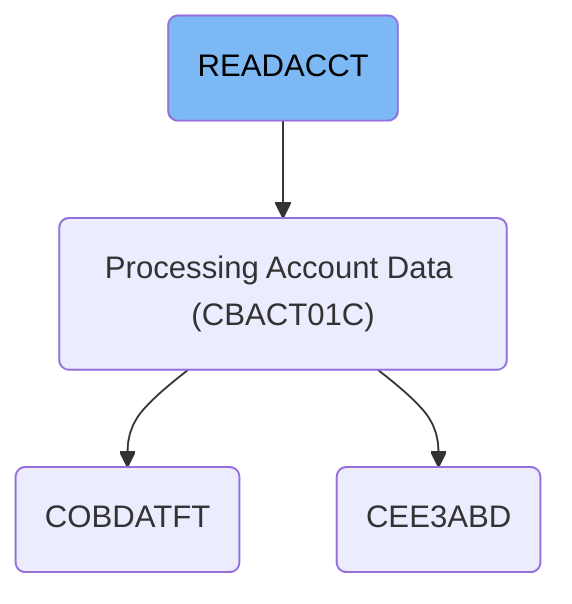
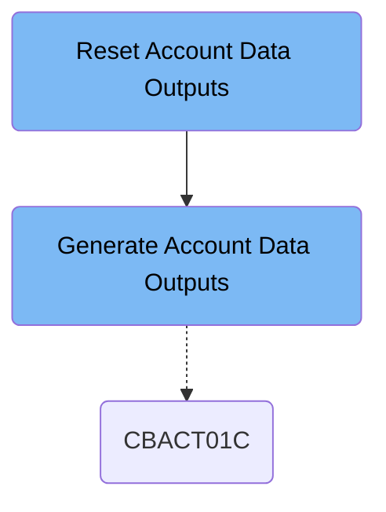

This document explains the READACCT batch job that processes credit card account master data. It reads the main account records from a VSAM file and generates multiple output files with processed account information to support downstream batch jobs and reporting workflows. For example, it reads raw account data and produces structured files tailored for different processing needs.

# Dependencies

Here is a high level diagram of the file:

## Reset Account Data Outputs

Step in this section: `PREDEL`.

This section clears previous processed account data by deleting output files, allowing the application to produce new and accurate results for subsequent batch jobs.

## Generate Account Data Outputs

Step in this section: `STEP05`.

This section reads the main account database and produces updated output files with processed and reformatted account information for use in later processing steps and reporting.

1. The section begins by reading all credit card account records from the main persistent account storage.
2. For each account, the relevant data elements (such as account number, customer details, balances, etc.) are extracted according to business processing rules.
3. The program then reformats and organizes extracted data into multiple structures: a processed account file for reporting, an array-based file for batch processing, and a variable-block file for flexible output scenarios.
4. Each processed version of the account data is sequentially written to its designated output file, enabling their use in downstream job steps and business workflows.
5. Once all accounts have been processed, the output files contain updated, structured information for subsequent steps in the credit card application lifecycle.

### Input

**ACCTFILE - AWS.M2.CARDDEMO.ACCTDATA.VSAM.KSDS (Account Master Storage)**

Holds the main records of all credit card accounts, including details needed for downstream processing and reporting.

### Output

**OUTFILE - AWS.M2.CARDDEMO.ACCTDATA.PSCOMP (Processed Account Data)**

Contains fully processed account information tailored for subsequent workflows and reporting.

**ARRYFILE - AWS.M2.CARDDEMO.ACCTDATA.ARRYPS (Account Data Arrays)**

Stores array-formatted account data to support batch processing and specialized downstream business jobs.

**VBRCFILE - AWS.M2.CARDDEMO.ACCTDATA.VBPS (Variable Account Output)**

Contains variable-block formatted account output for specific types of record-based workflows and flexible reporting needs.

&nbsp;

*This is an auto-generated document by Swimm 🌊 and has not yet been verified by a human*

<SwmMeta version="3.0.0" repo-id="Z2l0aHViJTNBJTNBYXdzLW1haW5mcmFtZS1tb2Rlcm5pemF0aW9uLWNhcmRkZW1vJTNBJTNBbXVkYXNpbjE=" repo-name="aws-mainframe-modernization-carddemo">Powered by [Swimm](https://app.swimm.io/)</SwmMeta>
