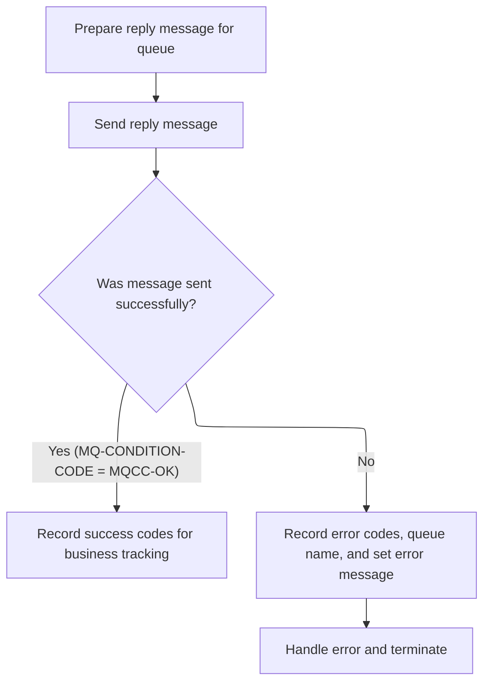

This document describes how account inquiry requests are processed and replied to. The system checks if the incoming request is valid, retrieves account data if possible, and sends a reply message with either the account details or an error message. Every request receives a response.

# Handling Account Inquiry Requests

<SwmSnippet path="/app/app-vsam-mq/cbl/COACCT01.cbl" line="390">

---

In `4000-PROCESS-REQUEST-REPLY`, this is just the setup: it clears out the reply message buffer and resets the date-time workspace so we don't get garbage from previous runs. This is the entry point for handling a new request message.

```cobol
036000 4000-PROCESS-REQUEST-REPLY.                                      03670010
036100     MOVE SPACES TO REPLY-MESSAGE                                 03680000
036100     INITIALIZE WS-DATE-TIME REPLACING NUMERIC BY ZEROES          03690000
```

---

</SwmSnippet>

<SwmSnippet path="/app/app-vsam-mq/cbl/COACCT01.cbl" line="393">

---

After setup, we check if the request is an account inquiry ('INQA') and the key is valid. If so, we prep the key and call CICS to read the account record from the dataset. This is the main data fetch step before we decide how to reply.

```cobol
036100     IF WS-FUNC = 'INQA' AND WS-KEY > ZEROES                      03700000
              MOVE WS-KEY       TO  WS-CARD-RID-ACCT-ID                 03700106
                                                                        03700206
           EXEC CICS READ                                               03700306
                DATASET   (LIT-ACCTFILENAME)                            03700406
                RIDFLD    (WS-CARD-RID-ACCT-ID-X)                       03700506
                KEYLENGTH (LENGTH OF WS-CARD-RID-ACCT-ID-X)             03700606
                INTO      (ACCOUNT-RECORD)                              03700706
                LENGTH    (LENGTH OF ACCOUNT-RECORD)                    03700806
                RESP      (WS-RESP-CD)                                  03700906
                RESP2     (WS-REAS-CD)                                  03701006
           END-EXEC                                                     03701106
```

---

</SwmSnippet>

<SwmSnippet path="/app/app-vsam-mq/cbl/COACCT01.cbl" line="407">

---

Once the account is found, we copy all the relevant fields from the record into the workspace, build the reply message, and call 4100-PUT-REPLY to actually send the response back over MQ. This is where the reply is constructed and dispatched.

```cobol
               WHEN DFHRESP(NORMAL)                                     03701406
                    MOVE ACCT-ID          TO WS-ACCT-ID                 03701510
                    MOVE ACCT-ACTIVE-STATUS                             03701610
                                          TO WS-ACCT-ACTIVE-STATUS      03701710
                    MOVE ACCT-CURR-BAL    TO WS-ACCT-CURR-BAL           03701810
                    MOVE ACCT-CREDIT-LIMIT                              03701910
                                          TO WS-ACCT-CREDIT-LIMIT       03702110
                    MOVE ACCT-CASH-CREDIT-LIMIT                         03702210
                                          TO WS-ACCT-CASH-CREDIT-LIMIT  03702310
                    MOVE ACCT-OPEN-DATE   TO WS-ACCT-OPEN-DATE          03702410
                    MOVE ACCT-EXPIRAION-DATE                            03702510
                                          TO WS-ACCT-EXPIRAION-DATE     03702610
                    MOVE ACCT-REISSUE-DATE                              03702710
                                          TO WS-ACCT-REISSUE-DATE       03702810
                    MOVE ACCT-CURR-CYC-CREDIT                           03702910
                                          TO WS-ACCT-CURR-CYC-CREDIT    03703010
                    MOVE ACCT-CURR-CYC-DEBIT                            03703110
                                          TO WS-ACCT-CURR-CYC-DEBIT     03703210
                    MOVE ACCT-GROUP-ID    TO WS-ACCT-GROUP-ID           03703310
                    MOVE WS-ACCT-RESPONSE TO REPLY-MESSAGE              03703510
                    PERFORM 4100-PUT-REPLY                              03703610
```

---

</SwmSnippet>

## Sending the Reply Message to MQ



<SwmSnippet path="/app/app-vsam-mq/cbl/COACCT01.cbl" line="462">

---

In `4100-PUT-REPLY`, we move the reply message into a 1000-byte buffer, set up the MQ message descriptor with IDs and format, set the put options for transactional and error handling, and call MQPUT to send the message. No checks for buffer overflow—so replies must fit in 1000 bytes.

```cobol
037000 4100-PUT-REPLY.                                                  03880010
037100                                                                  03890000
037200* PUT WILL PUT A MESSAGE ON THE QUEUE AND CONVERT IT TO A STRING  03900000
037300                                                                  03910000
037600                                                                  03940000
037700     MOVE REPLY-MESSAGE                TO MQ-BUFFER               03950007
037800     MOVE 1000                         TO MQ-BUFFER-LENGTH        03960007
037900     MOVE SAVE-MSGID                   TO MQMD-MSGID              03970007
038000     MOVE SAVE-CORELID                 TO MQMD-CORRELID           03980007
038100     MOVE MQFMT-STRING                 TO MQMD-FORMAT             03990007
038200                                                                  04000000
038300     COMPUTE MQMD-CODEDCHARSETID      =  MQCCSI-Q-MGR             04010007
038400                                                                  04020000
038500     COMPUTE MQPMO-OPTIONS = MQPMO-SYNCPOINT                      04030000
038600                           + MQPMO-DEFAULT-CONTEXT                04040000
038700                           + MQPMO-FAIL-IF-QUIESCING              04050007
038800                                                                  04060000
038900     CALL 'MQPUT'  USING MQ-HCONN                                 04070000
039000                         OUTPUT-QUEUE-HANDLE                      04080000
039100                         MQ-MESSAGE-DESCRIPTOR                    04090000
039200                         MQ-PUT-MESSAGE-OPTIONS                   04100000
039300                         MQ-BUFFER-LENGTH                         04110000
039400                         MQ-BUFFER                                04120000
039500                         MQ-CONDITION-CODE                        04130000
039600                         MQ-REASON-CODE                           04140007
```

---

</SwmSnippet>

<SwmSnippet path="/app/app-vsam-mq/cbl/COACCT01.cbl" line="488">

---

After sending the reply, we check if MQPUT succeeded. If not, we log the error, send an error message to the error queue by calling 9000-ERROR, and then terminate the app. No retries—just fail and exit.

```cobol
039800     EVALUATE MQ-CONDITION-CODE                                   04160000
039900         WHEN MQCC-OK                                             04170000
040000              MOVE MQ-CONDITION-CODE TO MQ-APPL-CONDITION-CODE    04180000
040100              MOVE MQ-REASON-CODE    TO MQ-APPL-REASON-CODE       04190000
040200         WHEN OTHER                                               04200000
040300              MOVE MQ-CONDITION-CODE TO MQ-APPL-CONDITION-CODE    04210000
040400              MOVE MQ-REASON-CODE    TO MQ-APPL-REASON-CODE       04220000
040500              MOVE REPLY-QUEUE-NAME  TO MQ-APPL-QUEUE-NAME        04230000
040600              MOVE 'MQPUT ERR'       TO MQ-APPL-RETURN-MESSAGE    04240000
040700              PERFORM 9000-ERROR                                  04250007
040800              PERFORM 8000-TERMINATION                            04260007
040900     END-EVALUATE.                                                04270000
```

---

</SwmSnippet>

## Handling Read Failures and Invalid Requests

<SwmSnippet path="/app/app-vsam-mq/cbl/COACCT01.cbl" line="428">

---

Back in `4000-PROCESS-REQUEST-REPLY`, if the account isn't found, we build an error message and call 4100-PUT-REPLY again to send the failure response. This keeps the client informed even on bad input.

```cobol
               WHEN DFHRESP(NOTFND)                                     03703710
                    STRING 'INVALID REQUEST PARAMETERS '                03703810
                           'ACCT ID : 'WS-KEY                           03703910
                           DELIMITED BY SIZE                            03704010
                           INTO                                         03704110
                           REPLY-MESSAGE                                03704210
                    END-STRING                                          03704310
                    PERFORM 4100-PUT-REPLY                              03704410
```

---

</SwmSnippet>

<SwmSnippet path="/app/app-vsam-mq/cbl/COACCT01.cbl" line="437">

---

If we hit any other error during the read, we log the error details, call 9000-ERROR to send an error message, and then terminate the app. This is a hard fail—no retries or recovery.

```cobol
               WHEN OTHER                                               03704610
017200                                                                  03704800
035100           MOVE WS-RESP-CD        TO MQ-APPL-CONDITION-CODE       03704903
035200           MOVE WS-REAS-CD        TO MQ-APPL-REASON-CODE          03705003
035300           MOVE INPUT-QUEUE-NAME  TO MQ-APPL-QUEUE-NAME           03705103
035400           MOVE 'ERROR WHILE READING ACCTFILE'                    03705204
035400                                  TO MQ-APPL-RETURN-MESSAGE       03705303
                  PERFORM 9000-ERROR                                    03705407
017400            PERFORM 8000-TERMINATION                              03705507
      *           PERFORM SEND-LONG-TEXT                                03705603
           END-EVALUATE                                                 03705703
```

---

</SwmSnippet>

<SwmSnippet path="/app/app-vsam-mq/cbl/COACCT01.cbl" line="448">

---

After returning from 8000-TERMINATION, if the request didn't match any valid pattern, we build a generic error message and call 4100-PUT-REPLY to send a response. This way, every request gets a reply, even if it's just to say it's invalid.

```cobol
           ELSE                                                         03705805
                    STRING 'INVALID REQUEST PARAMETERS '                03705905
                           'ACCT ID : 'WS-KEY                           03706005
                           'FUNCTION : 'WS-FUNC                         03706105
                           DELIMITED BY SIZE                            03706205
                           INTO                                         03706305
                           REPLY-MESSAGE                                03706405
                    END-STRING                                          03706505
                    PERFORM 4100-PUT-REPLY                              03706610
036100     END-IF                                                       03706705
```

---

</SwmSnippet>

&nbsp;

*This is an auto-generated document by Swimm 🌊 and has not yet been verified by a human*

<SwmMeta version="3.0.0" repo-id="Z2l0aHViJTNBJTNBYXdzLW1haW5mcmFtZS1tb2Rlcm5pemF0aW9uLWNhcmRkZW1vJTNBJTNBbXVkYXNpbjE=" repo-name="aws-mainframe-modernization-carddemo"><sup>Powered by [Swimm](https://app.swimm.io/)</sup></SwmMeta>
