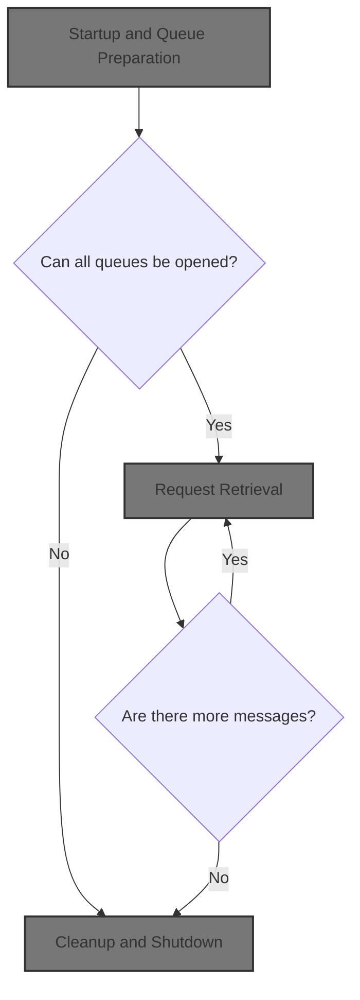

# Overview

This document describes how requests for the current system date and time are processed. Incoming messages are received from a queue, a reply with the formatted date and time is generated, and the reply is sent to the output queue. Errors are logged, and all queues are closed at the end of processing.

## Dependencies

### Programs

- CODATE01 (<SwmPath>[app/…/cbl/CODATE01.cbl](app/app-vsam-mq/cbl/CODATE01.cbl)</SwmPath>)
- MQOPEN
- MQGET
- MQPUT
- MQCLOSE

### Copybooks

- CMQGMOV
- CMQPMOV
- CMQMDV
- CMQODV
- CMQV
- CMQTML

&nbsp;

*This is an auto-generated document by Swimm 🌊 and has not yet been verified by a human*

<SwmMeta version="3.0.0" repo-id="Z2l0aHViJTNBJTNBYXdzLW1haW5mcmFtZS1tb2Rlcm5pemF0aW9uLWNhcmRkZW1vJTNBJTNBbXVkYXNpbjE=" repo-name="aws-mainframe-modernization-carddemo">Powered by [Swimm](https://app.swimm.io/)</SwmMeta>
