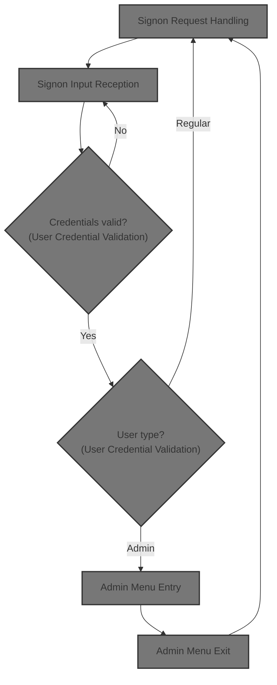
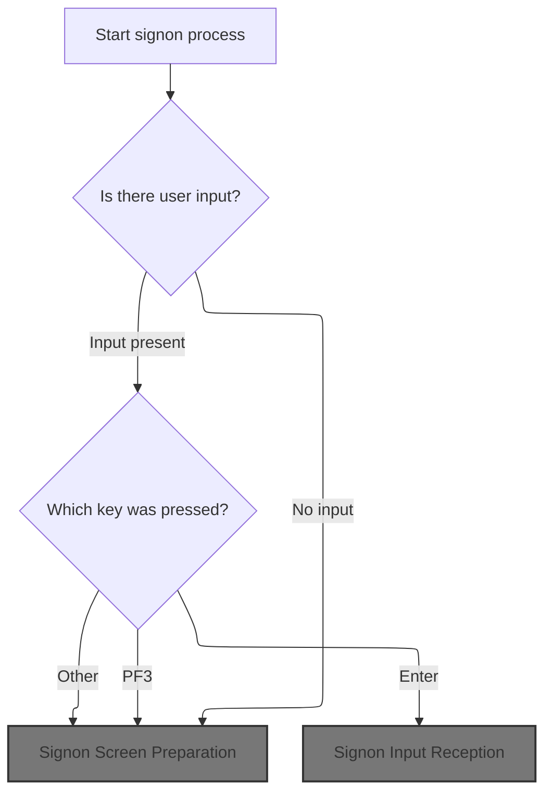
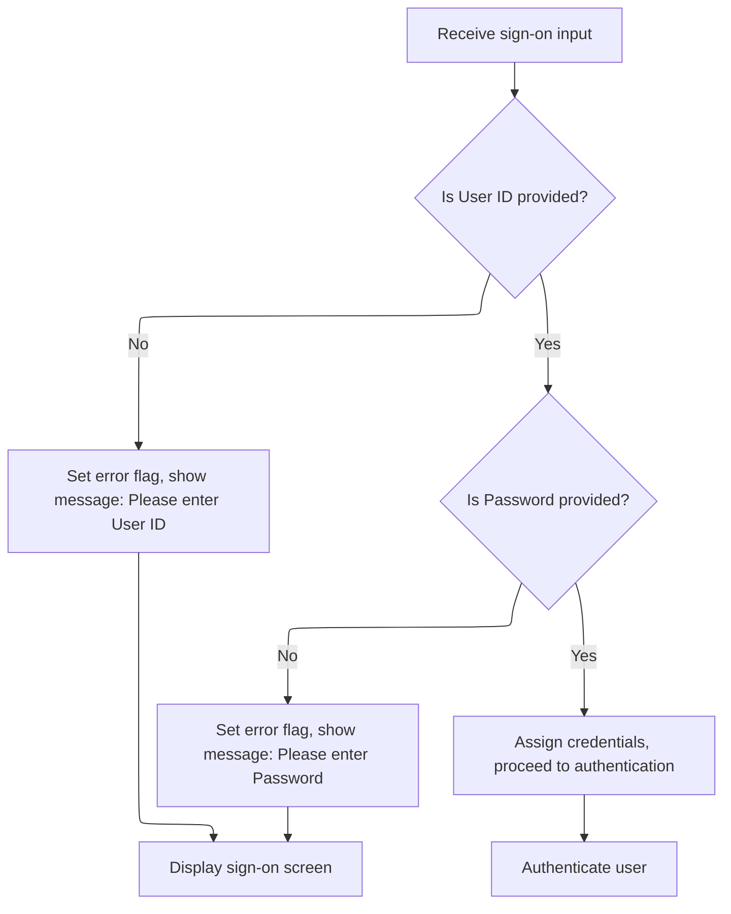

# Overview

This document explains the flow of the signon process for <SwmToken path="app/cbl/COSGN00C.cbl" pos="3:7:7" line-data="      * Application : CardDemo">`CardDemo`</SwmToken>. Users provide their credentials, which are validated and used to route them to the appropriate menu or prompt for correction if invalid.



## Dependencies

### Programs

- <SwmToken path="app/cbl/COADM01C.cbl" pos="87:4:4" line-data="               MOVE &#39;COSGN00C&#39; TO CDEMO-FROM-PROGRAM                            ">`COSGN00C`</SwmToken> (<SwmPath>[app/cbl/COSGN00C.cbl](app/cbl/COSGN00C.cbl)</SwmPath>)
- <SwmToken path="app/cbl/COSGN00C.cbl" pos="232:5:5" line-data="                              PROGRAM (&#39;COADM01C&#39;)">`COADM01C`</SwmToken> (<SwmPath>[app/cbl/COADM01C.cbl](app/cbl/COADM01C.cbl)</SwmPath>)
- <SwmToken path="app/cbl/COSGN00C.cbl" pos="237:5:5" line-data="                              PROGRAM (&#39;COMEN01C&#39;)">`COMEN01C`</SwmToken> (<SwmPath>[app/cbl/COMEN01C.cbl](app/cbl/COMEN01C.cbl)</SwmPath>)

### Copybooks

- <SwmToken path="app/cbl/COSGN00C.cbl" pos="48:3:3" line-data="       COPY COCOM01Y.">`COCOM01Y`</SwmToken> (<SwmPath>[app/cpy/COCOM01Y.cpy](app/cpy/COCOM01Y.cpy)</SwmPath>)
- <SwmToken path="app/cbl/COADM01C.cbl" pos="51:3:3" line-data="       COPY COADM02Y.                                                           ">`COADM02Y`</SwmToken> (<SwmPath>[app/cpy/COADM02Y.cpy](app/cpy/COADM02Y.cpy)</SwmPath>)
- <SwmToken path="app/cbl/COADM01C.cbl" pos="53:3:3" line-data="       COPY COADM01.                                                            ">`COADM01`</SwmToken> (<SwmPath>[app/cpy-bms/COADM01.CPY](app/cpy-bms/COADM01.CPY)</SwmPath>)
- <SwmToken path="app/cbl/COSGN00C.cbl" pos="52:3:3" line-data="       COPY COTTL01Y.">`COTTL01Y`</SwmToken> (<SwmPath>[app/cpy/COTTL01Y.cpy](app/cpy/COTTL01Y.cpy)</SwmPath>)
- <SwmToken path="app/cbl/COSGN00C.cbl" pos="53:3:3" line-data="       COPY CSDAT01Y.">`CSDAT01Y`</SwmToken> (<SwmPath>[app/cpy/CSDAT01Y.cpy](app/cpy/CSDAT01Y.cpy)</SwmPath>)
- <SwmToken path="app/cbl/COSGN00C.cbl" pos="54:3:3" line-data="       COPY CSMSG01Y.">`CSMSG01Y`</SwmToken> (<SwmPath>[app/cpy/CSMSG01Y.cpy](app/cpy/CSMSG01Y.cpy)</SwmPath>)
- <SwmToken path="app/cbl/COSGN00C.cbl" pos="55:3:3" line-data="       COPY CSUSR01Y.">`CSUSR01Y`</SwmToken> (<SwmPath>[app/cpy/CSUSR01Y.cpy](app/cpy/CSUSR01Y.cpy)</SwmPath>)
- DFHAID
- DFHBMSCA
- COMEN02Y (<SwmPath>[app/cpy/COMEN02Y.cpy](app/cpy/COMEN02Y.cpy)</SwmPath>)
- COMEN01 (<SwmPath>[app/cpy-bms/COMEN01.CPY](app/cpy-bms/COMEN01.CPY)</SwmPath>)
- <SwmToken path="app/cbl/COSGN00C.cbl" pos="112:4:4" line-data="                     MAPSET(&#39;COSGN00&#39;)">`COSGN00`</SwmToken> (<SwmPath>[app/cpy-bms/COSGN00.CPY](app/cpy-bms/COSGN00.CPY)</SwmPath>)

# Workflow

# Signon Request Handling



The Signon Request Handling section governs how user input is processed at the start of the signon process, ensuring users are guided to the correct next step based on their actions.

| Category        | Rule Name          | Description                                                                                                                                                                                                                                                     |
| --------------- | ------------------ | --------------------------------------------------------------------------------------------------------------------------------------------------------------------------------------------------------------------------------------------------------------- |
| Data validation | Enter Key Signon   | If the user presses the Enter key, the system initiates the signon input validation process, requiring both user ID and password to be entered.                                                                                                                 |
| Business logic  | No Input Reset     | If no user input is detected, the signon screen is displayed with all fields reset and no error messages shown.                                                                                                                                                 |
| Business logic  | PF3 Thank You Exit | If the user presses the PF3 key, a thank you message ('Thank you for using <SwmToken path="app/cbl/COSGN00C.cbl" pos="3:7:7" line-data="      * Application : CardDemo">`CardDemo`</SwmToken> application...') is displayed and the session is ended or exited. |

<SwmSnippet path="/app/cbl/COSGN00C.cbl" line="73">

---

In <SwmToken path="app/cbl/COSGN00C.cbl" pos="73:1:3" line-data="       MAIN-PARA.">`MAIN-PARA`</SwmToken>, we start by checking if there's any input. If not, we reset the screen and call <SwmToken path="app/cbl/COSGN00C.cbl" pos="83:3:7" line-data="               PERFORM SEND-SIGNON-SCREEN">`SEND-SIGNON-SCREEN`</SwmToken> to show the signon form. If there is input, we handle it based on the key pressed, either processing signon, sending a thank you, or showing an error.

```cobol
       MAIN-PARA.

           SET ERR-FLG-OFF TO TRUE

           MOVE SPACES TO WS-MESSAGE
                          ERRMSGO OF COSGN0AO

           IF EIBCALEN = 0
               MOVE LOW-VALUES TO COSGN0AO
               MOVE -1       TO USERIDL OF COSGN0AI
               PERFORM SEND-SIGNON-SCREEN
           ELSE
               EVALUATE EIBAID
                   WHEN DFHENTER
                       PERFORM PROCESS-ENTER-KEY
                   WHEN DFHPF3
                       MOVE CCDA-MSG-THANK-YOU        TO WS-MESSAGE
                       PERFORM SEND-PLAIN-TEXT
                   WHEN OTHER
                       MOVE 'Y'                       TO WS-ERR-FLG
                       MOVE CCDA-MSG-INVALID-KEY      TO WS-MESSAGE
                       PERFORM SEND-SIGNON-SCREEN
               END-EVALUATE
           END-IF.
```

---

</SwmSnippet>

## Signon Screen Preparation

The Signon Screen Preparation section ensures that every time a user is prompted to sign on, the interface is refreshed with the latest system details and any pertinent messages, providing a clear and current entry point for user authentication.

| Category        | Rule Name                     | Description                                                                                                                                             |
| --------------- | ----------------------------- | ------------------------------------------------------------------------------------------------------------------------------------------------------- |
| Data validation | Screen Erasure Before Display | The signon screen must be cleared of any previous data or artifacts before displaying new information to the user.                                      |
| Data validation | Cursor Positioning for Input  | The cursor must be positioned at the user input field when the signon screen is displayed, to facilitate immediate user interaction.                    |
| Business logic  | Current Header Information    | The signon screen header must always display the current date, time, and system information to ensure users see up-to-date details at each interaction. |
| Business logic  | Display User Messages         | Any message intended for the user (such as errors or notifications) must be displayed in the designated message area of the signon screen.              |

<SwmSnippet path="/app/cbl/COSGN00C.cbl" line="145">

---

In <SwmToken path="app/cbl/COSGN00C.cbl" pos="145:1:5" line-data="       SEND-SIGNON-SCREEN.">`SEND-SIGNON-SCREEN`</SwmToken>, we start by calling <SwmToken path="app/cbl/COSGN00C.cbl" pos="147:3:7" line-data="           PERFORM POPULATE-HEADER-INFO">`POPULATE-HEADER-INFO`</SwmToken> to fill in the signon screen header with up-to-date details like date, time, and system info. This keeps the screen relevant for each user interaction.

```cobol
       SEND-SIGNON-SCREEN.

           PERFORM POPULATE-HEADER-INFO
```

---

</SwmSnippet>

<SwmSnippet path="/app/cbl/COSGN00C.cbl" line="149">

---

After updating the header, we move any message text into the screen's message area and use EXEC CICS SEND to display the signon screen map to the user. ERASE clears the previous screen, and CURSOR sets the cursor position for user input.

```cobol
           MOVE WS-MESSAGE TO ERRMSGO OF COSGN0AO

           EXEC CICS SEND
                     MAP('COSGN0A')
                     MAPSET('COSGN00')
                     FROM(COSGN0AO)
                     ERASE
                     CURSOR
           END-EXEC.
```

---

</SwmSnippet>

## Signon Input Reception



The main product role of this section is to ensure that both User ID and Password are provided by the user before proceeding to authentication. If either field is missing, the user is prompted to correct the input.

| Category        | Rule Name              | Description                                                                                                                                                                                                              |
| --------------- | ---------------------- | ------------------------------------------------------------------------------------------------------------------------------------------------------------------------------------------------------------------------ |
| Data validation | User ID Required       | If the User ID field is blank or contains only spaces or low-values, the system must display an error message prompting the user to enter a User ID and prevent further processing until a valid User ID is provided.    |
| Data validation | Password Required      | If the Password field is blank or contains only spaces or low-values, the system must display an error message prompting the user to enter a Password and prevent further processing until a valid Password is provided. |
| Business logic  | Credentials Assignment | If both User ID and Password are provided, the system must assign the credentials for use in the authentication process and proceed to validate them against the security file.                                          |

<SwmSnippet path="/app/cbl/COSGN00C.cbl" line="108">

---

In <SwmToken path="app/cbl/COSGN00C.cbl" pos="108:1:5" line-data="       PROCESS-ENTER-KEY.">`PROCESS-ENTER-KEY`</SwmToken>, we grab the user's input from the signon screen using EXEC CICS RECEIVE. This pulls in whatever the user typed for further checks.

```cobol
       PROCESS-ENTER-KEY.

           EXEC CICS RECEIVE
                     MAP('COSGN0A')
                     MAPSET('COSGN00')
                     RESP(WS-RESP-CD)
                     RESP2(WS-REAS-CD)
           END-EXEC.
```

---

</SwmSnippet>

<SwmSnippet path="/app/cbl/COSGN00C.cbl" line="117">

---

After receiving input, we check if the user ID or password is missing. If either is blank, we set an error flag, update the message, and call <SwmToken path="app/cbl/COSGN00C.cbl" pos="122:3:7" line-data="                   PERFORM SEND-SIGNON-SCREEN">`SEND-SIGNON-SCREEN`</SwmToken> to show the form again with the error highlighted.

```cobol
           EVALUATE TRUE
               WHEN USERIDI OF COSGN0AI = SPACES OR LOW-VALUES
                   MOVE 'Y'      TO WS-ERR-FLG
                   MOVE 'Please enter User ID ...' TO WS-MESSAGE
                   MOVE -1       TO USERIDL OF COSGN0AI
                   PERFORM SEND-SIGNON-SCREEN
               WHEN PASSWDI OF COSGN0AI = SPACES OR LOW-VALUES
                   MOVE 'Y'      TO WS-ERR-FLG
                   MOVE 'Please enter Password ...' TO WS-MESSAGE
                   MOVE -1       TO PASSWDL OF COSGN0AI
                   PERFORM SEND-SIGNON-SCREEN
               WHEN OTHER
                   CONTINUE
           END-EVALUATE.
```

---

</SwmSnippet>

<SwmSnippet path="/app/cbl/COSGN00C.cbl" line="132">

---

Back in <SwmToken path="app/cbl/COSGN00C.cbl" pos="87:3:7" line-data="                       PERFORM PROCESS-ENTER-KEY">`PROCESS-ENTER-KEY`</SwmToken>, after handling missing fields, we uppercase the user ID and password for consistent validation. If no error flag is set, we call <SwmToken path="app/cbl/COSGN00C.cbl" pos="139:3:9" line-data="               PERFORM READ-USER-SEC-FILE">`READ-USER-SEC-FILE`</SwmToken> to check credentials against the security file.

```cobol
           MOVE FUNCTION UPPER-CASE(USERIDI OF COSGN0AI) TO
                           WS-USER-ID
                           CDEMO-USER-ID
           MOVE FUNCTION UPPER-CASE(PASSWDI OF COSGN0AI) TO
                           WS-USER-PWD

           IF NOT ERR-FLG-ON
               PERFORM READ-USER-SEC-FILE
           END-IF.
```

---

</SwmSnippet>

## User Credential Validation

This section governs how user credentials are validated and how users are routed to the correct menu based on their type after sign-on. It ensures only valid users can access the system and that they are directed to the appropriate interface.

| Category        | Rule Name                 | Description                                                                                                                                                |
| --------------- | ------------------------- | ---------------------------------------------------------------------------------------------------------------------------------------------------------- |
| Data validation | Credential Match Required | A user must provide a valid user ID and password to access the system. If the credentials do not match a record in the security dataset, access is denied. |
| Business logic  | Admin User Routing        | If the user is identified as an admin (user type 'A'), they are routed to the admin menu upon successful sign-on.                                          |
| Business logic  | Regular User Routing      | If the user is identified as a regular user (user type 'U'), they are routed to the regular user menu upon successful sign-on.                             |

<SwmSnippet path="/app/cbl/COSGN00C.cbl" line="209">

---

In <SwmToken path="app/cbl/COSGN00C.cbl" pos="209:1:7" line-data="       READ-USER-SEC-FILE.">`READ-USER-SEC-FILE`</SwmToken>, we use EXEC CICS READ to pull the user's security record from the dataset using their user ID. The response code from this read tells us what to do next.

```cobol
       READ-USER-SEC-FILE.

           EXEC CICS READ
                DATASET   (WS-USRSEC-FILE)
                INTO      (SEC-USER-DATA)
                LENGTH    (LENGTH OF SEC-USER-DATA)
                RIDFLD    (WS-USER-ID)
                KEYLENGTH (LENGTH OF WS-USER-ID)
                RESP      (WS-RESP-CD)
                RESP2     (WS-REAS-CD)
           END-EXEC.
```

---

</SwmSnippet>

<SwmSnippet path="/app/cbl/COSGN00C.cbl" line="222">

---

After a successful read and password match, we set up the communication area with user info and use XCTL to call either the admin menu (<SwmToken path="app/cbl/COSGN00C.cbl" pos="232:5:5" line-data="                              PROGRAM (&#39;COADM01C&#39;)">`COADM01C`</SwmToken>) or the regular user menu (<SwmToken path="app/cbl/COSGN00C.cbl" pos="237:5:5" line-data="                              PROGRAM (&#39;COMEN01C&#39;)">`COMEN01C`</SwmToken>), depending on user type.

```cobol
               WHEN 0
                   IF SEC-USR-PWD = WS-USER-PWD
                       MOVE WS-TRANID    TO CDEMO-FROM-TRANID
                       MOVE WS-PGMNAME   TO CDEMO-FROM-PROGRAM
                       MOVE WS-USER-ID   TO CDEMO-USER-ID
                       MOVE SEC-USR-TYPE TO CDEMO-USER-TYPE
                       MOVE ZEROS        TO CDEMO-PGM-CONTEXT

                       IF CDEMO-USRTYP-ADMIN
                            EXEC CICS XCTL
                              PROGRAM ('COADM01C')
                              COMMAREA(CARDDEMO-COMMAREA)
                            END-EXEC
                       ELSE
                            EXEC CICS XCTL
                              PROGRAM ('COMEN01C')
                              COMMAREA(CARDDEMO-COMMAREA)
                            END-EXEC
                       END-IF
```

---

</SwmSnippet>

### Admin Menu Entry

```mermaid
%%{init: {"flowchart": {"defaultRenderer": "elk"}} }%%
flowchart TD
    node1["Start MAIN-PARA"] --> node1a["Initialize error flag and message"]
    click node1 openCode "app/cbl/COADM01C.cbl:75:76"
    click node1a openCode "app/cbl/COADM01C.cbl:81:84"
    node1a --> node2{"Is communication area present? (EIBCALEN = 0)"}
    click node2 openCode "app/cbl/COADM01C.cbl:86:86"
    node2 -->|"No"| node3["Move communication area, check re-entry"]
    click node3 openCode "app/cbl/COADM01C.cbl:90:91"
    node2 -->|"Yes"| node4["Return to sign-on screen"]
    click node4 openCode "app/cbl/COADM01C.cbl:87:88"
    node3 --> node5{"Is this a re-entry? (CDEMO-PGM-REENTER)"}
    click node5 openCode "app/cbl/COADM01C.cbl:91:91"
    node5 -->|"No"| node6["Set re-entry flag, clear screen, send menu screen"]
    click node6 openCode "app/cbl/COADM01C.cbl:92:94"
    node5 -->|"Yes"| node7["Receive menu screen"]
    click node7 openCode "app/cbl/COADM01C.cbl:96:96"
    node7 --> node8{"Which key was pressed? (EIBAID)"}
    click node8 openCode "app/cbl/COADM01C.cbl:97:97"
    node8 -->|"ENTER"| node9["Process menu option"]
    click node9 openCode "app/cbl/COADM01C.cbl:99:99"
    node8 -->|"PF3"| node4
    node8 -->|"Other"| node10["Show invalid key message, send menu screen"]
    click node10 openCode "app/cbl/COADM01C.cbl:104:106"
    node9 --> node11{"Is menu option valid? (WS-OPTION)"}
    click node11 openCode "app/cbl/COADM01C.cbl:131:133"
    node11 -->|"Valid"| node12["Route to selected program"]
    click node12 openCode "app/cbl/COADM01C.cbl:142:148"
    node11 -->|"Invalid"| node13["Show invalid option message, send menu screen"]
    click node13 openCode "app/cbl/COADM01C.cbl:134:137"
    node6 --> node14["Return to CICS"]
    click node14 openCode "app/cbl/COADM01C.cbl:111:114"
    node4 --> node14
    node10 --> node14
    node12 --> node14
    node13 --> node14
classDef HeadingStyle fill:#777777,stroke:#333,stroke-width:2px;

%% Swimm:
%% %%{init: {"flowchart": {"defaultRenderer": "elk"}} }%%
%% flowchart TD
%%     node1["Start <SwmToken path="app/cbl/COSGN00C.cbl" pos="73:1:3" line-data="       MAIN-PARA.">`MAIN-PARA`</SwmToken>"] --> node1a["Initialize error flag and message"]
%%     click node1 openCode "<SwmPath>[app/cbl/COADM01C.cbl](app/cbl/COADM01C.cbl)</SwmPath>:75:76"
%%     click node1a openCode "<SwmPath>[app/cbl/COADM01C.cbl](app/cbl/COADM01C.cbl)</SwmPath>:81:84"
%%     node1a --> node2{"Is communication area present? (EIBCALEN = 0)"}
%%     click node2 openCode "<SwmPath>[app/cbl/COADM01C.cbl](app/cbl/COADM01C.cbl)</SwmPath>:86:86"
%%     node2 -->|"No"| node3["Move communication area, check re-entry"]
%%     click node3 openCode "<SwmPath>[app/cbl/COADM01C.cbl](app/cbl/COADM01C.cbl)</SwmPath>:90:91"
%%     node2 -->|"Yes"| node4["Return to sign-on screen"]
%%     click node4 openCode "<SwmPath>[app/cbl/COADM01C.cbl](app/cbl/COADM01C.cbl)</SwmPath>:87:88"
%%     node3 --> node5{"Is this a re-entry? (<SwmToken path="app/cbl/COADM01C.cbl" pos="91:5:9" line-data="               IF NOT CDEMO-PGM-REENTER                                         ">`CDEMO-PGM-REENTER`</SwmToken>)"}
%%     click node5 openCode "<SwmPath>[app/cbl/COADM01C.cbl](app/cbl/COADM01C.cbl)</SwmPath>:91:91"
%%     node5 -->|"No"| node6["Set re-entry flag, clear screen, send menu screen"]
%%     click node6 openCode "<SwmPath>[app/cbl/COADM01C.cbl](app/cbl/COADM01C.cbl)</SwmPath>:92:94"
%%     node5 -->|"Yes"| node7["Receive menu screen"]
%%     click node7 openCode "<SwmPath>[app/cbl/COADM01C.cbl](app/cbl/COADM01C.cbl)</SwmPath>:96:96"
%%     node7 --> node8{"Which key was pressed? (EIBAID)"}
%%     click node8 openCode "<SwmPath>[app/cbl/COADM01C.cbl](app/cbl/COADM01C.cbl)</SwmPath>:97:97"
%%     node8 -->|"ENTER"| node9["Process menu option"]
%%     click node9 openCode "<SwmPath>[app/cbl/COADM01C.cbl](app/cbl/COADM01C.cbl)</SwmPath>:99:99"
%%     node8 -->|"PF3"| node4
%%     node8 -->|"Other"| node10["Show invalid key message, send menu screen"]
%%     click node10 openCode "<SwmPath>[app/cbl/COADM01C.cbl](app/cbl/COADM01C.cbl)</SwmPath>:104:106"
%%     node9 --> node11{"Is menu option valid? (<SwmToken path="app/cbl/COADM01C.cbl" pos="126:18:20" line-data="           MOVE OPTIONI OF COADM1AI(1:WS-IDX) TO WS-OPTION-X                    ">`WS-OPTION`</SwmToken>)"}
%%     click node11 openCode "<SwmPath>[app/cbl/COADM01C.cbl](app/cbl/COADM01C.cbl)</SwmPath>:131:133"
%%     node11 -->|"Valid"| node12["Route to selected program"]
%%     click node12 openCode "<SwmPath>[app/cbl/COADM01C.cbl](app/cbl/COADM01C.cbl)</SwmPath>:142:148"
%%     node11 -->|"Invalid"| node13["Show invalid option message, send menu screen"]
%%     click node13 openCode "<SwmPath>[app/cbl/COADM01C.cbl](app/cbl/COADM01C.cbl)</SwmPath>:134:137"
%%     node6 --> node14["Return to CICS"]
%%     click node14 openCode "<SwmPath>[app/cbl/COADM01C.cbl](app/cbl/COADM01C.cbl)</SwmPath>:111:114"
%%     node4 --> node14
%%     node10 --> node14
%%     node12 --> node14
%%     node13 --> node14
%% classDef HeadingStyle fill:#777777,stroke:#333,stroke-width:2px;
```



The Admin Menu Entry section governs how administrative users access and interact with the admin menu in the <SwmToken path="app/cbl/COSGN00C.cbl" pos="3:7:7" line-data="      * Application : CardDemo">`CardDemo`</SwmToken> application. It determines when to display the menu, how user input is processed, and how navigation and error handling are managed for admin menu operations.

| Category        | Rule Name                       | Description                                                                                                                                                                       |
| --------------- | ------------------------------- | --------------------------------------------------------------------------------------------------------------------------------------------------------------------------------- |
| Data validation | Menu Option Validation          | If the user enters a menu option that is not numeric, is zero, or exceeds the number of available admin options, an error message must be displayed and the menu screen re-shown. |
| Business logic  | First Entry Menu Display        | If the user is entering the admin menu for the first time in the session, the menu screen must be displayed and the session marked as re-entered.                                 |
| Business logic  | PF3 Sign-off                    | If the user presses PF3, they must be returned to the sign-on screen, terminating the admin session.                                                                              |
| Business logic  | Unavailable Option Notification | If the user selects a valid menu option that is not installed (marked as 'DUMMY'), a message must be displayed indicating the option is not available.                            |
| Business logic  | Admin Option Routing            | If the user selects a valid and available menu option, the system must route the user to the corresponding admin program.                                                         |

<SwmSnippet path="/app/cbl/COADM01C.cbl" line="75">

---

In <SwmToken path="app/cbl/COADM01C.cbl" pos="75:1:3" line-data="       MAIN-PARA.                                                               ">`MAIN-PARA`</SwmToken> of <SwmToken path="app/cbl/COSGN00C.cbl" pos="232:5:5" line-data="                              PROGRAM (&#39;COADM01C&#39;)">`COADM01C`</SwmToken>, we handle admin menu logic. If the user is new, we show the menu; if they're returning, we process their input, handle key actions, and can transfer them back to signon or run admin options.

```cobol
       MAIN-PARA.                                                               
                                                                                
           EXEC CICS
                HANDLE CONDITION PGMIDERR(PGMIDERR-ERR-PARA)
           END-EXEC

           SET ERR-FLG-OFF TO TRUE                                              
                                                                                
           MOVE SPACES TO WS-MESSAGE                                            
                          ERRMSGO OF COADM1AO                                   
                                                                                
           IF EIBCALEN = 0                                                      
               MOVE 'COSGN00C' TO CDEMO-FROM-PROGRAM                            
               PERFORM RETURN-TO-SIGNON-SCREEN                                  
           ELSE                                                                 
               MOVE DFHCOMMAREA(1:EIBCALEN) TO CARDDEMO-COMMAREA                
               IF NOT CDEMO-PGM-REENTER                                         
                   SET CDEMO-PGM-REENTER    TO TRUE                             
                   MOVE LOW-VALUES          TO COADM1AO                         
                   PERFORM SEND-MENU-SCREEN                                     
               ELSE                                                             
                   PERFORM RECEIVE-MENU-SCREEN                                  
                   EVALUATE EIBAID                                              
                       WHEN DFHENTER                                            
                           PERFORM PROCESS-ENTER-KEY                            
                       WHEN DFHPF3                                              
                           MOVE 'COSGN00C' TO CDEMO-TO-PROGRAM                  
                           PERFORM RETURN-TO-SIGNON-SCREEN                      
                       WHEN OTHER                                               
                           MOVE 'Y'                       TO WS-ERR-FLG         
                           MOVE CCDA-MSG-INVALID-KEY      TO WS-MESSAGE         
                           PERFORM SEND-MENU-SCREEN                             
                   END-EVALUATE                                                 
               END-IF                                                           
           END-IF                                                               
                                                                                
           EXEC CICS RETURN                                                     
                     TRANSID (WS-TRANID)                                        
                     COMMAREA (CARDDEMO-COMMAREA)                               
           END-EXEC.                                                            
```

---

</SwmSnippet>

<SwmSnippet path="/app/cbl/COADM01C.cbl" line="119">

---

In <SwmToken path="app/cbl/COADM01C.cbl" pos="119:1:5" line-data="       PROCESS-ENTER-KEY.                                                       ">`PROCESS-ENTER-KEY`</SwmToken> for the admin menu, we trim and zero-fill the input to get a clean option number, validate it, and then either call the corresponding admin program or show an error if the input is invalid or the option isn't installed. The logic is tightly bound to the menu structure and expects specific input formats.

```cobol
       PROCESS-ENTER-KEY.                                                       
                                                                                
           PERFORM VARYING WS-IDX                                               
                   FROM LENGTH OF OPTIONI OF COADM1AI BY -1 UNTIL               
                   OPTIONI OF COADM1AI(WS-IDX:1) NOT = SPACES OR                
                   WS-IDX = 1                                                   
           END-PERFORM                                                          
           MOVE OPTIONI OF COADM1AI(1:WS-IDX) TO WS-OPTION-X                    
           INSPECT WS-OPTION-X REPLACING ALL ' ' BY '0'                         
           MOVE WS-OPTION-X              TO WS-OPTION                           
           MOVE WS-OPTION                TO OPTIONO OF COADM1AO                 
                                                                                
           IF WS-OPTION IS NOT NUMERIC OR                                       
              WS-OPTION > CDEMO-ADMIN-OPT-COUNT OR                              
              WS-OPTION = ZEROS                                                 
               MOVE 'Y'     TO WS-ERR-FLG                                       
               MOVE 'Please enter a valid option number...' TO                  
                                       WS-MESSAGE                               
               PERFORM SEND-MENU-SCREEN                                         
           END-IF                                                               

           IF NOT ERR-FLG-ON                                                    
               IF CDEMO-ADMIN-OPT-PGMNAME(WS-OPTION)(1:5) NOT = 'DUMMY'
                   MOVE WS-TRANID    TO CDEMO-FROM-TRANID                       
                   MOVE WS-PGMNAME   TO CDEMO-FROM-PROGRAM                      
                   MOVE ZEROS        TO CDEMO-PGM-CONTEXT                       
                   EXEC CICS                                                    
                       XCTL PROGRAM(CDEMO-ADMIN-OPT-PGMNAME(WS-OPTION))         
                       COMMAREA(CARDDEMO-COMMAREA)                              
                   END-EXEC                                                     
               END-IF                                                           
               MOVE SPACES             TO WS-MESSAGE                            
               MOVE DFHGREEN           TO ERRMSGC  OF COADM1AO                  
               STRING 'This option '       DELIMITED BY SIZE                    
      *                CDEMO-ADMIN-OPT-NAME(WS-OPTION)                          
      *                                DELIMITED BY SIZE                        
                       'is not installed ...'   DELIMITED BY SIZE               
                  INTO WS-MESSAGE                                               
               PERFORM SEND-MENU-SCREEN                                         
           END-IF.                                                              
```

---

</SwmSnippet>

### Admin Menu Exit

The Admin Menu Exit section ensures that when an admin user chooses to exit the admin menu, the system validates the action, provides feedback for invalid inputs, and displays a confirmation message upon successful exit. This maintains a clear and user-friendly experience for administrative users.

| Category        | Rule Name                 | Description                                                                                                                                                                                                                                               |
| --------------- | ------------------------- | --------------------------------------------------------------------------------------------------------------------------------------------------------------------------------------------------------------------------------------------------------- |
| Data validation | Invalid Key Message       | If the user presses an invalid key while attempting to exit the admin menu, the system must display the message: 'Invalid key pressed. Please see below...'.                                                                                              |
| Data validation | Admin User Restriction    | Only users with an admin user type ('A') are permitted to access and exit the admin menu.                                                                                                                                                                 |
| Business logic  | Exit Confirmation Message | Upon successful exit from the admin menu, the system must display a confirmation message such as 'Thank you for using <SwmToken path="app/cbl/COSGN00C.cbl" pos="3:7:7" line-data="      * Application : CardDemo">`CardDemo`</SwmToken> application...'. |

See <SwmLink doc-title="Main Menu Navigation Flow">[Main Menu Navigation Flow](/.swm/main-menu-navigation-flow.gjxmcf9e.sw.md)</SwmLink>

### Credential Error Handling

<SwmSnippet path="/app/cbl/COSGN00C.cbl" line="241">

---

After returning from <SwmToken path="app/cbl/COSGN00C.cbl" pos="237:5:5" line-data="                              PROGRAM (&#39;COMEN01C&#39;)">`COMEN01C`</SwmToken>, if the password check in <SwmToken path="app/cbl/COSGN00C.cbl" pos="139:3:9" line-data="               PERFORM READ-USER-SEC-FILE">`READ-USER-SEC-FILE`</SwmToken> fails, we set an error message, reset the password field, and call <SwmToken path="app/cbl/COSGN00C.cbl" pos="245:3:7" line-data="                       PERFORM SEND-SIGNON-SCREEN">`SEND-SIGNON-SCREEN`</SwmToken> to show the error and let the user retry.

```cobol
                   ELSE
                       MOVE 'Wrong Password. Try again ...' TO
                                                          WS-MESSAGE
                       MOVE -1       TO PASSWDL OF COSGN0AI
                       PERFORM SEND-SIGNON-SCREEN
                   END-IF
```

---

</SwmSnippet>

<SwmSnippet path="/app/cbl/COSGN00C.cbl" line="247">

---

After returning from <SwmToken path="app/cbl/COSGN00C.cbl" pos="251:3:7" line-data="                   PERFORM SEND-SIGNON-SCREEN">`SEND-SIGNON-SCREEN`</SwmToken>, if the user isn't found in <SwmToken path="app/cbl/COSGN00C.cbl" pos="139:3:9" line-data="               PERFORM READ-USER-SEC-FILE">`READ-USER-SEC-FILE`</SwmToken>, we set the error flag, update the message, reset the user ID, and redisplay the signon screen for another try.

```cobol
               WHEN 13
                   MOVE 'Y'      TO WS-ERR-FLG
                   MOVE 'User not found. Try again ...' TO WS-MESSAGE
                   MOVE -1       TO USERIDL OF COSGN0AI
                   PERFORM SEND-SIGNON-SCREEN
```

---

</SwmSnippet>

<SwmSnippet path="/app/cbl/COSGN00C.cbl" line="252">

---

For any error code other than success or user not found, <SwmToken path="app/cbl/COSGN00C.cbl" pos="139:3:9" line-data="               PERFORM READ-USER-SEC-FILE">`READ-USER-SEC-FILE`</SwmToken> sets a generic error message, flags the error, resets the user ID, and calls <SwmToken path="app/cbl/COSGN00C.cbl" pos="256:3:7" line-data="                   PERFORM SEND-SIGNON-SCREEN">`SEND-SIGNON-SCREEN`</SwmToken> to show the error and prompt for another attempt.

```cobol
               WHEN OTHER
                   MOVE 'Y'      TO WS-ERR-FLG
                   MOVE 'Unable to verify the User ...' TO WS-MESSAGE
                   MOVE -1       TO USERIDL OF COSGN0AI
                   PERFORM SEND-SIGNON-SCREEN
           END-EVALUATE.
```

---

</SwmSnippet>

## Signon Flow Completion

<SwmSnippet path="/app/cbl/COSGN00C.cbl" line="98">

---

After returning from <SwmToken path="app/cbl/COSGN00C.cbl" pos="87:3:7" line-data="                       PERFORM PROCESS-ENTER-KEY">`PROCESS-ENTER-KEY`</SwmToken>, <SwmToken path="app/cbl/COSGN00C.cbl" pos="73:1:3" line-data="       MAIN-PARA.">`MAIN-PARA`</SwmToken> wraps up by returning control to CICS, passing along the transaction ID and communication area so the next screen or logic can pick up where we left off.

```cobol
           EXEC CICS RETURN
                     TRANSID (WS-TRANID)
                     COMMAREA (CARDDEMO-COMMAREA)
                     LENGTH(LENGTH OF CARDDEMO-COMMAREA)
           END-EXEC.
```

---

</SwmSnippet>

&nbsp;

*This is an auto-generated document by Swimm 🌊 and has not yet been verified by a human*

<SwmMeta version="3.0.0" repo-id="Z2l0aHViJTNBJTNBYXdzLW1haW5mcmFtZS1tb2Rlcm5pemF0aW9uLWNhcmRkZW1vJTNBJTNBbXVkYXNpbjE=" repo-name="aws-mainframe-modernization-carddemo"><sup>Powered by [Swimm](https://app.swimm.io/)</sup></SwmMeta>
