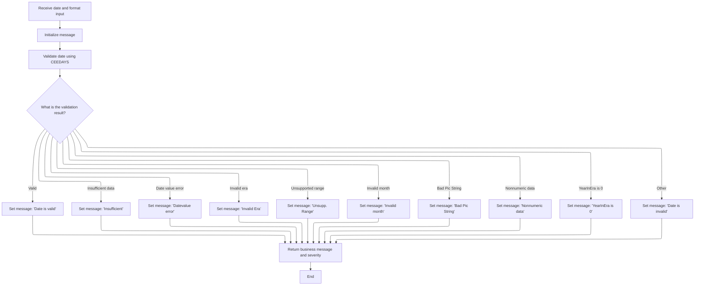
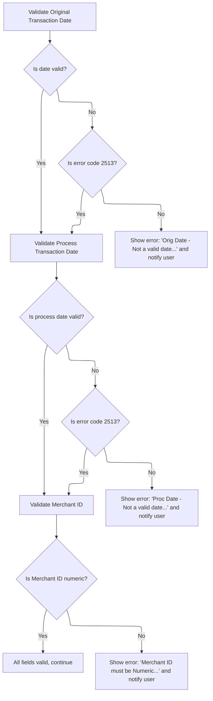

This document describes how transaction input fields are validated to ensure all required information is present and correctly formatted before a transaction can be processed. The flow checks for missing or invalid data, validates formats for codes, amounts, and dates, and uses an external routine for date validation. If any errors are found, the user is prompted to correct them before proceeding.

# Input Field Presence and Format Checks

<SwmSnippet path="/app/cbl/COTRN02C.cbl" line="235">

---

In `VALIDATE-INPUT-DATA-FIELDS`, we start by checking if the error flag is on. If it is, all relevant input fields are cleared to prevent any invalid or partial data from being processed further.

```cobol
       VALIDATE-INPUT-DATA-FIELDS.

           IF ERR-FLG-ON
               MOVE SPACES      TO TTYPCDI  OF COTRN2AI
                                   TCATCDI  OF COTRN2AI
                                   TRNSRCI  OF COTRN2AI
                                   TRNAMTI  OF COTRN2AI
                                   TDESCI   OF COTRN2AI
                                   TORIGDTI OF COTRN2AI
                                   TPROCDTI OF COTRN2AI
                                   MIDI     OF COTRN2AI
                                   MNAMEI   OF COTRN2AI
                                   MCITYI   OF COTRN2AI
                                   MZIPI    OF COTRN2AI
           END-IF.
```

---

</SwmSnippet>

<SwmSnippet path="/app/cbl/COTRN02C.cbl" line="251">

---

Next we check if the Type CD field is empty or invalid. If so, we set the error flag, set an error message, position the cursor for correction, and call SEND-TRNADD-SCREEN to show the error to the user.

```cobol
           EVALUATE TRUE
               WHEN TTYPCDI OF COTRN2AI = SPACES OR LOW-VALUES
                   MOVE 'Y'     TO WS-ERR-FLG
                   MOVE 'Type CD can NOT be empty...' TO
                                   WS-MESSAGE
                   MOVE -1       TO TTYPCDL OF COTRN2AI
                   PERFORM SEND-TRNADD-SCREEN
```

---

</SwmSnippet>

<SwmSnippet path="/app/cbl/COTRN02C.cbl" line="258">

---

Here we do the same check for Category CD—if it's empty, we flag the error, set the message, position the cursor, and call SEND-TRNADD-SCREEN. This pattern repeats for each required field.

```cobol
               WHEN TCATCDI OF COTRN2AI = SPACES OR LOW-VALUES
                   MOVE 'Y'     TO WS-ERR-FLG
                   MOVE 'Category CD can NOT be empty...' TO
                                   WS-MESSAGE
                   MOVE -1       TO TCATCDL OF COTRN2AI
                   PERFORM SEND-TRNADD-SCREEN
```

---

</SwmSnippet>

<SwmSnippet path="/app/cbl/COTRN02C.cbl" line="264">

---

Now we check the Source field for emptiness. If it's not filled, we flag the error, set the message, and prompt the user to correct it before continuing.

```cobol
               WHEN TRNSRCI OF COTRN2AI = SPACES OR LOW-VALUES
                   MOVE 'Y'     TO WS-ERR-FLG
                   MOVE 'Source can NOT be empty...' TO
                                   WS-MESSAGE
                   MOVE -1       TO TRNSRCL OF COTRN2AI
                   PERFORM SEND-TRNADD-SCREEN
```

---

</SwmSnippet>

<SwmSnippet path="/app/cbl/COTRN02C.cbl" line="270">

---

Here we validate the Description field. If it's empty, we set a unique error message and prompt the user to correct it, just like the previous fields.

```cobol
               WHEN TDESCI OF COTRN2AI = SPACES OR LOW-VALUES
                   MOVE 'Y'     TO WS-ERR-FLG
                   MOVE 'Description can NOT be empty...' TO
                                   WS-MESSAGE
                   MOVE -1       TO TDESCL OF COTRN2AI
                   PERFORM SEND-TRNADD-SCREEN
```

---

</SwmSnippet>

<SwmSnippet path="/app/cbl/COTRN02C.cbl" line="276">

---

Now we check if the Amount field is empty. If so, we flag the error, set the message, and prompt the user to fix it. Format validation comes later.

```cobol
               WHEN TRNAMTI OF COTRN2AI = SPACES OR LOW-VALUES
                   MOVE 'Y'     TO WS-ERR-FLG
                   MOVE 'Amount can NOT be empty...' TO
                                   WS-MESSAGE
                   MOVE -1       TO TRNAMTL OF COTRN2AI
                   PERFORM SEND-TRNADD-SCREEN
```

---

</SwmSnippet>

<SwmSnippet path="/app/cbl/COTRN02C.cbl" line="282">

---

Here we check if Orig Date is empty. If it is, we flag the error and prompt the user. The actual format validation for this field happens later.

```cobol
               WHEN TORIGDTI OF COTRN2AI = SPACES OR LOW-VALUES
                   MOVE 'Y'     TO WS-ERR-FLG
                   MOVE 'Orig Date can NOT be empty...' TO
                                   WS-MESSAGE
                   MOVE -1       TO TORIGDTL OF COTRN2AI
                   PERFORM SEND-TRNADD-SCREEN
```

---

</SwmSnippet>

<SwmSnippet path="/app/cbl/COTRN02C.cbl" line="288">

---

Now we check if Proc Date is empty. If so, we flag the error and prompt the user. Format validation comes later, just like Orig Date.

```cobol
               WHEN TPROCDTI OF COTRN2AI = SPACES OR LOW-VALUES
                   MOVE 'Y'     TO WS-ERR-FLG
                   MOVE 'Proc Date can NOT be empty...' TO
                                   WS-MESSAGE
                   MOVE -1       TO TPROCDTL OF COTRN2AI
                   PERFORM SEND-TRNADD-SCREEN
```

---

</SwmSnippet>

<SwmSnippet path="/app/cbl/COTRN02C.cbl" line="294">

---

Here we check if Merchant ID is empty. If it is, we flag the error and prompt the user. Numeric validation comes later.

```cobol
               WHEN MIDI OF COTRN2AI = SPACES OR LOW-VALUES
                   MOVE 'Y'     TO WS-ERR-FLG
                   MOVE 'Merchant ID can NOT be empty...' TO
                                   WS-MESSAGE
                   MOVE -1       TO MIDL OF COTRN2AI
                   PERFORM SEND-TRNADD-SCREEN
```

---

</SwmSnippet>

<SwmSnippet path="/app/cbl/COTRN02C.cbl" line="300">

---

Now we check if Merchant Name is empty. If so, we flag the error and prompt the user, just like the other merchant fields.

```cobol
               WHEN MNAMEI OF COTRN2AI = SPACES OR LOW-VALUES
                   MOVE 'Y'     TO WS-ERR-FLG
                   MOVE 'Merchant Name can NOT be empty...' TO
                                   WS-MESSAGE
                   MOVE -1       TO MNAMEL OF COTRN2AI
                   PERFORM SEND-TRNADD-SCREEN
```

---

</SwmSnippet>

<SwmSnippet path="/app/cbl/COTRN02C.cbl" line="306">

---

Here we check if Merchant City is empty. If it is, we flag the error and prompt the user, just like the other merchant address fields.

```cobol
               WHEN MCITYI OF COTRN2AI = SPACES OR LOW-VALUES
                   MOVE 'Y'     TO WS-ERR-FLG
                   MOVE 'Merchant City can NOT be empty...' TO
                                   WS-MESSAGE
                   MOVE -1       TO MCITYL OF COTRN2AI
                   PERFORM SEND-TRNADD-SCREEN
```

---

</SwmSnippet>

<SwmSnippet path="/app/cbl/COTRN02C.cbl" line="312">

---

Now we check if Merchant Zip is empty. If so, we flag the error and prompt the user, completing the presence checks for all merchant fields.

```cobol
               WHEN MZIPI OF COTRN2AI = SPACES OR LOW-VALUES
                   MOVE 'Y'     TO WS-ERR-FLG
                   MOVE 'Merchant Zip can NOT be empty...' TO
                                   WS-MESSAGE
                   MOVE -1       TO MZIPL OF COTRN2AI
                   PERFORM SEND-TRNADD-SCREEN
```

---

</SwmSnippet>

<SwmSnippet path="/app/cbl/COTRN02C.cbl" line="318">

---

If none of the previous field checks trigger, we just continue to the next set of validations without any action.

```cobol
               WHEN OTHER
                   CONTINUE
           END-EVALUATE.
```

---

</SwmSnippet>

<SwmSnippet path="/app/cbl/COTRN02C.cbl" line="322">

---

Now we check if Type CD and Category CD are numeric. If not, we flag the error, set a format-specific message, and prompt the user to fix it.

```cobol
           EVALUATE TRUE
               WHEN TTYPCDI OF COTRN2AI NOT NUMERIC
                   MOVE 'Y'     TO WS-ERR-FLG
                   MOVE 'Type CD must be Numeric...' TO
                                   WS-MESSAGE
                   MOVE -1       TO TTYPCDL OF COTRN2AI
                   PERFORM SEND-TRNADD-SCREEN
               WHEN TCATCDI OF COTRN2AI NOT NUMERIC
                   MOVE 'Y'     TO WS-ERR-FLG
                   MOVE 'Category CD must be Numeric...' TO
                                   WS-MESSAGE
                   MOVE -1       TO TCATCDL OF COTRN2AI
                   PERFORM SEND-TRNADD-SCREEN
               WHEN OTHER
                   CONTINUE
           END-EVALUATE
```

---

</SwmSnippet>

<SwmSnippet path="/app/cbl/COTRN02C.cbl" line="339">

---

Here we validate the Amount field's format in detail. If it doesn't match the expected pattern, we flag the error and show a message with the required format.

```cobol
           EVALUATE TRUE
               WHEN TRNAMTI OF COTRN2AI(1:1) NOT EQUAL '-' AND '+'
               WHEN TRNAMTI OF COTRN2AI(2:8) NOT NUMERIC
               WHEN TRNAMTI OF COTRN2AI(10:1) NOT = '.'
               WHEN TRNAMTI OF COTRN2AI(11:2) IS NOT NUMERIC
                   MOVE 'Y'     TO WS-ERR-FLG
                   MOVE 'Amount should be in format -99999999.99' TO
                                   WS-MESSAGE
                   MOVE -1       TO TRNAMTL OF COTRN2AI
                   PERFORM SEND-TRNADD-SCREEN
               WHEN OTHER
                   CONTINUE
           END-EVALUATE
```

---

</SwmSnippet>

<SwmSnippet path="/app/cbl/COTRN02C.cbl" line="353">

---

Now we validate the Orig Date format. If it doesn't match 'YYYY-MM-DD', we flag the error and show the correct format in the message.

```cobol
           EVALUATE TRUE
               WHEN TORIGDTI OF COTRN2AI(1:4) IS NOT NUMERIC
               WHEN TORIGDTI OF COTRN2AI(5:1) NOT EQUAL '-'
               WHEN TORIGDTI OF COTRN2AI(6:2) NOT NUMERIC
               WHEN TORIGDTI OF COTRN2AI(8:1) NOT EQUAL '-'
               WHEN TORIGDTI OF COTRN2AI(9:2) NOT NUMERIC
                   MOVE 'Y'     TO WS-ERR-FLG
                   MOVE 'Orig Date should be in format YYYY-MM-DD' TO
                                   WS-MESSAGE
                   MOVE -1       TO TORIGDTL OF COTRN2AI
                   PERFORM SEND-TRNADD-SCREEN
               WHEN OTHER
                   CONTINUE
           END-EVALUATE
```

---

</SwmSnippet>

<SwmSnippet path="/app/cbl/COTRN02C.cbl" line="368">

---

Here we validate the Proc Date format, just like Orig Date. If it's wrong, we flag the error and show the correct format.

```cobol
           EVALUATE TRUE
               WHEN TPROCDTI OF COTRN2AI(1:4) IS NOT NUMERIC
               WHEN TPROCDTI OF COTRN2AI(5:1) NOT EQUAL '-'
               WHEN TPROCDTI OF COTRN2AI(6:2) NOT NUMERIC
               WHEN TPROCDTI OF COTRN2AI(8:1) NOT EQUAL '-'
               WHEN TPROCDTI OF COTRN2AI(9:2) NOT NUMERIC
                   MOVE 'Y'     TO WS-ERR-FLG
                   MOVE 'Proc Date should be in format YYYY-MM-DD' TO
                                   WS-MESSAGE
                   MOVE -1       TO TPROCDTL OF COTRN2AI
                   PERFORM SEND-TRNADD-SCREEN
               WHEN OTHER
                   CONTINUE
           END-EVALUATE
```

---

</SwmSnippet>

<SwmSnippet path="/app/cbl/COTRN02C.cbl" line="383">

---

We prep and call CSUTLDTC to validate Orig Date using the CEEDAYS API.

```cobol
           COMPUTE WS-TRAN-AMT-N = FUNCTION NUMVAL-C(TRNAMTI OF
           COTRN2AI)
           MOVE WS-TRAN-AMT-N TO WS-TRAN-AMT-E
           MOVE WS-TRAN-AMT-E TO TRNAMTI OF COTRN2AI


           MOVE TORIGDTI OF COTRN2AI TO CSUTLDTC-DATE
           MOVE WS-DATE-FORMAT       TO CSUTLDTC-DATE-FORMAT
           MOVE SPACES               TO CSUTLDTC-RESULT

           CALL 'CSUTLDTC' USING   CSUTLDTC-DATE
                                   CSUTLDTC-DATE-FORMAT
                                   CSUTLDTC-RESULT
```

---

</SwmSnippet>

## Date Validation via External Routine



<SwmSnippet path="/app/cbl/CSUTLDTC.cbl" line="88">

---

`PROCEDURE DIVISION` in CSUTLDTC.cbl takes the date, format, and result parameters, runs the main validation logic, and returns a result message for the caller to use.

```cobol
       PROCEDURE DIVISION USING LS-DATE, LS-DATE-FORMAT, LS-RESULT.             
           
           INITIALIZE WS-MESSAGE
           MOVE SPACES TO WS-DATE
                                                                        
           PERFORM A000-MAIN                                                    
              THRU A000-MAIN-EXIT                                               

      *    DISPLAY WS-MESSAGE                                                   
           MOVE WS-MESSAGE                 TO LS-RESULT 
           MOVE WS-SEVERITY-N              TO RETURN-CODE          
                                                                                
           EXIT PROGRAM                                                         
      *    GOBACK                                                               
           .                                                                    
```

---

</SwmSnippet>

<SwmSnippet path="/app/cbl/CSUTLDTC.cbl" line="103">

---

`A000-MAIN` sets up the date and format, calls the CEEDAYS API to validate and convert the date, then interprets the feedback code to produce a result message. This lets us handle all sorts of date errors in a consistent way.

```cobol
       A000-MAIN.                                                               
                                                                                
           MOVE LENGTH OF LS-DATE                                               
                        TO VSTRING-LENGTH  OF WS-DATE-TO-TEST                   
           MOVE LS-DATE TO VSTRING-TEXT    OF WS-DATE-TO-TEST
                           WS-DATE                  
           MOVE LENGTH OF LS-DATE-FORMAT                                        
                         TO VSTRING-LENGTH OF WS-DATE-FORMAT                    
           MOVE LS-DATE-FORMAT                                                  
                         TO VSTRING-TEXT   OF WS-DATE-FORMAT   
                            WS-DATE-FMT  
           MOVE 0        TO OUTPUT-LILLIAN                              
                                                                        
           CALL "CEEDAYS" USING                                                 
                  WS-DATE-TO-TEST,                                              
                  WS-DATE-FORMAT,                                               
                  OUTPUT-LILLIAN,                                               
                  FEEDBACK-CODE                                                 
                                                                                
           MOVE WS-DATE-TO-TEST            TO WS-DATE                           
           MOVE SEVERITY OF FEEDBACK-CODE  TO WS-SEVERITY-N                     
           MOVE MSG-NO OF FEEDBACK-CODE    TO WS-MSG-NO-N                       
                                                                 
      *    WS-RESULT IS 15 CHARACTERS                                           
      *                123456789012345'                                         
           EVALUATE TRUE                                                        
              WHEN FC-INVALID-DATE                                   
                 MOVE 'Date is valid'      TO WS-RESULT              
              WHEN FC-INSUFFICIENT-DATA                              
                 MOVE 'Insufficient'       TO WS-RESULT              
              WHEN FC-BAD-DATE-VALUE                                 
                 MOVE 'Datevalue error'    TO WS-RESULT              
              WHEN FC-INVALID-ERA                                    
                 MOVE 'Invalid Era    '    TO WS-RESULT              
              WHEN FC-UNSUPP-RANGE                                   
                 MOVE 'Unsupp. Range  '    TO WS-RESULT              
              WHEN FC-INVALID-MONTH                                  
                 MOVE 'Invalid month  '    TO WS-RESULT              
              WHEN FC-BAD-PIC-STRING                                 
                 MOVE 'Bad Pic String '    TO WS-RESULT              
              WHEN FC-NON-NUMERIC-DATA                               
                 MOVE 'Nonnumeric data'    TO WS-RESULT              
              WHEN FC-YEAR-IN-ERA-ZERO                               
                 MOVE 'YearInEra is 0 '    TO WS-RESULT              
              WHEN OTHER                                             
                 MOVE 'Date is invalid'    TO WS-RESULT 
           END-EVALUATE                                                         
                                                                                
           .                                                                    
```

---

</SwmSnippet>

## Post-Date Validation and Final Field Checks



<SwmSnippet path="/app/cbl/COTRN02C.cbl" line="397">

---

Back in VALIDATE-INPUT-DATA-FIELDS, after returning from CSUTLDTC, we check the result. If the Orig Date isn't valid, we flag the error and prompt the user to fix it.

```cobol
           IF CSUTLDTC-RESULT-SEV-CD = '0000'
               CONTINUE
           ELSE
               IF CSUTLDTC-RESULT-MSG-NUM NOT = '2513'
                   MOVE 'Orig Date - Not a valid date...'
                     TO WS-MESSAGE
                   MOVE 'Y'     TO WS-ERR-FLG
                   MOVE -1       TO TORIGDTL OF COTRN2AI
                   PERFORM SEND-TRNADD-SCREEN
               END-IF
```

---

</SwmSnippet>

<SwmSnippet path="/app/cbl/COTRN02C.cbl" line="407">

---

Next we prep and call CSUTLDTC again, this time to validate the Proc Date field, using the same process as for Orig Date.

```cobol
           END-IF

           MOVE TPROCDTI OF COTRN2AI TO CSUTLDTC-DATE
           MOVE WS-DATE-FORMAT       TO CSUTLDTC-DATE-FORMAT
           MOVE SPACES               TO CSUTLDTC-RESULT

           CALL 'CSUTLDTC' USING   CSUTLDTC-DATE
                                   CSUTLDTC-DATE-FORMAT
                                   CSUTLDTC-RESULT
```

---

</SwmSnippet>

<SwmSnippet path="/app/cbl/COTRN02C.cbl" line="417">

---

After CSUTLDTC returns for Proc Date, we check the result. If it's invalid, we flag the error and prompt the user to fix Proc Date, just like Orig Date.

```cobol
           IF CSUTLDTC-RESULT-SEV-CD = '0000'
               CONTINUE
           ELSE
               IF CSUTLDTC-RESULT-MSG-NUM NOT = '2513'
                   MOVE 'Proc Date - Not a valid date...'
                     TO WS-MESSAGE
                   MOVE 'Y'     TO WS-ERR-FLG
                   MOVE -1       TO TPROCDTL OF COTRN2AI
                   PERFORM SEND-TRNADD-SCREEN
               END-IF
```

---

</SwmSnippet>

<SwmSnippet path="/app/cbl/COTRN02C.cbl" line="427">

---

Finally, before returning from VALIDATE-INPUT-DATA-FIELDS, we check if Merchant ID is numeric. If not, we flag the error and prompt the user to fix it.

```cobol
           END-IF


           IF MIDI OF COTRN2AI IS NOT NUMERIC
               MOVE 'Y'     TO WS-ERR-FLG
               MOVE 'Merchant ID must be Numeric...' TO
                               WS-MESSAGE
               MOVE -1       TO MIDL OF COTRN2AI
               PERFORM SEND-TRNADD-SCREEN
           END-IF
```

---

</SwmSnippet>

&nbsp;

*This is an auto-generated document by Swimm 🌊 and has not yet been verified by a human*

<SwmMeta version="3.0.0" repo-id="Z2l0aHViJTNBJTNBYXdzLW1haW5mcmFtZS1tb2Rlcm5pemF0aW9uLWNhcmRkZW1vJTNBJTNBbXVkYXNpbjE=" repo-name="aws-mainframe-modernization-carddemo"><sup>Powered by [Swimm](https://app.swimm.io/)</sup></SwmMeta>
